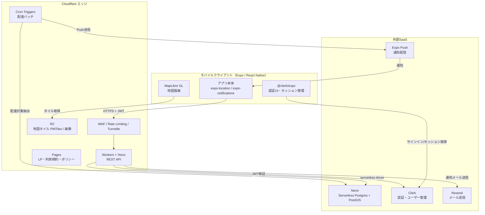
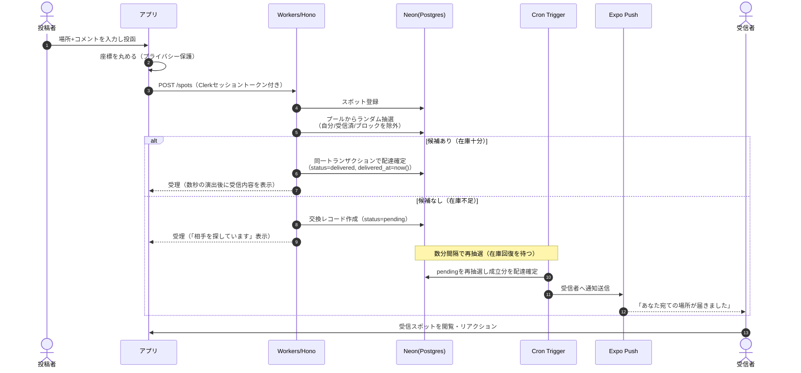
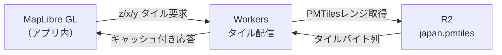
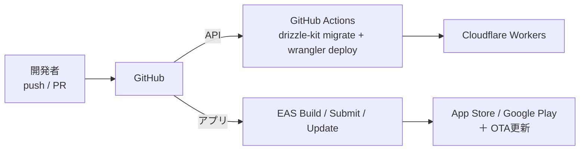

# アーキテクチャ設計書

**プロダクト名:** まちびん
**サブタイトル:** 「おすすめ場所」ランダム交換サービス — システムアーキテクチャ

---

## 改訂履歴

| 版数 | 改訂日 | 改訂者 | 改訂内容 |
| --- | --- | --- | --- |
| 1.0 | 2026-07-07 | 優太 | 初版作成 |
| 1.1 | 2026-07-12 | 優太 | データベースをNeonからCloudflare D1へ変更、認証を自前JWTからClerkへ変更、メール送信をResendに確定。関連する地理検索方式・コスト試算・NFR対応・リスクを全面改訂。 |
| 1.2 | 2026-07-12 | 優太 | データベースをCloudflare D1からNeon（PostGIS）へ差し戻し。認証（Clerk）・メール送信（Resend）はv1.1のまま維持。地理検索・コスト試算・NFR対応・リスクをPostGIS前提で再改訂。 |
| 1.3 | 2026-07-12 | Claude | 基本設計工程での決定を反映。配達を配達ウィンドウ（朝夕バッチ）方式から即時配達方式（在庫不足時のみ非同期再抽選）へ変更し、関連するデータフロー・コスト最適化根拠を改訂。認証手段をメールOTPからGoogleソーシャルログインのみへ変更。 |

## 文書情報

| 項目 | 内容 |
| --- | --- |
| 文書名 | まちびん アーキテクチャ設計書 |
| ステータス | ドラフト |
| 関連文書 | まちびん 要件定義書 v1.0 |
| 想定規模 | 個人開発〜小規模チーム（MVP → 段階的拡張） |

> ※本書に記載する料金・無料枠は 2026年7月時点の各社公開情報に基づく。実装着手時に最新値を再確認すること。

---

## 1. はじめに

### 1.1 目的

本書は、要件定義書 v1.0 で定義した まちびん を実現するためのシステムアーキテクチャを定義する。技術スタックの選定理由、システム構成、主要データフロー、非機能要件の実現方式、およびランニングコストを明確化し、基本設計・実装の指針とすることを目的とする。

### 1.2 前提条件

- クライアントはスマートフォンアプリ（iOS / Android）である。
- サービスは日本国内を主対象とする（多言語・多地域は将来検討）。
- MVP段階では小規模トラフィックを想定し、成長に応じて段階的にスケールする。

### 1.3 設計上の主要な要求

本アーキテクチャは、要件に加えて次の2点を最優先の設計ドライバとする。

1. **ランニングコストの最小化** — アイドル時に費用が発生しない従量課金・サーバーレス構成を徹底する。
2. **Cloudflareエコシステムの活用**（必須ではない） — コンピュート・ストレージ・エッジ機能はCloudflareに寄せる。合理的な理由がある一部要素のみ他サービスを採用し、その理由と代替案を明示する。

---

## 2. アーキテクチャ設計方針

| No | 原則 | 内容 |
| --- | --- | --- |
| P-1 | アイドルコスト・ゼロ | サーバー常駐を排し、リクエスト従量課金＋スケールtoゼロを基本とする。無料枠内での運用をMVPの目標とする。 |
| P-2 | Cloudflare中心 | API・エッジ機能・オブジェクトストレージ・地図タイル配信をCloudflareに集約する。 |
| P-3 | コアはPostgreSQL/PostGISで正攻法に、非コアはマネージドへ委譲 | 地理検索などサービスの中核ロジックは、開発者の強みであるPostgreSQL資産を活かしPostGISで正確に実装する。一方、認証やメール送信のように実装・運用コストが高く独自性を要さない機能はマネージドSaaS（Clerk・Resend）に委ねる。 |
| P-4 | 運用負荷の最小化 | マネージド・サーバーレスを優先し、サーバー保守・パッチ・スケール運用を極力持たない。 |
| P-5 | 段階的拡張性 | MVPの構成のまま、距離モード・お題交換・旅先モード等を段階的に追加できる構造とする。 |
| P-6 | ベンダーロックインの抑制 | ORM抽象化・標準Postgres・OSS地図により、主要素の差し替え余地を残す。 |

---

## 3. 技術スタック選定

### 3.1 全体一覧

| レイヤ | 採用技術 | 主な選定理由 | 主な代替案 |
| --- | --- | --- | --- |
| モバイルクライアント | **Expo（React Native）＋ TypeScript** | クロスプラットフォーム単一コード、地図/位置/通知のライブラリが充実、OTA更新でコスト・運用が軽い | Flutter |
| 地図描画 | **MapLibre GL（`@maplibre/maplibre-react-native`）** | OSSで利用料が発生しない。ベクタータイル対応 | react-native-maps（ネイティブ地図） |
| 地図タイル | **Protomaps（PMTiles）を Cloudflare R2 に配置** | 単一ファイルを配置しWorker経由で配信。**R2は下り転送料無料**で極めて低コスト | MapTiler / Google Maps（従量課金） |
| APIレイヤ | **Cloudflare Workers ＋ Hono** | エッジ実行・無料枠が大きい。HonoはWorkers向けの軽量TypeScript製フレームワーク | Hono on Bun/Node（VPS）、AWS Lambda |
| データベース | **Neon（Serverless Postgres ＋ PostGIS）** | スケールtoゼロでアイドル無課金、PostGISで地理機能を正確に実装、Postgres資産をそのまま活用 | Cloudflare D1（SQLite）、Supabase |
| ORM / マイグレーション | **Drizzle ORM ＋ drizzle-kit** | Workers/エッジで軽量に動作、型安全。Postgres方言に対応 | Prisma、Kysely、生SQL |
| 非同期・スケジューリング | **Cloudflare Cron Triggers**（＋必要に応じ Queues / Durable Objects Alarms） | 配達は即時配達を基本とし（BD-01）、在庫不足時のみ再抽選ジョブで非同期に配達する。無料枠内、常駐不要 | 外部cron、SQS+Lambda |
| 認証 | **Clerk（`@clerk/expo` ＋ Cloudflare Workers上でJWT検証）** | マネージドで実装・運用コストを大幅削減。2026年2月の改定で無料枠が**5万MRU/月**に拡大しMVP〜成長初期を無料でカバー。Expo公式SDKでネイティブUI・セッション管理が揃う | 自前JWT+OTP、Neon Auth |
| メール送信（OTP等） | **Resend** | シンプルなAPIで無料枠3,000通/月。トランザクションメール中心の用途に十分 | AWS SES（無料枠超過時の代替） |
| オブジェクトストレージ | **Cloudflare R2**（Phase 1は最小利用） | 下り無料。アバター/画像を将来追加する際も低コスト | S3、Supabase Storage |
| プッシュ通知 | **Expo Push（`expo-notifications`）** | APNs/FCMをラップし**無料**、実装が容易 | FCM直、OneSignal |
| 不正・スパム対策 | **Cloudflare Turnstile ＋ Rate Limiting / WAF** | Turnstileは無料のCAPTCHA代替。Botサインアップ・連投を抑止 | hCaptcha、reCAPTCHA |
| CDN / エッジ | **Cloudflare** | 上記と統合。TLS終端、キャッシュ、DDoS防御 | — |
| CI/CD | **GitHub Actions ＋ Wrangler（API）＋ EAS（アプリ）** | 無料枠で完結。GitHub運用と親和 | Cloudflare Workers Builds、Bitrise |
| 監視・エラー | **Cloudflare Analytics / Logpush ＋ Sentry（無料枠）** | 標準メトリクス＋例外収集を低コストで | Datadog、Grafana Cloud |

### 3.2 主要な選定の補足

> **v1.2時点の構成は、DBをNeon（PostGIS）に差し戻したことで、Cloudflare外に残るのはDB（Neon）・認証（Clerk）・メール送信（Resend）の3点になる。** いずれも「地理検索を正確に実装する」「実装・運用コストの高い機能をマネージドへ委ねる」という合理的な理由に基づく選択であり、それ以外のコンピュート・ストレージ・エッジ機能はCloudflareに集約している（P-2・P-3）。

#### データベース：Neon（PostGIS）を主とする理由

1. **地理機能（PostGIS）** — 距離モード（ご近所交換）や「もらった場所帳」の近傍検索は、`ST_DWithin` とGiSTインデックスで正確・高速に実装できる。SQLiteベースのD1にはPostGIS相当がなく、Geohash＋バウンディングボックスでの近似実装が必要になる。
2. **Postgres資産の活用（P-3）** — 開発者の中核スキルがPostgreSQLであり、複雑なSQL・トランザクション設計をそのまま活かせる。
3. **アイドル無課金（P-1）** — Neonはスケールtoゼロを標準搭載し、アイドル時のコンピュート課金がゼロ。無料枠（ストレージ0.5GB、コンピュート100 CU-hours/月）で長くMVPを運用できる。Cloudflare Workers向けの `@neondatabase/serverless` ドライバ（HTTP接続）で接続数問題も回避できる。

> **完全Cloudflare化を優先する場合の代替:** DBを **Cloudflare D1（SQLite）** に置き換える。地理検索はGeohashのプレフィックス一致＋距離計算で代替する。ORMにDrizzleを採用しているため、Phase 1（マッチングが「完全ランダム」で地理不要）はD1でも成立する。距離モード導入（Phase 2）でPostGISの優位が効くため、そのタイミングでNeonへ移行する二段構えも可能（本アーキテクチャでは最初からNeonを採用し、この移行ステップ自体を省略している）。

#### 地図：MapLibre ＋ Protomaps（R2）を主とする理由

Google Maps等の従量課金APIは、地図表示回数の増加に伴いコストが読みにくい。日本エリアのベクタータイル（PMTiles）をR2に1ファイル配置し、Worker経由で配信すれば、**下り転送料無料＋数GBのストレージ料（無料枠10GB内に収まる）** のみで地図を提供できる。要求P-1・P-2の双方に最も合致する。

> **最速で作る場合の代替:** `react-native-maps` を用い、iOSはApple Maps、AndroidはGoogle Mapsのネイティブ地図をそのまま使う。タイル配信インフラが不要になる反面、Androidの地図ロードにGoogleの従量課金が絡む。初期構築の速さを優先するならこちら。

#### 認証：Clerkを採用する理由

1. **実装・運用コストの削減** — サインアップ・ログイン・セッション管理・トークンローテーション・不正ログイン検知等を自前実装せず、Expo公式SDK（`@clerk/expo`）とバックエンド検証で完結する。認証手段はGoogleソーシャルログインのみとし（BD-02）、OTP・パスワード管理を自前で作り込む工数が丸ごと不要になる。なお、iOSでサードパーティのソーシャルログインを提供する場合、App Store審査ガイドライン4.8によりSign in with Apple相当の選択肢の併設が必須となる点に留意する。
2. **無料枠の大きさ** — 2026年2月の改定で無料枠が**5万MRU（月間復帰ユーザー）/月**に拡大されており、MVP〜成長初期のフェーズは実質無料で運用できる（超過時はPro $25/月＋$0.02/MRU）。
3. **Cloudflare Workersとの親和性** — API側はClerkが発行するセッショントークン（JWT）を`@clerk/backend`（またはJWKS検証）で検証するだけでよく、独自のトークン発行・リフレッシュ実装が不要になる。

**匿名志向のプライバシー方針との両立:** 要件定義（2.4節）にある本名・写真を必須としない方針は維持する。Clerk側にはメールアドレス等の最小限の認証情報のみを持たせ、ニックネーム・アバター・居住エリアといったアプリ固有のプロフィールはNeon側の`profiles`テーブルで、Clerkが払い出す`user_id`を外部キーとして別管理する。Clerkのユーザー作成イベント（Webhook）を受けてNeonにプロフィールの空レコードを自動作成する構成を推奨する（9章参照）。

---

## 4. システム構成

### 4.1 全体アーキテクチャ

### 4.2 コンポーネント責務

| コンポーネント | 責務 |
| --- | --- |
| モバイルアプリ | UI表示、GPS取得、**座標の丸め（送信前）**、地図描画、通知受信、APIコール |
| @clerk/expo | サインアップ・ログインUI、セッショントークンの保持・自動更新（`expo-secure-store`で暗号化保存） |
| WAF / Rate Limiting / Turnstile | 不正アクセス・Bot・連投の抑止、TLS終端、DDoS防御 |
| Workers + Hono（API） | Clerkトークン検証、スポット投函受理、交換抽選、リアクション、場所帳取得等のREST API |
| Cron Triggers（在庫不足時の再抽選） | 在庫不足で保留（`pending`）となった交換の再抽選・配達確定と、受信者へのプッシュ通知送信 |
| R2 | 地図タイル（PMTiles）の配信、将来の画像保管 |
| Pages | ランディングページ、利用規約、プライバシーポリシーの静的配信 |
| Clerk | 認証・セッション管理・ユーザーの本人性確保（アプリ固有プロフィールはNeon側で別管理） |
| Neon（Postgres + PostGIS） | アプリ固有の全永続データの保持、地理検索、抽選クエリ、トランザクション |
| Expo Push | 端末への通知配信 |
| Resend | 将来のトランザクションメール送信用に予約（Phase 1は認証をGoogleソーシャルログインのみとするため出番なし） |

---

## 5. 主要データフロー

### 5.1 投函 → 交換 → 配達 → 受信

本サービスの中核サイクル。**配達は投函と同期して即時に行う（バッチウィンドウは設けない）。** 抽選候補が見つかれば投函APIの処理内で配達まで完了させ、アプリ側は数秒の演出後に受信内容を表示する。抽選候補が不足する場合のみ、非同期の再抽選ジョブ（Cron Trigger）が見つかり次第配達する。朝夕のウィンドウ配達や距離連動の遅延演出は、Phase 2以降のオプションとして温存する（12章参照）。

**補足：交換モデル（Postcrossing方式）**
スポットは「消費」ではなく再利用可能なプール項目として扱う。1件投函するごとに1回の抽選権（ドロー）を得て、プールからランダムに1件を受け取る。抽選されたスポットはプールに残り、他ユーザーへも配られ得る。これによりプールの枯渇を防ぎつつ、投函と受信の1対1の対価関係（要件 FR-04）を維持する。

### 5.2 地図タイル配信

日本エリアのPMTilesを1ファイルとしてR2に格納し、Workerがレンジリクエストで必要なタイルのみ切り出して返す。Cloudflareのキャッシュを併用し、R2への実アクセスと料金を最小化する。

### 5.3 認証フロー（概要）

1. 初回起動：Clerkのサインアップ／ログインUI（`@clerk/expo`）で**Googleソーシャルログインのみ**を行い、Clerkがセッショントークン（JWT）を発行する（メールOTP・マジックリンク等は提供しない）。
2. モバイルアプリは、以降のAPIコール時にClerkのセッショントークンをAuthorizationヘッダーに付与する。
3. Cloudflare Workers側は`@clerk/backend`（またはJWKS検証）でトークンを検証し、`userId`をリクエストコンテキストに設定する。トークンの発行・ローテーション自体はClerkに一任し、自前実装は持たない。
4. アプリ固有のプロフィール（ニックネーム・アバター・居住エリア等）はNeon側の`profiles`テーブルにClerkの`user_id`を外部キーとして保存・管理する。Clerkのユーザー作成イベント（Webhook: `user.created`）を受けて、Neonにプロフィールの空レコードを自動作成する。

---

## 6. データベース設計方針（Neon / PostgreSQL + PostGIS）

### 6.1 地理データ（PostGIS）

- スポットの位置は PostGIS の `geography(Point, 4326)` 型で保持する。
- 近傍検索（距離モード、場所帳の地図表示）は `ST_DWithin(geog, :point, :radius)` を用い、距離順は `ST_Distance` で取得する。

### 6.2 位置情報の丸め（プライバシー：要件 NFR-PR01）

- **原則、生の端末座標をサーバーに送信・保存しない。** クライアント側で送信前に座標を丸める。
- 丸め方式：ジオハッシュのプレフィックス（precision 7 ≒ 約150m四方）またはグリッドへのスナップ。個人宅をピンポイント特定できない粒度とする。
- サーバー側でも受領時に精度を再検証し、規定より高精度な座標は丸め直す。
- 場所の識別性は、ユーザーが入力する**場所名（施設・公共スポット名）**で担保する（座標は保護、名称で識別）。
- **Phase 2拡張:** OSM/ジオコーダ（Photon等の自ホスト、Geoapify等の無料枠）による近傍POIスナップを導入し、プライバシーとUXの双方を向上させる。

### 6.3 インデックス方針

- 位置：GiSTインデックス（`USING gist(geog)`）で近傍検索を高速化。
- 抽選・除外条件：交換テーブルの `(recipient_user_id, spot_id)` に複合インデックス、スポットの `status`・`category` にインデックス。
- ブロック関係：`(blocker_id, blocked_id)` にインデックス。

### 6.4 交換プールとマッチング（抽選）

- 抽選クエリは「自分の投稿・受信済み・ブロック関係」を除外したうえでプールからランダムに1件を選ぶ。
- MVP（小規模）は `ORDER BY random() LIMIT 1` で十分。規模拡大時は `TABLESAMPLE` や乱数キー列＋範囲検索でフルスキャンを回避する。
- Phase 2の距離モードでは、上記の除外条件に `ST_DWithin` を追加してプールを地理的に絞り込む。

### 6.5 接続方式

- Workersからは `@neondatabase/serverless` ドライバ（HTTP）で接続し、サーバーレス特有の接続数肥大を回避する。
- 将来、TCP接続やクエリキャッシュが必要になれば **Cloudflare Hyperdrive** の併用を検討する。

---

## 7. 非機能要件の実現方式（要件定義 NFR との対応）

| NFR-ID | 要件概要 | 本アーキテクチャでの実現方式 |
| --- | --- | --- |
| NFR-P01 | 主要画面3秒以内 | エッジ実行（Workers）＋タイルキャッシュ＋近傍検索のインデックス化。Neonのコールドスタート（初回300〜500ms）は許容範囲。 |
| NFR-P02 | 交換・配達は非同期許容 | 投函はAPIで即時受理し、配達はCron Triggersでバッチ処理。 |
| NFR-A01 | 稼働率99.5%目標 | Cloudflare・Neon・Clerkのマネージド基盤に依拠。単一障害点となる自前サーバーを持たない。 |
| NFR-A02 | 計画メンテ告知 | Pagesの告知ページ＋アプリ内通知で対応。 |
| NFR-S01 | 通信TLS | Cloudflareで全通信TLS終端。 |
| NFR-S02 | 認証情報の保護 | 認証情報の保存・保護自体をClerkに一任（パスワードハッシュ化・セッション管理・不正ログイン検知はClerk側で実施）。Workers側はJWT検証のみを行い、機微情報を自社DBに持たない。 |
| NFR-S03 | Bot・スパム抑止 | Turnstile（サインアップ・投函時）＋ Rate Limiting/WAF ＋ 投稿最低文字数（FR-03）。 |
| NFR-S04 | 最小権限アクセス | APIを介したアクセスのみ許可。DB資格情報・外部SaaSのAPIキーはWranglerシークレットで管理。 |
| NFR-PR01 | 位置の丸め | クライアント側で座標を丸めて送信、サーバーで再検証（6.2）。 |
| NFR-PR02 | 差出人非開示・エリアは市区町村まで | 応答に個人情報を含めず、エリア表示は市区町村粒度に限定。 |
| NFR-PR03 | 位置取得は許可制 | OSの許可に従い、未許可時は地図ピン指定で投稿可能。 |
| NFR-PR04 | 法令遵守・ポリシー掲示 | Pagesにプライバシーポリシー・利用規約を掲示。 |
| NFR-PR05 | データ削除要求 | 退会・データ削除APIを提供し、Postgresでの論理/物理削除に加え、Clerk側のユーザー削除APIも呼び出す。 |
| NFR-E01 | スケール可能 | サーバーレスの水平スケール。Neonはオートスケール（〜8 CU）。 |
| NFR-E02 | 機能追加に強い | Drizzleによる抽象化と段階的スキーマ拡張。距離モードは抽選クエリへの条件追加（`ST_DWithin`）で実現。 |
| NFR-E03 | パラメータの運用調整 | 配達時刻・最低文字数・距離しきい値を環境変数/設定テーブルで管理し、コード改修なしに変更。 |
| NFR-O01 | 通報対応の管理手段 | 管理用エンドポイント（将来は簡易管理画面）で投稿・アカウントを停止。 |
| NFR-O02 | シードスポット管理 | 運営用の投入APIで通常投稿と同基準のスポットを追加。 |
| NFR-O03 | 主要指標の計測 | Cloudflare Analytics＋DB集計。必要に応じPostHog（無料枠）。 |
| NFR-O04 | 障害・不正の監視 | Logpush＋Sentryで例外・異常を検知。 |
| NFR-C01 | iOS/Android対応 | Expoでクロスプラットフォーム対応。 |
| NFR-C02 | 日本語優先 | UI日本語化、地図タイルも日本エリアを主に整備。 |

---

## 8. ランニングコスト試算

### 8.1 MVP（低トラフィック：無料枠内での運用を目標）

| 項目 | サービス／プラン | 想定月額 | 備考 |
| --- | --- | --- | --- |
| API・エッジ | Cloudflare Workers 無料枠 | **$0** | 10万リクエスト/日まで。超過時は Workers Paid $5/月へ。 |
| データベース | Neon 無料枠 | **$0** | 0.5GB・100 CU-hours/月・スケールtoゼロ。即時配達も投函と同一トランザクションで完結し、追加のポーリングは在庫不足時のみ（8.4参照）。 |
| 地図タイル | Cloudflare R2 | **$0** | 日本PMTilesは数GB＝無料枠10GB内、下り無料。 |
| 静的サイト | Cloudflare Pages 無料枠 | **$0** | LP・規約・ポリシー。 |
| 認証 | Clerk 無料枠 | **$0** | 5万MRU（月間復帰ユーザー）/月まで無料。超過時はPro $25/月＋$0.02/MRU。 |
| プッシュ通知 | Expo Push | **$0** | 無料。 |
| Bot対策 | Cloudflare Turnstile | **$0** | 無料。 |
| メール（将来用） | Resend 無料枠 | **$0** | 3,000通/月。Phase 1は認証をGoogleソーシャルログインのみとするため未使用。超過時はSESや上位プランへ。 |
| エラー監視 | Sentry 無料枠 | **$0** | 個人規模で十分。 |
| CI/CD | GitHub Actions 無料枠 | **$0** | Wranglerデプロイ。 |
| アプリビルド | EAS（無料枠）またはローカルビルド | **$0** | 無料枠のビルド枠内、またはローカルで回避。 |
| ドメイン | レジストラ | 約 **$1** | 年額$10〜15を月割。 |
| **合計（インフラ）** | | **≒ $0〜1／月** | |

**別途、アプリ配信の固定費（不可避）**
Apple Developer Program 年 $99、Google Play Console 初回 $25（買い切り）。

### 8.2 成長時（目安：数千〜1万MAU規模、一部無料枠超過）

| 項目 | 想定月額 | 主なコストドライバ |
| --- | --- | --- |
| Cloudflare Workers Paid | $5〜 | リクエスト・CPU時間 |
| Neon（Launch, 従量） | $10〜30 | アクティブなコンピュート時間・ストレージ |
| Clerk | $0 | 数千〜1万MAU規模なら無料枠（5万MRU）内に収まる想定 |
| R2 / メール / その他 | $0〜数 | 画像追加時のストレージ、メール通数 |
| **合計** | **概ね $15〜35／月** | 主なコストドライバはNeonのコンピュート時間。Clerkはこの規模なら無料枠内 |

> 認証はMAUベースで費用が嵩みやすい領域だが、Clerkの無料枠（5万MRU）が大きいため、数千〜1万MAU規模のサービスであれば認証コストは実質発生しない。コストの主役はNeonのコンピュート時間になる。

### 8.3 コストの効きどころ

- **Neonのコンピュート時間**が最大の変動要因。スケールtoゼロを維持できるかが分かれ目。
- **Clerkの月間復帰ユーザー数（MRU）** — 5万MRUを超えたタイミングで従量課金が始まる。
- 画像投稿を追加すると**R2のストレージ**が増える（下りは無料のまま）。

### 8.4 コスト最適化の設計判断

- **即時配達はDBアクセスの観点で追加コストを生まない:** 配達は投函APIの処理に内包されるため、Neonへのアクセスはもとの投函・抽選処理と同一トランザクションで完結し、常駐ポーリングを必要としない。DBのスケールtoゼロを妨げるのは、在庫不足（`pending`）時の再抽選ジョブのみであり、これは数分間隔の軽量なポーリングに限定する（08 バッチ設計書）。
- **R2＋PMTilesで地図の下り料金をゼロ化。**
- **無料枠の大きいマネージドサービス（Clerk・Expo Push・Turnstile・Pages・Sentry・Resend）を積極採用。**
- **フロントのポーリング（React Query間隔・ヘルスチェック等）を抑制**し、意図せずDBを起こし続けないようにする。

---

## 9. CI/CD・デプロイ・運用

### 9.1 パイプライン

- **API:** GitHub Actions で `drizzle-kit` によるマイグレーション適用後、`wrangler deploy` でWorkersへ配信。
- **アプリ:** EAS Build でネイティブビルド、EAS Submit でストア申請、**EAS Update でOTA更新**（軽微な修正はストア審査を経ずに配信）。

### 9.2 環境分離（Neonブランチの活用）

- Neonの**コピーオンライト・ブランチ**でdev / staging / preview環境を安価に用意する（本番＝mainブランチ）。PRごとのプレビューDBも低コストで作れる。

### 9.3 Clerk Webhookの扱い

- Clerkのユーザー作成イベント（`user.created`）をWorkers上のWebhookエンドポイントで受信し、Neon側に対応する`profiles`レコードを自動作成する。
- 退会（ユーザー削除）イベントも同様にWebhookで受信し、Neon側の関連データの論理/物理削除をトリガーする（NFR-PR05）。

### 9.4 シークレット管理

- DB接続文字列（Neon）、外部SaaSのAPIキー（Clerk、Resend等）、JWT検証用の鍵情報は Wrangler Secrets／Cloudflare環境変数で管理し、リポジトリに含めない。

### 9.5 監視・ログ

- Cloudflare Analytics（リクエスト・エラー率）、Logpush（ログ転送）、Sentry（例外）。
- 主要プロダクト指標（投函数・交換成立数・配達完了数・リアクション率・通報数：NFR-O03）はDB集計、必要に応じPostHog無料枠を併用。

---

## 10. スケール戦略

| 段階 | 想定 | 主な打ち手 |
| --- | --- | --- |
| MVP | 無料枠内 | 現構成のまま。配達バッチでアイドル維持。 |
| 成長初期 | 無料枠超過 | Workers Paid（$5）へ。Neonはオートスケールと`ORDER BY random()`の最適化（`TABLESAMPLE`等）。 |
| 地理機能本格化 | 距離モード常用 | PostGIS＋GiSTで近傍検索を最適化。既にNeonを採用しているため追加移行は不要。 |
| 高トラフィック | 接続・レイテンシ増 | Cloudflare Hyperdriveで接続プール/キャッシュ、Neonの読み取りレプリカ、Queues/Durable Objectsで配達の精緻化・分散。 |
| 認証規模拡大 | MAU増加 | Clerk Pro（$25/月＋$0.02/MRU）への移行、Enterprise connections等の要否を検討。 |
| 画像・多地域 | 機能拡張 | R2で画像配信、タイルの多地域整備、CDNキャッシュ最適化。 |

---

## 11. 技術的リスクと対策

| No | リスク | 内容 | 対策 |
| --- | --- | --- | --- |
| AR-01 | Neonコールドスタート | アイドル復帰時の初回クエリに300〜500msの遅延。 | UX上許容範囲。必要なら自動休止までの猶予を延長、または重要導線でウォームアップ。 |
| AR-02 | 無料枠の急な超過 | トラフィック増で予期せぬ制限・課金。 | 使用量アラート設定、Workers上限CPU設定でランナウェイ課金防止、Neon・Clerkの使用量監視。 |
| AR-03 | 地図タイルの整備・更新 | PMTilesの生成・更新運用が必要。 | 日本エリアの定期再ビルド手順を用意。初期はreact-native-mapsへの切替も選択肢。 |
| AR-04 | 交換の公平性・スパム | 低品質投稿の連投、プール汚染。 | 最低文字数、Turnstile、Rate Limiting、通報→マッチ永久除外、シードスポットで品質底上げ。 |
| AR-05 | 位置プライバシー | 丸め不足による自宅推定。 | クライアント丸め＋サーバー再検証、住宅地投稿の抑制、POIスナップ（Phase 2）。 |
| AR-06 | ベンダーロックイン（Cloudflare・Neon・Clerk） | Cloudflare／Neon／Clerkへの依存。特にClerkは認証基盤そのものであり移行影響が大きい。 | Drizzle抽象化・標準Postgres・OSS地図で差し替え余地を確保。Clerkは全プランでユーザーデータのエクスポートに対応しており、移行自体は技術的に可能。 |
| AR-07 | コールドスタート型DBと常時ポーリングの相性 | ポーリングでNeonのスケールtoゼロが無効化。 | 配達バッチ化とフロントのポーリング抑制（8.4）。 |
| AR-08 | 認証SaaS（Clerk）の障害影響 | Clerk側の障害時はログイン・セッション検証ができず、サービス全体が利用不可になり得る。 | Clerkのステータスページ監視、障害時のアプリ内案内文言の用意。重要度に応じて代替手段（キャッシュ済みセッションの一時許容等）を検討。 |

---

## 12. 今後の検討事項

- 配達演出の秒数、および在庫不足時の再抽選間隔の初期値確定（UXとコストのバランス。08 バッチ設計書 PRM-03・PRM-10）。
- Phase 2以降での朝夕ウィンドウ配達・距離連動の遅延演出のオプション化検討。
- 抽選クエリの規模対応方式（`TABLESAMPLE`／乱数キー）の実装方針決定。
- POIスナップ導入時のデータソース選定（OSM/ジオコーダの無料枠・自ホスト可否・権利確認）。
- Clerkのオンボーディングフロー（Google OAuthのスコープ・同意画面の文言等）の確定と、Neon側プロフィールとのWebhook連携設計。
- 画像投稿を追加する場合のR2設計とモデレーション方針。
- 監視・アラートのしきい値と、使用量が無料枠に近づいた際の運用手順。

---

*本書はドラフトであり、基本設計工程で内容を精緻化する。記載の料金・無料枠は実装着手時に最新情報で再確認すること。*
