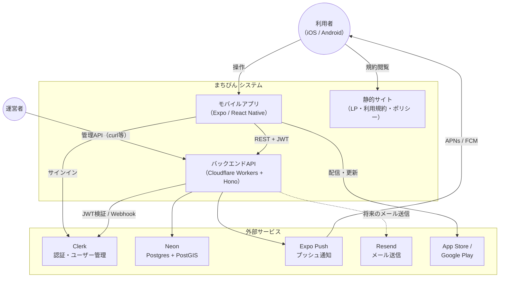
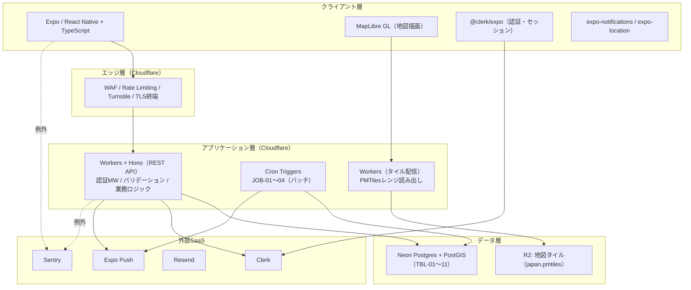

# システム構成設計書

**プロダクト名:** まちびん
**サブタイトル:** 「おすすめ場所」ランダム交換サービス

---

## 改訂履歴

| 版数 | 改訂日 | 改訂者 | 改訂内容 |
| --- | --- | --- | --- |
| 1.0 | 2026-07-12 | Claude | 初版作成 |

## 文書情報

| 項目 | 内容 |
| --- | --- |
| 文書名 | まちびん システム構成設計書 |
| ステータス | ドラフト |
| 位置づけ | 02 アーキテクチャ設計書（方式設計）を受け、システム関連図・構成図・インフラリソース・環境定義を基本設計として具体化する |
| 関連文書 | 02 アーキテクチャ設計書、07 API設計書、08 バッチ・非同期処理設計書、10 認証・認可設計書 |

> ※ドメイン名 `machibin.app` は仮であり、取得後に確定する。

---

## 1. システム関連図（コンテキスト図)

システムと利用者・外部サービスの関係を示す。

| 関連先 | 方向 | 内容 |
| --- | --- | --- |
| 利用者 | 双方向 | アプリの操作、プッシュ通知の受信 |
| 運営者 | → | 管理API（BD-04。シード投入・通報対応）の呼び出し |
| Clerk | 双方向 | 認証UI・トークン発行（アプリ）、JWT検証・ユーザー削除・Webhook受信（API） |
| Neon | → | 全永続データの読み書き（HTTPドライバ） |
| Expo Push | → | プッシュ通知の配信依頼 |
| Resend | → | 将来のトランザクションメール送信用に予約（Phase 1の認証OTPメールはClerkが直接送信するため、Resendの出番は限定的） |
| ストア | → | アプリ配信、EAS UpdateによるOTA更新 |

---

## 2. アーキテクチャ構成図（論理構成）

### コンポーネントと担当設計書

| コンポーネント | 責務 | 詳細設計 |
| --- | --- | --- |
| モバイルアプリ | UI・画面遷移、GPS取得と**送信前の座標丸め**、地図描画、通知受信 | 05 画面設計書、11 プライバシー設計書 |
| REST API（Workers + Hono） | 認証・認可、投函/交換/場所帳/通報等の業務ロジック | 04 機能設計書、07 API設計書、10 認証・認可設計書 |
| バッチ(Cron Triggers) | 配達確定、再抽選、通知レシート確認、TTL削除 | 08 バッチ・非同期処理設計書 |
| タイル配信Worker | PMTilesのレンジ読み出しとキャッシュ付き応答 | 02 §5.2 |
| Neon（Postgres + PostGIS） | 永続データ、地理検索、抽選クエリ | 06 データベース設計書 |
| Clerk | 認証・セッション・ユーザー本人性 | 10 認証・認可設計書 |
| Expo Push | 通知配信 | 09 通知設計書 |

---

## 3. インフラ構成

### 3.1 リソース一覧

| 基盤 | リソース | 名称（案） | 用途 |
| --- | --- | --- | --- |
| Cloudflare | Workers | `machibin-api` | REST API＋Webhook＋タイル配信＋Cron |
| Cloudflare | Cron Triggers | （machibin-apiに付随） | JOB-01〜04（08 §2） |
| Cloudflare | R2バケット | `machibin-tiles` | 地図タイル（japan.pmtiles）。将来の画像用に `machibin-media` を予約 |
| Cloudflare | Pages | `machibin-web` | LP・利用規約・プライバシーポリシー |
| Cloudflare | Turnstile | ウィジェット2種 | 投函用・通報用（API-20 / API-50） |
| Cloudflare | Rate Limiting ルール | — | 07 §1.5の制限値 |
| Neon | プロジェクト | `machibin` | 本番=mainブランチ。PostGIS拡張有効化 |
| Clerk | アプリケーション | `machibin` | Development/Productionの2インスタンス |
| Resend | ドメイン | `machibin.app`（仮） | 将来のトランザクションメール送信元（SPF/DKIM設定）。Phase 1ではOTPメールをClerkが直接送信 |
| Expo | EASプロジェクト | `machibin` | ビルド・ストア申請・OTA更新・Push |
| Sentry | プロジェクト2種 | `machibin-app` / `machibin-api` | クラッシュ・例外収集 |
| GitHub | リポジトリ | `yasudaProduct/machibin` | ソース管理・GitHub Actions |

### 3.2 ドメイン・DNS構成（仮）

| ホスト | 向き先 | 用途 |
| --- | --- | --- |
| `machibin.app` / `www` | Cloudflare Pages | LP・規約・ポリシー |
| `api.machibin.app` | Workers（machibin-api） | REST API・Webhook |
| `tiles.machibin.app` | Workers（タイル配信ルート） | 地図タイル。Cache Ruleで長期キャッシュ |
| `clerk.machibin.app` 等 | Clerk | Clerk本番インスタンスの必須CNAME（Production設定時にClerk指定値を登録） |

- DNSはCloudflareで管理し、全ホストでTLS必須（NFR-S01）。

### 3.3 通信経路と認証方式

| No | 経路 | プロトコル | 認証 |
| --- | --- | --- | --- |
| C-01 | アプリ → api.machibin.app | HTTPS / REST | Clerkセッショントークン（Bearer JWT） |
| C-02 | アプリ → Clerk | HTTPS | Clerk SDK（公開キー） |
| C-03 | アプリ → tiles.machibin.app | HTTPS | なし（公開。Rate Limitingで保護） |
| C-04 | Workers → Neon | HTTPS（@neondatabase/serverless） | 接続文字列（Wrangler Secrets） |
| C-05 | Workers → Clerk（JWKS・Backend API） | HTTPS | CLERK_SECRET_KEY |
| C-06 | Clerk → Workers（Webhook） | HTTPS | Svix署名検証 |
| C-07 | Workers → Expo Push API | HTTPS | アクセストークン（Wrangler Secrets） |
| C-08 | Workers/アプリ → Sentry | HTTPS | DSN |

---

## 4. 環境定義

| 環境 | 用途 | Workers | Neon | Clerk | アプリ配信 |
| --- | --- | --- | --- | --- | --- |
| dev | 開発 | ローカル（wrangler dev） | `dev` ブランチ | Developmentインスタンス | Expo Go / development build |
| staging | 結合確認 | `machibin-api-staging`（wrangler env） | `staging` ブランチ | Developmentインスタンス | EAS internal distribution（previewチャネル） |
| production | 本番 | `machibin-api` | `main` ブランチ | Productionインスタンス | ストア配信＋EAS Update（productionチャネル） |

- Neonはコピーオンライト・ブランチで環境を分離する（02 §9.2）。PRごとのプレビューDBブランチはCIから任意作成。
- 環境ごとの変数・シークレットはwranglerの環境定義（`[env.staging]` 等）で分離する（一覧は 10 認証・認可設計書 §10）。
- EAS Updateのチャネル（production / preview）とWorkers環境を対応させ、アプリが参照するAPIベースURLはビルド時の環境変数で切り替える。

---

## 5. 対応環境（NFR-C01。BD-05）

| 項目 | 内容 |
| --- | --- |
| iOS | 15.1以上 |
| Android | 7.0（API 24）以上 |
| 画面言語 | 日本語のみ(Phase 1) |

※Expo SDKのサポート下限に準拠する。実装着手時のSDKバージョンで再確認し、必要なら本書を改訂する。

---

## 6. プラットフォーム制約と考慮事項

| No | 制約 | 影響と対応 |
| --- | --- | --- |
| SC-01 | Workers無料枠: 10万リクエスト/日、CPU 10ms/リクエスト | 超過時はWorkers Paid（$5/月）へ。重い処理（一括配達）は集合SQLでクエリ数・CPUを抑える（08 §共通設計） |
| SC-02 | Workersのサブリクエスト上限（無料50/リクエスト） | 配達バッチはチャンク処理＋一括UPDATE。Expo Pushは100件/リクエストでまとめ送信 |
| SC-03 | Neon無料枠: 0.5GB・100 CU-hours/月、コールドスタート300〜500ms | 配達バッチ化とポーリング抑制でアイドル維持(02 §8.4)。初回アクセス遅延はUX上許容（02 AR-01） |
| SC-04 | Cron TriggersはUTC指定 | JSTとの9時間差をcron式に反映（08 §2。7:00 JST = 前日22:00 UTC） |
| SC-05 | Expo Pushのレシートは非同期 | 送信後にレシート確認ジョブ（JOB-03）で配信失敗・トークン無効を回収 |
| SC-06 | Clerk無料枠: 5万MRU/月 | 超過時はPro移行（02 §8.2）。使用量をダッシュボードで監視 |

---

## 7. 監視・ログ構成（NFR-O03 / O04）

| 対象 | 手段 | 内容 |
| --- | --- | --- |
| API例外 | Sentry（machibin-api） | 未捕捉例外・5xx。座標・コメント等のPIIは送信しない（11 §8） |
| アプリクラッシュ | Sentry（machibin-app） | クラッシュ・JSエラー |
| リクエスト量・エラー率 | Cloudflare Analytics | Workersの標準メトリクス |
| バッチ実行 | Cron実行ログ＋Sentry | 失敗時はSentryへ捕捉イベント送信（08 §各ジョブ） |
| プロダクト指標 | DB集計（SQL） | 投函数・交換成立数・配達完了数・リアクション率・通報数 |
| 使用量 | 各SaaSダッシュボード | 無料枠残量（Workers・Neon・Clerk・Resend） |

---

## 8. 拡張方針

- 高トラフィック時: Cloudflare Hyperdrive（接続プール）、Neonリードレプリカ、Queues/Durable Objectsによる配達分散（02 §10）。
- 画像投稿導入時: R2バケット `machibin-media` を有効化し、アップロードは署名付きURL方式を検討。
- 管理画面導入時（Phase 2以降）: Pages上に管理UIを追加し、管理APIへ接続（BD-04の見直し）。

---

*本書はドラフトであり、リソース名・ドメインは取得・作成時に確定して改訂する。*
