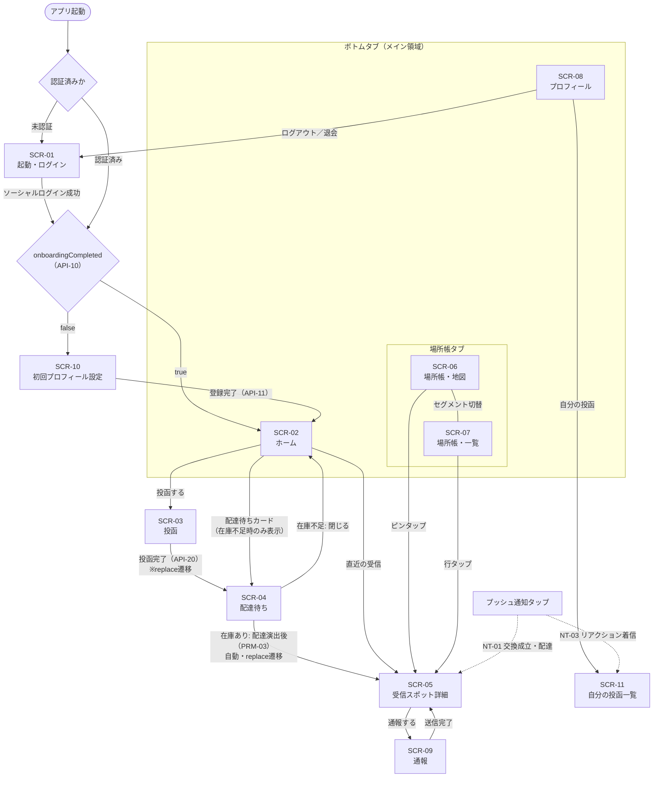

# 画面設計書

**プロダクト名:** まちびん
**サブタイトル:** 「おすすめ場所」ランダム交換サービス

---

## 改訂履歴

| 版数 | 改訂日 | 改訂者 | 改訂内容 |
| --- | --- | --- | --- |
| 1.0 | 2026-07-12 | Claude | 初版作成 |
| 1.1 | 2026-07-12 | Claude | BD-01を即時配達方式へ、BD-02をGoogleソーシャルログインのみへ、BD-08未成年者注記を追加。通知をNT-01に統合 |
| 1.2 | 2026-07-12 | Claude | BD-02再改訂によりAppleソーシャルログインを追加。SCR-01を2ボタン構成に変更 |

## 文書情報

| 項目 | 内容 |
| --- | --- |
| 文書名 | まちびん 画面設計書 |
| ステータス | ドラフト |
| 対象 | モバイルアプリ（Expo / React Native） |
| 関連文書 | 01 要件定義書 §4.4、04 機能設計書、07 API設計書、09 通知設計書 |

---

## 1. はじめに

### 1.1 本書の目的

本書は、まちびん モバイルアプリの画面構成・画面遷移・表示項目・入力チェックを定義する。各画面の処理仕様（ビジネスロジック）は 04 機能設計書、API入出力は 07 API設計書を正とし、本書は画面側の振る舞いを定める。

### 1.2 対象読者

モバイルアプリの設計者・実装者・レビュー担当者。

### 1.3 前提

| 項目 | 内容 |
| --- | --- |
| クライアント | Expo（React Native）＋ TypeScript（02 §3.1） |
| 地図描画 | MapLibre GL（`@maplibre/maplibre-react-native`）。タイルは自前配信（Protomaps + R2） |
| 対応OS下限 | iOS 15.1以上 / Android 7.0（API 24）以上（BD-05） |
| 表示言語 | 日本語のみ（NFR-C02） |
| 画面向き | 縦固定 |
| 認証 | Clerk（`@clerk/expo`）。Google・Appleのソーシャルログインのみ（BD-02） |
| 日時 | APIはUTC。表示時にJSTへ変換する（§4.3） |

---

## 2. 画面一覧

Phase 1（MVP）の画面を以下に定める。SCR-01〜09 は要件定義書 §4.4 の画面一覧に対応する。**SCR-10・SCR-11 は要件定義書の画面一覧にない追加画面**であり、追加理由を備考に示す。

| 画面ID | 画面名 | 概要 | 主な使用API | 備考 |
| --- | --- | --- | --- | --- |
| SCR-01 | 起動・ログイン画面 | 「Googleでログイン」「Appleでログイン」の2ボタンによるソーシャルログイン認証（Clerk。BD-02） | （Clerk SDK） | |
| SCR-02 | ホーム画面 | 投函導線、配達待ち状況、直近の受信、本日の投函数 | API-30 | |
| SCR-03 | 投函画面 | 位置選択・場所名・カテゴリ・コメント入力・投函 | API-20 | |
| SCR-04 | 配達待ち画面 | 投函直後の数秒間の配達演出→自動でSCR-05へ（在庫あり）／相手探し中の待機表示（在庫不足） | （API-20/30の結果表示） | |
| SCR-05 | 受信スポット詳細画面 | 受信内容の表示・リアクション・訪問管理・通報導線 | API-41, 42, 43 | |
| SCR-06 | もらった場所帳（地図） | 受信スポットのピン表示（未訪問／訪問済み色分け） | API-40（bbox） | |
| SCR-07 | もらった場所帳（一覧） | 受信スポットの新着順一覧・訪問フィルタ | API-40（cursor） | |
| SCR-08 | プロフィール画面 | プロフィール編集・通知設定・visitedCount・ログアウト・退会 | API-10, 11, 12, 13, 15 | |
| SCR-09 | 通報画面 | 通報理由の選択・詳細入力・送信 | API-50 | |
| SCR-10 | 初回プロフィール設定画面 | ニックネーム・アバター・居住エリア・年齢確認/規約同意 | API-10, 11 | **追加画面**。Clerk側にはプロフィールが存在せず、初回ログイン後にアプリ側profiles（TBL-01）の本登録が必要なため |
| SCR-11 | 自分の投函一覧画面 | 自分が投函したスポットの一覧 | API-10, 21 | **追加画面**。FR-07「行ってきた」累計の確認先、およびNT-03通知の遷移先として必要なため |

---

## 3. ナビゲーション構成と画面遷移図

### 3.1 ナビゲーション構成

認証済みかつ初回設定完了後のメイン領域は、ボトムタブ3タブで構成する。

| 領域 | 構成 | 含まれる画面 |
| --- | --- | --- |
| 認証スタック | 未認証時のみ表示 | SCR-01 |
| オンボーディングスタック | `onboardingCompleted = false` の間のみ表示 | SCR-10 |
| タブ1: ホーム | ホームタブ | SCR-02（配下スタック: SCR-03, SCR-04, SCR-05, SCR-09） |
| タブ2: 場所帳 | 場所帳タブ。**タブ内上部のセグメントで地図⇔一覧を切替**（タブ自体は1つ） | SCR-06 ⇔ SCR-07（配下: SCR-05, SCR-09） |
| タブ3: プロフィール | プロフィールタブ | SCR-08（配下: SCR-11） |
| モーダル | タブの上に重ねて表示 | SCR-03（投函）、SCR-09（通報） |

- SCR-05 はホームタブ・場所帳タブ双方のスタックから遷移し得る（遷移元のタブ内に積む）。
- SCR-04 は SCR-03 完了時に SCR-03 を置換（replace）して表示する（戻る操作で投函画面へ戻さない）。
- SCR-04 は在庫あり（配達済み）の場合、配達演出（PRM-03「配達演出秒数」、既定8秒）の表示後に自動でSCR-05を置換（replace）表示する（ユーザー操作不要）。在庫不足（pending）の場合は本画面のまま待機し、自動遷移しない（§5.5）。

### 3.2 画面遷移図



### 3.3 ガード遷移

アプリ起動時・フォアグラウンド復帰時・画面遷移時に、以下の順で判定する。

| No | 条件 | 遷移先 | 備考 |
| --- | --- | --- | --- |
| G-01 | Clerkセッションなし（未認証） | SCR-01 | メイン領域の全画面が対象。API 401受信時も同様（§4.5） |
| G-02 | 認証済みかつ `onboardingCompleted = false`（API-10） | SCR-10 | 完了までメイン領域へ進ませない。SCR-10は戻る操作で回避不可 |
| G-03 | 上記以外 | SCR-02（ホーム） | |

---

## 4. 共通UI仕様

### 4.1 状態表示（ローディング／エラー／空／オフライン）

| 状態 | 表示仕様 |
| --- | --- |
| 初回ローディング | 画面骨格のスケルトン表示（一覧・ホーム）またはセンタースピナー（詳細） |
| 追加読み込み | リスト末尾にフッタースピナー（カーソルページネーション時） |
| 画面エラー | 初回取得失敗時は全画面エラー表示（メッセージ＋「再試行」ボタン） |
| 操作エラー | 更新系API失敗時はトーストで通知し、画面状態は操作前に戻す |
| 空状態 | 画面ごとの空状態文言（各画面詳細に記載）＋主要アクションへの導線 |
| オフライン | ネットワーク切断検知時、画面上部に常駐バナー「オフラインです。接続を確認してください」。更新系操作は実行前にブロックしトースト表示 |

- 一覧系画面（SCR-02, 06, 07, 11）は pull-to-refresh に対応する。
- 更新系ボタンは送信中スピナー表示＋非活性とし、二重送信を防止する（§6）。

### 4.2 トースト

| 項目 | 仕様 |
| --- | --- |
| 表示位置 | 画面下部（タブバーの上）。約3秒で自動消滅 |
| 種別 | 成功（例:「通報を受け付けました」）／失敗（例:「通信に失敗しました。もう一度お試しください」） |
| 多重表示 | 最新1件のみ表示（後勝ち） |

### 4.3 日時表示（JST）

APIの日時はISO 8601（UTC）で返却される（07 §1.1）。表示は**すべて日本標準時（JST）に変換**する。

| 用途 | 形式 | 例 |
| --- | --- | --- |
| 受信日時・投函日時 | 「M月d日 H:mm」。当日分は「今日 H:mm」 | 「7月11日 7:00」 |
| リアクション付与日時 | 同上 | |

BD-01（即時配達方式）では、投函完了時点で配達まで完了しているため、「配達予定時刻」を独立した表示項目としては用いない（§5.5）。将来Phase 2以降で朝夕ウィンドウ配達をオプション提供する場合の表示形式は §7.1 に定める。

### 4.4 プッシュ通知タップ時の遷移（ディープリンク）

通知種別（NT-xx、09 通知設計書）ごとの遷移先を定める。通知ペイロードのIDを用いて対象画面を直接開く。

| 通知 | 内容 | 遷移先 | フォールバック |
| --- | --- | --- | --- |
| NT-01 | 交換成立・配達（在庫不足から復帰し配達されたときのみ送信。統合後の単一通知） | SCR-05（対象の場所帳アイテム詳細） | 対象が見つからない場合はSCR-06（場所帳） |
| NT-03 | リアクション着信 | SCR-11（自分の投函一覧） | — |

- 旧仕様の「NT-01 交換成立」と「NT-02 配達完了」は廃止し、単一の「NT-01 交換成立・配達」に統合した。投函時点で在庫があり即時配達が完了するケース（BD-01）ではプッシュ通知を送信しない（ユーザーはSCR-04の演出を経てその場でSCR-05を見るため）。NT-01は在庫不足（pending）から後日配達に至った場合にのみ送信される。

- 未認証状態で通知をタップした場合はSCR-01を表示し、認証完了後に本来の遷移先へ進む。
- 通知許可は初回設定完了直後（SCR-10→SCR-02遷移時）にOSダイアログで要求し、許可時にAPI-14でトークンを登録する。ログアウト時はAPI-15で削除する。

### 4.5 認証・アカウント状態の共通ハンドリング

| 事象 | 挙動 |
| --- | --- |
| API 401（UNAUTHORIZED） | Clerkセッションを破棄しSCR-01へ遷移 |
| API 403（ACCOUNT_SUSPENDED） | ダイアログ「アカウントは現在停止されています」を表示。閲覧系は継続可、投函・リアクション等の更新系は不可（07 §4） |
| API 429（RATE_LIMITED） | トースト「操作が集中しています。しばらくしてからお試しください」 |
| API 500（INTERNAL_ERROR） | トースト「エラーが発生しました。時間をおいてお試しください」 |

---

## 5. 画面詳細

### 5.1 SCR-01 起動・ログイン画面

#### 概要

Clerk（`@clerk/expo`）が提供するGoogle OAuth／Apple OAuthフローによるソーシャルログインのみを行う（BD-02）。画面に表示するのは「Googleでログイン」「Appleでログイン」の2ボタンのみであり、メールアドレス入力・パスワード入力・確認コード（OTP）入力は一切行わない。いずれかのボタンをタップするとブラウザ／ネイティブの各社認証画面に遷移し、認証完了後にアプリへ戻ってセッションを確立する。新規登録とログインは区別しない（各アカウントの登録有無に応じてClerkが内部でSign up／Sign inフローを切り替える）。

Appleログインを追加した理由は、iOSでサードパーティのソーシャルログイン（Google）を提供する場合、App Store審査ガイドライン4.8によりSign in with Appleを同等の視認性で併設することが義務付けられているためである。従来の設計ではこれをPhase 1未実装の要対応事項として先送りしていたが、本改訂によりPhase 1のスコープに含め解消する。

**ボタンの配置順序**: Apple Human Interface Guidelinesの慣行に従い、iOSでは「Appleでログイン」を上、「Googleでログイン」を下に配置することを推奨する。Androidには順序の制約はなく本来どちらを上にしてもよいが、UI実装を簡潔にするため両OSで同一の並び順（Apple→Google）とする設計判断とする。

#### 画面レイアウト

```
┌──────────────────────────┐
│                          │
│                          │
│      [ロゴ] まちびん      │
│  あなたの日常は、         │
│  誰かの旅になる。         │
│                          │
│                          │
│  [  Appleでログイン ]     │
│  [ G  Googleでログイン ]  │
│                          │
│  （タップするとApple／    │
│   Googleの認証画面に      │
│   移動します）            │
│                          │
└──────────────────────────┘
```

#### 表示項目

| 項目 | 内容 |
| --- | --- |
| ロゴ・タグライン | サービスロゴと「あなたの日常は、誰かの旅になる。」 |
| 「Appleでログイン」ボタン | 認証導線の1つ（iOSでは上・Androidでも同順で上に配置）。Apple公式のSign in with Appleボタン仕様（黒／白／アウトラインいずれかの公式バリエーション）に準拠したボタン意匠とする |
| 「Googleでログイン」ボタン | 認証導線の1つ（下に配置）。Googleブランドガイドラインに準拠したボタン意匠とする |
| 補足テキスト | 「タップするとApple／Googleの認証画面に移動します」 |

#### 入力項目とバリデーション

テキスト入力フォームなし（Apple／Googleの認証画面側での入力に委譲するため、本画面自体に入力項目・バリデーションは存在しない）。

#### アクションと遷移

| 操作 | 挙動 |
| --- | --- |
| 「Appleでログイン」 | Clerkの Apple OAuthフローを開始し、Apple認証・同意画面へ遷移する |
| Apple認証成功 | アプリへ復帰しClerkセッションを確立。以降はGoogleと同じ後続処理（API-10 GET /me を取得し、G-02判定（SCR-10 または SCR-02）へ） |
| Apple認証キャンセル・失敗 | SCR-01に留まる。トースト「ログインをキャンセルしました」（キャンセル時）または「ログインに失敗しました。もう一度お試しください」（失敗時） |
| 「Googleでログイン」 | Clerkの Google OAuthフローを開始し、ブラウザ／ネイティブのGoogle認証画面へ遷移する |
| Google認証成功 | アプリへ復帰しClerkセッションを確立。API-10 GET /me を取得し、G-02判定（SCR-10 または SCR-02）へ |
| Google認証キャンセル・失敗 | SCR-01に留まる。トースト「ログインをキャンセルしました」（キャンセル時）または「ログインに失敗しました。もう一度お試しください」（失敗時） |

#### 使用API

Clerk SDK（`@clerk/expo`）のGoogle OAuthフロー・Apple OAuthフロー。認証成功後にAPI-10 GET /me を取得する（いずれの手段でログインした場合も後続処理は共通）。

#### 特記事項

- メールアドレス＋パスワード認証、Google・Apple以外のSNSログイン、メール確認コード（OTP）は提供しない（BD-02）。
- 利用規約・年齢確認の同意はSCR-10で行う（本画面では求めない）。
- Google／Appleアカウントから取得できる氏名・プロフィール画像等は、SCR-10のニックネーム・アバターに自動転記しない。ニックネームは引き続き入力必須、アバターはプリセット選択式（BD-07）のままとし、匿名性方針との整合を保つ（§5.2）。
- Appleは「メールを非公開」機能により、実メールアドレスではなくApple提供のプライベートリレーアドレスが渡される場合がある。また、Apple提供の氏名情報は初回認可時のみ返却され、以降の再ログインでは返却されない。これらの情報も上記の匿名性方針に従いアプリのプロフィールへは転記しない。

---

### 5.2 SCR-10 初回プロフィール設定画面（追加画面）

#### 概要

初回ログイン後にプロフィール本登録を行う。**要件定義書 §4.4 の画面一覧にはない追加画面**である（Clerkは認証情報のみを持ち、アプリ側profiles（TBL-01）の本登録が別途必要なため）。`onboardingCompleted = true` になるまで本画面から先へ進ませない（G-02）。

#### 画面レイアウト

```
┌──────────────────────────┐
│  はじめまして             │
│  プロフィールを設定しよう │
│                          │
│  アバター                 │
│  ( 1)( 2)( 3)( 4)( 5)(…) │  ← プリセットから1つ選択
│                          │
│  ニックネーム（必須）      │
│  [______________] 0/20   │
│                          │
│  住んでいるエリア（任意）  │
│  [都道府県 ▼][市区町村 ▼] │
│  ※市区町村までしか        │
│    公開されません         │
│                          │
│  [✓] 13歳以上です         │
│  [✓] 利用規約・プライバシー│
│      ポリシーに同意します  │
│  ※未成年の方は保護者の    │
│    同意を得たうえで        │
│    ご利用ください          │
│                          │
│  [ はじめる ]             │
└──────────────────────────┘
```

#### 表示項目

| 項目 | 内容 |
| --- | --- |
| アバター候補 | プリセットアバターの一覧（BD-07。画像アップロードなし）。既定で1番を選択状態 |
| エリア説明 | 「市区町村までしか公開されません」（NFR-PR02の説明） |
| 規約リンク | 「利用規約」「プライバシーポリシー」は外部ブラウザで開く |
| 未成年者向け注記 | 規約同意チェック項目の直下に「未成年の方は保護者の同意を得たうえでご利用ください」を表示する（BD-08）。チェックボックス項目自体は増やさず、既存の2項目に添える説明文として表示する |

#### 入力項目とバリデーション

| 項目 | 形式 | 必須 | チェック | エラーメッセージ例 |
| --- | --- | --- | --- | --- |
| アバター | プリセット単一選択 | ○ | プリセット範囲内の整数（07 API-11） | —（選択式のためエラーなし） |
| ニックネーム | テキスト＋文字数カウンタ | ○ | 1〜20文字（PRM-08） | 「ニックネームを入力してください。」「ニックネームは20文字以内で入力してください。」 |
| 居住エリア | 都道府県→市区町村の2段ピッカー | — | 選択式（JIS X 0402の5桁コード＋表示名。マスタはアプリに同梱） | — |
| 13歳以上チェック | チェックボックス | ○ | true必須（BD-03。生年月日は収集しない） | 「13歳以上であることの確認が必要です。」 |
| 規約同意チェック | チェックボックス | ○ | true必須 | 「利用規約・プライバシーポリシーへの同意が必要です。」 |

- 「はじめる」ボタンは、ニックネーム有効かつ両チェックONまで非活性。

#### アクションと遷移

| 操作 | 挙動 |
| --- | --- |
| 「はじめる」 | API-11 PATCH /me（nickname, avatarId, homeArea, ageConfirmed: true, tosAgreed: true）。成功時SCR-02へ。直後に通知許可を要求（§4.4） |
| 都道府県選択 | 市区町村ピッカーの選択肢を当該都道府県で絞り込み。「未選択」に戻すことも可 |

#### 使用API

API-10（表示判定）、API-11（登録）。

#### 特記事項

- 居住エリアは任意。未設定の場合、配達時の差出人エリア表示（SCR-05）は「エリア非公開」となる。
- `ageConfirmed` / `tosAgreed` はtrueのみ送信可能（07 API-11。false変更不可）。
- 登録途中でアプリを終了した場合も、次回起動時にG-02により本画面へ戻る。
- 未成年者（13歳以上20歳未満等）が利用する場合は保護者の同意を得たうえで利用する旨を、規約同意チェック項目の近傍に注記として表示する（BD-08）。チェックボックスは「13歳以上です」「利用規約・プライバシーポリシーに同意します」の2項目のままとし、保護者同意そのものをシステム的に確認する機能（追加チェック・保護者連絡等）はPhase 1では設けない。

---

### 5.3 SCR-02 ホーム画面

#### 概要

コアサイクル（投函→配達待ち→受信）の起点。投函ボタンを最優先のプライマリアクションとして配置し、配達待ち状況・直近の受信・本日の投函数を表示する。BD-01（即時配達方式）により、配達待ちカードとして残るのは在庫不足（pending）の場合のみである（§5.5）。

#### 画面レイアウト

```
┌──────────────────────────┐
│  まちびん            [🔔] │
│                          │
│  ┌────────────────────┐  │
│  │ ✉ おすすめの場所を  │  │  ← プライマリボタン
│  │    投函する         │  │
│  └────────────────────┘  │
│  本日の投函 1/5           │
│                          │
│  ▌配達待ち（在庫不足時のみ）│
│  ┌────────────────────┐  │
│  │ 🕊 相手を探しています │  │ → SCR-04
│  └────────────────────┘  │
│                          │
│  ▌最近届いた場所          │
│  ┌────────────────────┐  │
│  │ 夕焼けだんだん  NEW  │  │ → SCR-05
│  │ 今日 7:00           │  │
│  └────────────────────┘  │
├──────────────────────────┤
│ [ホーム] [場所帳] [プロフ] │
└──────────────────────────┘
```

#### 表示項目

| 項目 | 取得元（API-30） | 仕様 |
| --- | --- | --- |
| 投函ボタン | — | プライマリ。上限到達時は非活性＋「本日の投函上限に達しました」 |
| 本日の投函数 | `todayPostCount` / `todayPostLimit` | 「本日の投函 1/5」形式 |
| 配達待ちカード | `pendingDeliveries[]` | 在庫不足（`status = pending`）の交換のみ表示。文言は常に「相手を探しています」に統一し、時刻表示は行わない。タップでSCR-04へ |
| 直近の受信カード | `recentItems[]` | `spotName`・`deliveredAt`。`hasReaction = false` の場合「NEW」バッジ。タップでSCR-05へ |

#### 入力項目とバリデーション

入力項目なし。

#### アクションと遷移

| 操作 | 挙動 |
| --- | --- |
| 投函ボタン | SCR-03をモーダル表示 |
| 配達待ちカード | SCR-04へ（対象交換の情報を引き渡す） |
| 直近の受信カード | SCR-05へ（`collectionItemId` を引き渡す） |
| pull-to-refresh | API-30再取得 |

#### 使用API

API-30 GET /home。

#### 特記事項

- 空状態（投函・受信とも0件）: 「最初のおすすめの場所を投函してみよう。誰かのおすすめが届きます」＋投函ボタンを強調。
- フォアグラウンド復帰時にAPI-30を再取得する（在庫不足（pending）から配達済みに変化した場合に配達待ちカードを消すため）。
- 在庫が十分な通常時は、投函完了からSCR-04の配達演出（PRM-03）を経てSCR-05へ至るまでが数秒で完結する（BD-01）ため、配達待ちカードがホーム画面に表示される機会は基本的にない。本カードが表示され続けるのは在庫不足（pending）の場合に限られる。

---

### 5.4 SCR-03 投函画面

#### 概要

スポットの投函（FR-03）。地図での位置選択、場所名・カテゴリ・コメントの入力、投函確認を行い、API-20で投函と交換抽選を実行する。

#### 画面レイアウト

```
┌──────────────────────────┐
│  ✕ 閉じる      投函する   │
│  ┌────────────────────┐  │
│  │      [地図]         │  │
│  │        ＋          │  │  ← 中央固定ピン（ドラッグで位置調整）
│  │              [◎現在地]│  │
│  └────────────────────┘  │
│  ※位置はおおよその地点に  │
│    丸めて保存されます     │
│                          │
│  場所の名前（必須）        │
│  [________________] 0/50 │
│                          │
│  カテゴリ（必須）          │
│  (カフェ)(飲食店)(公園・屋外)│
│  (景色・眺め)(ショップ)(その他)│
│                          │
│  おすすめコメント（必須）   │
│  [                    ]  │
│  [                    ]  │
│  あと20文字（20〜300文字）  │
│                          │
│  [ 投函する ]             │
└──────────────────────────┘
```

#### 表示項目

| 項目 | 仕様 |
| --- | --- |
| 地図 | MapLibre GL。画面中央の固定ピンで位置を指定（地図をドラッグして調整） |
| 現在地ボタン | 位置情報権限を要求し、許可時は現在地へ地図を移動。**拒否時もピン指定で投函可能**（NFR-PR03） |
| 丸め注記 | 「位置はおおよその地点に丸めて保存されます」（NFR-PR01。送信前にクライアントで丸め、サーバーで再検証） |
| 残り文字数 | コメント欄下部に常時表示。最低文字数未満は「あと◯文字」、以降は「◯/300」 |

#### 入力項目とバリデーション

| 項目 | 形式 | 必須 | チェック | エラーメッセージ例 |
| --- | --- | --- | --- | --- |
| 位置 | 地図中央ピン | ○ | 日本国内の有効範囲（07 API-20） | 「地図で場所を選択してください。」 |
| 場所の名前 | テキスト＋カウンタ | ○ | 1〜50文字 | 「場所の名前を入力してください。」「場所の名前は50文字以内で入力してください。」 |
| カテゴリ | チップ単一選択 | ○ | CD-01のいずれか | 「カテゴリを選択してください。」 |
| コメント | 複数行テキスト＋カウンタ | ○ | 20〜300文字（PRM-01／PRM-02） | 「コメントは20文字以上で入力してください。」「コメントは300文字以内で入力してください。」 |

#### アクションと遷移

| 操作 | 挙動 |
| --- | --- |
| 「投函する」 | 確認ダイアログ「この場所を投函しますか？ 投函後の修正・取り消しはできません」→OKでAPI-20実行 |
| API-20成功（201） | SCR-04へ**replace遷移**（レスポンスの `exchange` を引き渡す） |
| 「✕ 閉じる」 | 入力がある場合は破棄確認ダイアログ→ホームへ戻る |

#### 使用API

API-20 POST /spots。リクエストにはTurnstileトークン（不可視ウィジェットで取得）と `idempotencyKey`（クライアント生成UUID）を含める（07 API-20）。

#### エラー処理

| エラー | 挙動 |
| --- | --- |
| 400 VALIDATION_ERROR | `details[].field` を各入力欄のインラインエラーにマッピング |
| 403 TURNSTILE_FAILED | トースト「確認に失敗しました。もう一度お試しください」（トークン再取得のうえ再送可能にする） |
| 422 POST_LIMIT_EXCEEDED | ダイアログ「本日の投函上限に達しました。明日また投函できます。」→ホームへ戻る |

#### 特記事項

- 通信リトライはidempotencyKeyにより二重投函にならない（07 API-20）。
- 位置情報権限はこの画面で初めて要求する（利用文脈が明確な時点で要求する方針）。

---

### 5.5 SCR-04 配達待ち画面

#### 概要

投函（SCR-03）直後の遷移先。BD-01（即時配達方式）により、交換候補が見つかった場合（在庫あり）はバックエンド側で配達まですでに完了しており、本画面は**数秒間（PRM-03「配達演出秒数」、既定8秒）だけ「配達中」の演出を見せるための画面**となる。演出時間の経過後、ユーザー操作なしに自動でSCR-05（受信スポット詳細）へreplace遷移する。演出は純粋なUI上の「間」であり、遷移先の内容自体はAPI-20のレスポンスにすでに含まれ取得済みである。

交換候補が0件（在庫不足）の場合のみ、本画面は「相手を探しています…」の待機表示のまま留まり、自動遷移しない。この場合、後日在庫が確保され配達が完了すると、プッシュ通知（NT-01。§4.4）によってSCR-05へ遷移する。

#### 画面レイアウト

```
┌──────────────────────────┐   ┌──────────────────────────┐
│                          │   │                          │
│      [配達中の演出]       │   │      [手紙が舞う演出]     │
│      （Lottie等）         │   │                          │
│                          │   │   相手を探しています…     │
│    お届けしています…       │   │                          │
│                          │   │   見つかりしだい、        │
│  （数秒後、自動で受信内容へ）│   │   お届けします           │
│                          │   │                          │
│                          │   │   [ ホームへ戻る ]        │
└──────────────────────────┘   └──────────────────────────┘
    在庫あり（自動でSCR-05へ）      在庫不足・pending（待機）
```

#### 表示項目

| 項目 | 状態 | 仕様 |
| --- | --- | --- |
| 配達演出 | 在庫あり | 「お届けしています…」等のアニメーション（Lottie等）。ユーザー操作導線は表示しない（操作不要のため） |
| 相手探し中の待機表示 | 在庫不足（pending） | 「相手を探しています…」＋「見つかりしだい、お届けします」。自動遷移は行わない |

#### 入力項目とバリデーション

入力項目なし。

#### アクションと遷移

| 操作 | 挙動 |
| --- | --- |
| （在庫あり時）演出終了 | PRM-03「配達演出秒数」（既定8秒）経過後、ユーザー操作なしにSCR-05へ自動でreplace遷移する |
| 「ホームへ戻る」（在庫不足時のみ表示） | SCR-02へ |

#### 使用API

なし。SCR-03からはAPI-20レスポンス（在庫あり時は配達済み内容を含む `exchange`）を引き渡して表示する。SCR-02の配達待ちカード（在庫不足時のみ）から開いた場合はAPI-30の `pendingDeliveries` を引き渡す。

#### 特記事項

- 在庫あり時、本画面はプッシュ通知の遷移先にはならない（§4.4）。通知が発生する前にSCR-04→SCR-05が完結するためである。
- 在庫あり時に演出表示中でアプリがバックグラウンド化された場合、フォアグラウンド復帰時に演出の残り時間が経過していれば即座にSCR-05へreplace遷移し、経過前であれば残り時間分の演出を継続する。
- pendingは在庫不足時の状態であり、後日の再抽選により配達済みへ進む（04機能設計書CD-03参照）。日をまたいでも本画面に留まり続けるものではなく、ユーザーはSCR-02へ戻ってよい（ホーム画面の配達待ちカードで同じ状態を確認できる。§5.3）。実際に配達が完了した際は、本画面を経由せずNT-01（統合後）によって直接SCR-05へ遷移する。

---

### 5.6 SCR-05 受信スポット詳細画面

#### 概要

受信したスポット（場所帳アイテム）の詳細表示。リアクション付与（FR-06）、訪問ステータス管理（FR-07）、通報導線（FR-08）を提供する。

#### 画面レイアウト

```
┌──────────────────────────┐
│  ← 戻る            [⋯]   │  ← メニュー（通報する）
│  ┌────────────────────┐  │
│  │   [地図] 📍         │  │
│  └────────────────────┘  │
│  夕焼けだんだん           │
│  (景色・眺め)             │
│  東京都荒川区 からの便り   │
│  7月11日 7:00 に受け取り  │
│                          │
│  ▌おすすめコメント        │
│  階段の上から見る夕日が   │
│  本当にきれいです。…      │
│                          │
│  [♡ 行ってみたい]         │
│  [👣 行ってきた]          │
│                          │
│  訪問ステータス           │
│  ( 未訪問 | 訪問済み ✓)   │
│                          │
│  [ 地図アプリで開く ]     │
└──────────────────────────┘
```

#### 表示項目

| 項目 | 取得元（API-41） | 仕様 |
| --- | --- | --- |
| 地図 | `location` | MapLibre GL。受信スポットのピンを中心に表示（操作は拡大縮小のみ） |
| 場所名 | `spotName` | |
| カテゴリ | `categoryCode` | CD-01の表示名でバッジ表示 |
| 差出人エリア | `senderAreaLabel` | 「◯◯ からの便り」。**市区町村レベルのみ**（NFR-PR02）。nullの場合「エリア非公開」 |
| 受信日時 | `deliveredAt` | JST表示 |
| コメント | `comment` | 全文表示 |
| リアクション状態 | `reactions[]` | 付与済みの種別はボタンを付与済み表示（非活性）＋付与日時 |
| 訪問ステータス | `visitedAt` | 未訪問／訪問済みのトグル。訪問済みはスタンプ表現（FR-07） |
| 通報メニュー | `reportable` | trueのときのみ「⋯」メニューに「通報する」を表示 |

#### 入力項目とバリデーション

| 項目 | 形式 | 必須 | チェック | エラーメッセージ例 |
| --- | --- | --- | --- | --- |
| 報告コメント | 「行ってきた」押下時のモーダル内テキスト＋カウンタ | —（任意） | 200文字以内（PRM-07）。「行ってきた」のときのみ | 「報告コメントは200文字以内で入力してください。」 |

#### アクションと遷移

| 操作 | 挙動 |
| --- | --- |
| 「行ってみたい」 | API-43 POST（type: want_to_go）。成功時ボタンを付与済み表示に |
| 「行ってきた」 | 報告コメント入力モーダル（任意・スキップ可）→API-43 POST（type: visited, reportComment）。成功時、未訪問であればAPI-42も呼び訪問済みへ更新 |
| 訪問ステータス切替 | API-42 PATCH（visited: true/false）。楽観更新し、失敗時は戻してトースト |
| 「地図アプリで開く」 | OSの地図アプリを座標指定で起動 |
| 「⋯」→「通報する」 | SCR-09をモーダル表示 |

#### 使用API

API-41（表示）、API-42（訪問ステータス）、API-43（リアクション）。

#### エラー処理

| エラー | 挙動 |
| --- | --- |
| 409 ALREADY_REACTED | API-41を再取得して表示を最新化（トースト「すでにリアクション済みです」） |
| 404 NOT_FOUND | 「この場所は表示できません」を表示し前画面へ戻す |

#### 特記事項

- リアクションの取り消しAPIは提供されない（07）。付与後のボタンは押下不可とし、その旨を確認モーダルで事前に伝える（「リアクションは差出人に届きます。取り消しはできません」）。
- 差出人のニックネーム・アバター等の個人情報は表示しない（NFR-PR02。APIも返却しない）。
- 通報対象は本アイテムの原本スポットである。API-41応答の `spotId` をSCR-09へ引き渡し、通報（API-50）の `targetId` に使用する。`reportable = false`（原本削除済み等）の場合は通報導線を表示しない。

---

### 5.7 SCR-06 もらった場所帳（地図）

#### 概要

受信スポットを地図上にピン表示するコレクションビュー（FR-07）。場所帳タブの既定表示。上部セグメントでSCR-07（一覧）と切り替える。

#### 画面レイアウト

```
┌──────────────────────────┐
│  ( 地図 ● | 一覧 ○ )      │
│  ┌────────────────────┐  │
│  │   [地図]            │  │
│  │  📍未訪問(青)        │  │
│  │      📍訪問済み(金+✓)│  │
│  │            [◎現在地] │  │
│  │  ┌───────────────┐ │  │
│  │  │夕焼けだんだん    │ │  │ ← ピンタップで吹き出し
│  │  │(景色・眺め)  >   │ │  │
│  │  └───────────────┘ │  │
│  └────────────────────┘  │
├──────────────────────────┤
│ [ホーム] [場所帳] [プロフ] │
└──────────────────────────┘
```

#### 表示項目

| 項目 | 取得元（API-40） | 仕様 |
| --- | --- | --- |
| ピン | `items[].location` | 表示中のbboxで取得。**未訪問（`visitedAt = null`）＝プライマリ色、訪問済み＝達成色＋スタンプ表現**で色分け（FR-07） |
| 吹き出し | `spotName`, `categoryCode` | ピンタップで表示。タップでSCR-05へ |
| 現在地ボタン | — | 位置情報権限の許可時のみ現在地へ移動（拒否時も閲覧に支障なし） |

#### 入力項目とバリデーション

入力項目なし。

#### アクションと遷移

| 操作 | 挙動 |
| --- | --- |
| 地図移動・ズーム | 表示領域確定後（300ms デバウンス）にAPI-40を `bbox` 指定で再取得 |
| ピンタップ→吹き出しタップ | SCR-05へ |
| セグメント「一覧」 | SCR-07へ切替（地図の表示状態は保持） |

#### 使用API

API-40 GET /collection（`?bbox=minLng,minLat,maxLng,maxLat`。カーソルなし・上限200件）。

#### 特記事項

- 初期表示位置: 直近受信スポットを含む範囲。0件時は居住エリア（未設定時は日本全体）。
- bbox結果が上限200件に達した場合はトースト「表示できる範囲を超えています。地図を拡大してください」。
- 空状態: 地図上にオーバーレイ「まだ受け取った場所がありません。投函すると誰かのおすすめが届きます」。

---

### 5.8 SCR-07 もらった場所帳（一覧）

#### 概要

受信スポットの新着順一覧（FR-07）。訪問ステータスでの絞り込みができる。

#### 画面レイアウト

```
┌──────────────────────────┐
│  ( 地図 ○ | 一覧 ● )      │
│  (すべて)(未訪問)(訪問済み) │  ← フィルタチップ
│  ┌────────────────────┐  │
│  │ 夕焼けだんだん       │  │
│  │ (景色・眺め)         │  │
│  │ 7月11日 受け取り     │  │
│  ├────────────────────┤  │
│  │ 喫茶ロマン      ✓済  │  │
│  │ (カフェ)             │  │
│  │ 7月8日 受け取り      │  │
│  └────────────────────┘  │
├──────────────────────────┤
│ [ホーム] [場所帳] [プロフ] │
└──────────────────────────┘
```

#### 表示項目

| 項目 | 取得元（API-40） | 仕様 |
| --- | --- | --- |
| 行 | `items[]` | `spotName`・カテゴリバッジ・`deliveredAt`（JST）。訪問済みはスタンプアイコン「✓済」 |
| 並び順 | — | 新着順（`deliveredAt` 降順。APIの返却順に従う） |
| フィルタ | — | すべて／未訪問（`?visited=false`）／訪問済み（`?visited=true`） |

#### 入力項目とバリデーション

入力項目なし（フィルタは選択式）。

#### アクションと遷移

| 操作 | 挙動 |
| --- | --- |
| 行タップ | SCR-05へ |
| フィルタ切替 | 先頭から再取得（cursorリセット） |
| 末尾到達 | `nextCursor` があれば追加取得（`?cursor=&limit=20`） |
| セグメント「地図」 | SCR-06へ切替 |

#### 使用API

API-40 GET /collection（カーソル方式）。

#### 特記事項

- 空状態: フィルタ「すべて」では場所帳未着の案内、フィルタ適用時は「該当する場所がありません」。
- SCR-05で訪問ステータスを変更して戻った場合、一覧の該当行へ反映する（再取得または画面内更新）。

---

### 5.9 SCR-08 プロフィール画面

#### 概要

プロフィールの確認・編集、通知設定、visitedCount（自分の投稿が「行ってきた」された累計。FR-07）の確認、規約類リンク、ログアウト・退会を提供する。

#### 画面レイアウト

```
┌──────────────────────────┐
│  プロフィール             │
│  (アバター) ゆうた [編集] │
│  東京都台東区・散歩が好き  │
│                          │
│  ▌あなたの投函            │
│  👣「行ってきた」された数  │
│     12回                 │
│  自分の投函一覧      >    │  → SCR-11
│                          │
│  ▌通知設定               │
│  交換成立・配達  [ON ]   │
│  リアクション     [OFF]   │
│                          │
│  ▌その他                 │
│  利用規約           >    │
│  プライバシーポリシー >   │
│  ログアウト          >    │
│  退会               >    │
├──────────────────────────┤
│ [ホーム] [場所帳] [プロフ] │
└──────────────────────────┘
```

#### 表示項目

| 項目 | 取得元（API-10） | 仕様 |
| --- | --- | --- |
| アバター・ニックネーム | `avatarId`, `nickname` | プリセットアバター表示 |
| 居住エリア・自己紹介 | `homeArea.label`, `bio` | 未設定時は非表示 |
| visitedCount | `visitedCount` | 「『行ってきた』された数 ◯回」。**本人のみ閲覧可・他者公開なし**（FR-07） |
| 通知設定トグル | `notificationSettings` | 交換成立・配達（NT-01統合。delivery）／リアクション（reaction）の2種（FR-09） |

#### 入力項目とバリデーション（編集モーダル。API-11）

| 項目 | 形式 | 必須 | チェック | エラーメッセージ例 |
| --- | --- | --- | --- | --- |
| ニックネーム | テキスト＋カウンタ | ○ | 1〜20文字（PRM-08） | 「ニックネームは20文字以内で入力してください。」 |
| アバター | プリセット単一選択 | ○ | プリセット範囲内 | — |
| 居住エリア | 2段ピッカー（SCR-10と同一） | — | 選択式。「未設定」へ戻すことも可 | — |
| 自己紹介 | テキスト＋カウンタ | — | 50文字以内（PRM-09） | 「自己紹介は50文字以内で入力してください。」 |

#### アクションと遷移

| 操作 | 挙動 |
| --- | --- |
| 「編集」 | 編集モーダルを表示→保存でAPI-11 PATCH /me |
| 通知トグル切替 | 即時にAPI-13 PUT /me/notification-settings（2種の現在値をまとめて送信）。失敗時はトグルを戻しトースト |
| 「自分の投函一覧」 | SCR-11へ |
| 「利用規約」「プライバシーポリシー」 | 外部ブラウザで開く |
| 「ログアウト」 | 確認ダイアログ→API-15（プッシュトークン削除）→Clerkサインアウト→SCR-01へ |
| 「退会」 | **二段確認**。(1) 影響説明ダイアログ「投函した場所と受け取った場所帳はすべて削除されます。この操作は取り消せません」→ (2) 最終確認ダイアログ（「退会する」を明示的に押下）→API-12 DELETE /me→ローカルデータ・セッション破棄→SCR-01へ |

#### 使用API

API-10（表示）、API-11（編集）、API-12（退会）、API-13（通知設定）、API-15（ログアウト時のトークン削除）。

#### 特記事項

- OSの通知許可がオフの場合、通知設定セクション上部に「端末の設定で通知が許可されていません」＋OS設定への導線を表示する（トグル自体はサーバー設定として保存可能）。
- 退会時のデータの扱い（削除・匿名化）はBD-06・06 §7.1に従う。ダイアログ文言で「配達済みの場所は相手の場所帳に匿名で残ります」ことを伝える。

---

### 5.10 SCR-09 通報画面

#### 概要

不適切な受信スポットの通報（FR-08、UC-03）。SCR-05からモーダルで表示する。

#### 画面レイアウト

```
┌──────────────────────────┐
│  ✕ 閉じる       通報する  │
│                          │
│  通報の理由（必須）        │
│  (・) 不適切な内容        │
│  ( ) 位置情報の悪用       │
│  ( ) 迷惑行為            │
│  ( ) スパム・宣伝         │
│  ( ) その他              │
│                          │
│  詳細（任意）             │
│  [                    ]  │
│  [                    ]  │
│  0/500                   │
│                          │
│  ※通報した相手とは今後    │
│    交換されなくなります    │
│                          │
│  [ 送信する ]             │
└──────────────────────────┘
```

#### 表示項目

| 項目 | 仕様 |
| --- | --- |
| 理由選択肢 | CD-04の5種（不適切な内容／位置情報の悪用／迷惑行為／スパム・宣伝／その他）。ラジオ単一選択 |
| マッチ除外の説明 | 「通報した相手とは今後交換されなくなります」（FR-08。blocks登録の説明） |

#### 入力項目とバリデーション

| 項目 | 形式 | 必須 | チェック | エラーメッセージ例 |
| --- | --- | --- | --- | --- |
| 理由 | ラジオ単一選択 | ○ | CD-04のいずれか | 「通報理由を選択してください。」 |
| 詳細 | 複数行テキスト＋カウンタ | —（任意） | 500文字以内（07 API-50 `detail`） | 「詳細は500文字以内で入力してください。」 |

#### アクションと遷移

| 操作 | 挙動 |
| --- | --- |
| 「送信する」 | API-50 POST /reports（targetType: spot）。成功時モーダルを閉じ、トースト「通報を受け付けました。ご協力ありがとうございます」 |
| 「✕ 閉じる」 | 入力がある場合は破棄確認→SCR-05へ戻る |

#### 使用API

API-50 POST /reports。

#### 特記事項

- Phase 1の通報起点は受信スポット詳細（SCR-05）のみとし、`targetType` は `spot` 固定とする（ユーザー単体の通報導線は設けない。API-50側でspot通報から投稿者を解決しマッチ除外する）。
- `targetId` には通報対象の原本スポットID（API-41応答の `spotId`）を設定する。送信時はTurnstileトークン（不可視ウィジェット）を併せて送信する（07 API-50）。
- 通報のレート制限（10回/日。07 §1.5）超過時はトースト「通報の受付上限に達しました。しばらくしてからお試しください」。

---

### 5.11 SCR-11 自分の投函一覧画面（追加画面）

#### 概要

自分が投函したスポットの一覧。**要件定義書 §4.4 の画面一覧にはない追加画面**である（FR-07の「行ってきた」累計の確認先、およびNT-03（リアクション着信）通知の遷移先として必要なため）。SCR-08から遷移する。

#### 画面レイアウト

```
┌──────────────────────────┐
│  ← 戻る    自分の投函     │
│                          │
│  👣「行ってきた」された数  │
│     累計 12回            │
│                          │
│  ┌────────────────────┐  │
│  │ 喫茶ロマン           │  │
│  │ (カフェ)   公開中    │  │
│  │ 7月10日 投函        │  │
│  ├────────────────────┤  │
│  │ ◯◯神社の裏参道      │  │
│  │ (景色・眺め) 公開中  │  │
│  │ 7月2日 投函         │  │
│  └────────────────────┘  │
└──────────────────────────┘
```

#### 表示項目

| 項目 | 取得元 | 仕様 |
| --- | --- | --- |
| 「行ってきた」された累計 | API-10 `visitedCount` | 画面上部にサマリ表示（本人のみ閲覧可。FR-07） |
| 行 | API-21 `items[]` | `name`・カテゴリバッジ・`createdAt`（JST）・ステータス表示 |
| ステータス表示 | `status` | CD-02を表示名に変換: active＝「公開中」／hidden＝「非表示」／deleted＝「削除済み」 |

#### 入力項目とバリデーション

入力項目なし。

#### アクションと遷移

| 操作 | 挙動 |
| --- | --- |
| 末尾到達 | `nextCursor` があれば追加取得（`?cursor=&limit=20`） |
| 「← 戻る」 | SCR-08へ |

#### 使用API

API-21 GET /me/spots、API-10 GET /me（visitedCountサマリ）。

#### 特記事項

- 投函の編集・削除はPhase 1では提供しない（行タップでの詳細画面はなし）。
- 空状態: 「まだ投函がありません。ホームから最初の場所を投函してみよう」。
- NT-03（リアクション着信）通知のタップで本画面を開く（§4.4）。ただしAPI-21の応答には投函ごとのリアクション情報が含まれないため、Phase 1では累計値と一覧のみの表示とする（投函ごとのリアクション表示は07 API-21の拡張が必要。§7参照）。

---

## 6. 入力チェック共通仕様

各画面のバリデーションに共通して適用する規則を定める。値の上限・下限は 04 機能設計書の設定パラメータ（PRM-xx）および 07 API設計書を正とする。

| No | 規則 | 内容 |
| --- | --- | --- |
| V-01 | 文字数カウント | **全角・半角を問わず1文字と数える**（Unicodeコードポイント単位。改行も1文字）。バイト数・全角換算は用いない。サーバー側カウント（07）と同一規則とする |
| V-02 | 前後空白トリム | テキスト入力は送信前に前後の空白（半角・全角スペース、改行、タブ）を除去し、**トリム後の値で文字数判定・送信**を行う |
| V-03 | 空白のみ入力 | トリム後に0文字となる入力は未入力として扱う（必須エラー） |
| V-04 | チェック順序 | 必須 → 形式 → 文字数 の順に判定し、最初のエラーのみ表示する |
| V-05 | エラー表示位置 | 対象入力欄の直下にインライン表示（赤字）。フォーカスアウト時または送信時に判定 |
| V-06 | 文字数カウンタ | 上限のある入力欄には「現在/上限」形式のカウンタを常時表示。最低文字数のある欄（コメント）は充足まで「あと◯文字」を表示 |
| V-07 | 送信ボタン制御 | 必須項目が有効になるまで送信ボタンを非活性とする。文字数超過中も非活性 |
| V-08 | 二重送信防止 | 送信中はボタンを非活性＋スピナー表示。API-20は加えて `idempotencyKey` を付与する |
| V-09 | サーバーエラーの反映 | 400 VALIDATION_ERROR受信時は `details[].field` を該当欄のインラインエラーへマッピングする。対応欄がない場合はトースト表示 |
| V-10 | 入力中の制限 | 上限超過の入力は受け付ける（打鍵を妨げない）が、カウンタを赤字にし送信を抑止する |

---

## 7. 拡張方針（Phase 2以降）

Phase 2以降の機能追加時の画面拡張方針を示す。本章は方針のみを定め、詳細設計は各Phaseの改訂で行う。

### 7.1 Phase 2

| 対象 | 拡張内容 |
| --- | --- |
| 距離モード選択UI（FR-11） | SCR-03（投函画面）のカテゴリ選択の下に「交換の範囲」セグメント（ご近所交換／遠距離交換／完全ランダム）を追加する。選択値はAPI-20の `distanceMode` パラメータ（07 §5）として送信。既定は完全ランダム |
| お題交換（FR-12） | SCR-02（ホーム）に今週のお題バナーを追加し、SCR-03に「お題で投函する」切替（`themeId` 指定。GET /themes）を追加する。SCR-05・SCR-07の受信スポットにお題バッジを表示する |
| 朝夕ウィンドウ配達（BD-01のPhase 2オプション） | Phase 1の即時配達方式に代えて、配達タイミングを朝7:00／夜19:00の2ウィンドウによるバッチ配達に切り替えるオプションを設定可能にする。有効時はSCR-04に「M月d日 朝7:00に届く予定」等の次回配達時刻表示（`deliverAt`のJST変換）を復活させ、SCR-02の配達待ちカードにも同様の時刻表示を追加する。SCR-04は本オプション有効時のみ「配達演出→自動遷移」ではなく旧仕様同様の「交換成立（次回配達時刻表示）／相手探し中」の2状態表示に戻す |
| 距離連動配達演出 | SCR-04の配達演出（PRM-03）を、投函者との距離に応じて演出時間を延伸する表現（遠いほど時間がかかる）へ拡張する。即時配達（Phase 1）・朝夕ウィンドウ配達（上記オプション）のいずれの方式でも適用可能とする |
| 投函ごとのリアクション表示 | SCR-11で投函ごとの「行ってみたい／行ってきた」件数・報告コメントを表示する（API-21の応答拡張が前提） |

### 7.2 Phase 3

| 対象 | 拡張内容 |
| --- | --- |
| 旅先モード（FR-13） | SCR-02（ホーム）に旅先モードのトグルを追加する。有効化時は現在地（丸め済み）を交換リクエストに付与し（07 §5）、「旅先の街のおすすめが届きやすくなります」の説明を表示する。位置情報権限が未許可の場合は権限導線を表示 |
| プレミアム（FR-14） | SCR-08（プロフィール）にプレミアム案内・購入導線を追加する。投函上限拡張時はSCR-02の「本日の投函 n/m」の上限値表示に反映する |

---

*本書はドラフトであり、基本設計の進行・関連文書（04/07/09）の改訂にあわせて内容を精緻化する。*
