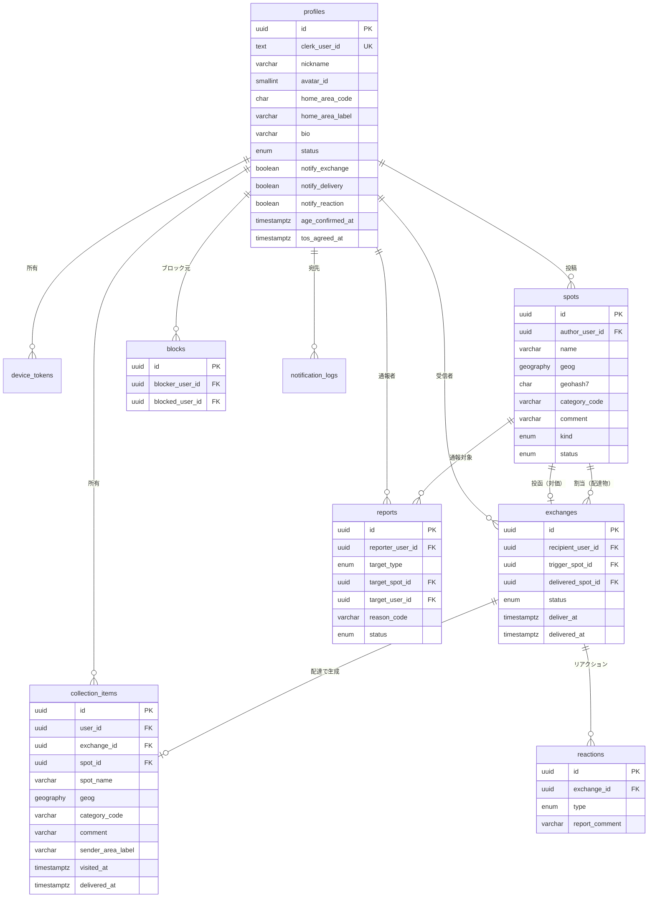
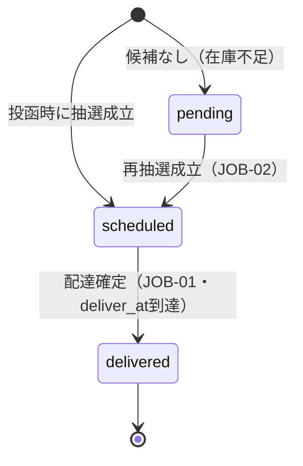

# データベース設計書

**プロダクト名:** まちびん
**サブタイトル:** 「おすすめ場所」ランダム交換サービス

---

## 改訂履歴

| 版数 | 改訂日 | 改訂者 | 改訂内容 |
| --- | --- | --- | --- |
| 1.0 | 2026-07-12 | Claude | 初版作成 |

## 文書情報

| 項目 | 内容 |
| --- | --- |
| 文書名 | まちびん データベース設計書 |
| ステータス | ドラフト |
| 対象DB | Neon（Serverless PostgreSQL 16系）＋ PostGIS |
| ORM | Drizzle ORM ＋ drizzle-kit（マイグレーション） |
| 関連文書 | 01 要件定義書 §6、02 アーキテクチャ設計書 §6、04 機能設計書、07 API設計書、11 プライバシー・データ保護設計書 |

---

## 1. 設計方針

1. **PostGISを正とする地理データ管理** — スポット位置は `geography(Point, 4326)` で保持し、近傍検索は `ST_DWithin`＋GiSTインデックスで実現する（02 §6.1）。
2. **丸め済み座標のみを保存** — 生の端末座標は保存しない。保存されるのはクライアントで丸め、サーバーで再検証した座標のみ（NFR-PR01、詳細は 11 プライバシー設計書）。
3. **配達スナップショット方式** — 配達時点のスポット内容を「もらった場所帳」（`collection_items`）に複製する。原本の削除・投稿者の退会後も受信者の場所帳は維持され、かつ場所帳レコードは差出人個人への参照を持たない（BD-06）。
4. **認証情報は保持しない** — メールアドレス・認証情報はClerk側にのみ存在する。DB側はClerkの `user_id` を外部キー相当（`clerk_user_id`）として持つのみ（NFR-S02）。
5. **運用パラメータのDB管理** — 配達時刻・最低文字数等は `app_settings` に保持し、コード改修なしに変更可能とする（NFR-E03）。

---

## 2. ER図



※ `app_settings`（設定）、`notification_logs`（通知ログ）、`webhook_events`（Webhook冪等性管理）は独立テーブルのため図から省略。

---

## 3. テーブル定義

### TBL-01 profiles（ユーザープロフィール）

Clerkが管理する認証ユーザーに1:1で対応する、アプリ固有のプロフィール。Clerkの `user.created` Webhook受信時に空レコードを作成し、初回設定画面（SCR-10）で本登録する。

| カラム | 型 | NULL | 既定値 | 説明 |
| --- | --- | --- | --- | --- |
| id | uuid | NOT NULL | gen_random_uuid() | PK |
| clerk_user_id | text | NOT NULL | — | ClerkのユーザーID。UNIQUE |
| nickname | varchar(20) | NULL | — | 表示名。初回設定完了までNULL |
| avatar_id | smallint | NOT NULL | 1 | プリセットアバターの番号（BD-07） |
| home_area_code | char(5) | NULL | — | 居住エリア。全国地方公共団体コード（JIS X 0402）5桁 |
| home_area_label | varchar(20) | NULL | — | 居住エリア表示名（例:「東京都台東区」） |
| bio | varchar(50) | NULL | — | ひとこと自己紹介 |
| status | user_status | NOT NULL | 'active' | CD-06 |
| notify_exchange | boolean | NOT NULL | true | 交換成立通知の受信可否（FR-09） |
| notify_delivery | boolean | NOT NULL | true | 配達完了通知の受信可否 |
| notify_reaction | boolean | NOT NULL | true | リアクション通知の受信可否 |
| age_confirmed_at | timestamptz | NULL | — | 「13歳以上」同意日時（BD-03）。初回設定で記録 |
| tos_agreed_at | timestamptz | NULL | — | 利用規約同意日時 |
| created_at | timestamptz | NOT NULL | now() | |
| updated_at | timestamptz | NOT NULL | now() | |
| withdrawn_at | timestamptz | NULL | — | 退会日時 |

- UNIQUE: `clerk_user_id`
- 管理者権限はDBでは持たない。Clerkの `publicMetadata.role` をJWTクレームで判定する（10 認証・認可設計書）。

### TBL-02 device_tokens（プッシュ通知トークン）

| カラム | 型 | NULL | 既定値 | 説明 |
| --- | --- | --- | --- | --- |
| id | uuid | NOT NULL | gen_random_uuid() | PK |
| user_id | uuid | NOT NULL | — | FK → profiles(id) ON DELETE CASCADE |
| expo_push_token | text | NOT NULL | — | ExpoPushToken。UNIQUE |
| platform | platform | NOT NULL | — | CD-09（ios / android） |
| disabled_at | timestamptz | NULL | — | 配信不能（DeviceNotRegistered）検出時に設定 |
| created_at | timestamptz | NOT NULL | now() | |
| updated_at | timestamptz | NOT NULL | now() | |

### TBL-03 spots（スポット）

投函された場所。交換プールの実体（Postcrossing方式：配達されてもプールに残り、複数ユーザーに配られ得る。02 §5.1補足）。

| カラム | 型 | NULL | 既定値 | 説明 |
| --- | --- | --- | --- | --- |
| id | uuid | NOT NULL | gen_random_uuid() | PK |
| author_user_id | uuid | NULL | — | FK → profiles(id)。退会時にNULL化（匿名化） |
| name | varchar(50) | NOT NULL | — | 場所名（施設・公共スポット名） |
| geog | geography(Point,4326) | NOT NULL | — | **丸め済み**座標（NFR-PR01） |
| geohash7 | char(7) | NOT NULL | — | 丸めセル（precision 7 ≒ 約150m四方）。サーバー再検証・重複判定の補助 |
| category_code | varchar(20) | NOT NULL | — | CD-01 |
| comment | varchar(300) | NOT NULL | — | おすすめコメント。最低文字数はPRM-01（既定: 全角20文字） |
| kind | spot_kind | NOT NULL | 'normal' | CD-08（normal / seed）。FR-10 |
| status | spot_status | NOT NULL | 'active' | CD-02。hidden=運営非表示、deleted=削除 |
| created_at | timestamptz | NOT NULL | now() | |
| updated_at | timestamptz | NOT NULL | now() | |

### TBL-04 exchanges（交換）

1件の投函（trigger_spot）を対価とした1回の交換トランザクション。投函APIで同期的に抽選し、配達はバッチで確定する。

| カラム | 型 | NULL | 既定値 | 説明 |
| --- | --- | --- | --- | --- |
| id | uuid | NOT NULL | gen_random_uuid() | PK |
| recipient_user_id | uuid | NOT NULL | — | 受信者（=投函者）。FK → profiles(id) |
| trigger_spot_id | uuid | NOT NULL | — | 対価として投函されたスポット。FK → spots(id)。UNIQUE |
| delivered_spot_id | uuid | NULL | — | 割り当てられたスポット。FK → spots(id)。pending中はNULL |
| status | exchange_status | NOT NULL | — | CD-03（pending / scheduled / delivered） |
| matched_at | timestamptz | NULL | — | 抽選成立日時 |
| deliver_at | timestamptz | NULL | — | 配達予定時刻（次の配達ウィンドウ。BD-01） |
| delivered_at | timestamptz | NULL | — | 配達完了日時 |
| created_at | timestamptz | NOT NULL | now() | 投函受理日時 |

- UNIQUE: `trigger_spot_id`（1投函=1交換）
- UNIQUE（部分）: `(recipient_user_id, delivered_spot_id) WHERE delivered_spot_id IS NOT NULL`（同一スポットの再受信防止。FR-04）

**状態遷移**



### TBL-05 collection_items（もらった場所帳）

配達時に生成される受信スポットのスナップショット（FR-07、BD-06）。差出人個人を特定できる情報は持たない。

| カラム | 型 | NULL | 既定値 | 説明 |
| --- | --- | --- | --- | --- |
| id | uuid | NOT NULL | gen_random_uuid() | PK |
| user_id | uuid | NOT NULL | — | 所有者。FK → profiles(id) ON DELETE CASCADE |
| exchange_id | uuid | NOT NULL | — | FK → exchanges(id)。UNIQUE |
| spot_id | uuid | NULL | — | 原本参照。FK → spots(id) ON DELETE SET NULL |
| spot_name | varchar(50) | NOT NULL | — | スナップショット |
| geog | geography(Point,4326) | NOT NULL | — | スナップショット |
| category_code | varchar(20) | NOT NULL | — | スナップショット |
| comment | varchar(300) | NOT NULL | — | スナップショット |
| sender_area_label | varchar(20) | NULL | — | 差出人エリア（市区町村レベルのみ。NFR-PR02）。配達時の投稿者居住エリア |
| visited_at | timestamptz | NULL | — | 訪問日時。NULL=未訪問（FR-07） |
| delivered_at | timestamptz | NOT NULL | — | 配達日時 |
| created_at | timestamptz | NOT NULL | now() | |

### TBL-06 reactions（リアクション）

| カラム | 型 | NULL | 既定値 | 説明 |
| --- | --- | --- | --- | --- |
| id | uuid | NOT NULL | gen_random_uuid() | PK |
| exchange_id | uuid | NOT NULL | — | FK → exchanges(id) |
| reactor_user_id | uuid | NOT NULL | — | リアクションした受信者。FK → profiles(id) |
| type | reaction_type | NOT NULL | — | CD-07（want_to_go / visited） |
| report_comment | varchar(200) | NULL | — | 「行ってきた」時のみ設定可（FR-06、PRM-07） |
| created_at | timestamptz | NOT NULL | now() | |

- UNIQUE: `(exchange_id, type)`（同一交換への同種リアクションは1回）

### TBL-07 blocks（マッチ除外）

通報を起点に生成されるマッチング除外関係（FR-08「マッチ永久除外」）。マッチングでは双方向に除外する。

| カラム | 型 | NULL | 既定値 | 説明 |
| --- | --- | --- | --- | --- |
| id | uuid | NOT NULL | gen_random_uuid() | PK |
| blocker_user_id | uuid | NOT NULL | — | FK → profiles(id) |
| blocked_user_id | uuid | NOT NULL | — | FK → profiles(id) |
| source | block_source | NOT NULL | 'report' | report=通報起点（Phase 1はこれのみ） |
| created_at | timestamptz | NOT NULL | now() | |

- UNIQUE: `(blocker_user_id, blocked_user_id)`

### TBL-08 reports（通報）

| カラム | 型 | NULL | 既定値 | 説明 |
| --- | --- | --- | --- | --- |
| id | uuid | NOT NULL | gen_random_uuid() | PK |
| reporter_user_id | uuid | NOT NULL | — | FK → profiles(id) |
| target_type | report_target | NOT NULL | — | spot / user |
| target_spot_id | uuid | NULL | — | FK → spots(id)。target_type=spot時 |
| target_user_id | uuid | NULL | — | FK → profiles(id)。spot通報時も投稿者を解決して格納（マッチ除外用） |
| reason_code | varchar(30) | NOT NULL | — | CD-04 |
| detail | varchar(500) | NULL | — | 補足（任意） |
| status | report_status | NOT NULL | 'open' | open / resolved |
| action_code | varchar(30) | NULL | — | CD-05。対応内容 |
| resolved_at | timestamptz | NULL | — | |
| created_at | timestamptz | NOT NULL | now() | |

### TBL-09 app_settings(設定パラメータ)

運用調整可能なパラメータ（NFR-E03）。キーと既定値の一覧は 04 機能設計書のPRM一覧を正とする。

| カラム | 型 | NULL | 既定値 | 説明 |
| --- | --- | --- | --- | --- |
| key | varchar(50) | NOT NULL | — | PK（例: `comment_min_length`） |
| value | jsonb | NOT NULL | — | 値 |
| description | varchar(200) | NULL | — | 説明 |
| updated_at | timestamptz | NOT NULL | now() | |

### TBL-10 notification_logs（通知送信ログ）

| カラム | 型 | NULL | 既定値 | 説明 |
| --- | --- | --- | --- | --- |
| id | uuid | NOT NULL | gen_random_uuid() | PK |
| user_id | uuid | NOT NULL | — | FK → profiles(id) ON DELETE CASCADE |
| type | varchar(10) | NOT NULL | — | NT-01〜03（09 通知設計書） |
| exchange_id | uuid | NULL | — | 関連交換（NT-03はリアクション対象の交換を記録。リアクション・スポットはexchange経由で解決） |
| expo_ticket_id | text | NULL | — | Expo Pushチケット |
| status | varchar(10) | NOT NULL | 'sent' | sent / ok / error |
| error_detail | text | NULL | — | レシートのエラー内容 |
| created_at | timestamptz | NOT NULL | now() | |

### TBL-11 webhook_events（Webhook冪等性管理）

| カラム | 型 | NULL | 既定値 | 説明 |
| --- | --- | --- | --- | --- |
| id | text | NOT NULL | — | PK。Svixメッセージ ID（svix-id） |
| event_type | varchar(50) | NOT NULL | — | 例: user.created |
| processed_at | timestamptz | NOT NULL | now() | |

---

## 4. コード定義

### CD-01 カテゴリ（spots.category_code）

| コード | 表示名 |
| --- | --- |
| cafe | カフェ |
| restaurant | 飲食店 |
| park | 公園・屋外 |
| scenery | 景色・眺め |
| shop | ショップ |
| other | その他 |

### CD-02 スポットステータス（spot_status）

| コード | 意味 |
| --- | --- |
| active | 公開（交換プール対象） |
| hidden | 非表示（運営対応・通報自動非表示。プール対象外） |
| deleted | 削除（本人削除・退会。プール対象外） |

### CD-03 交換ステータス（exchange_status）

| コード | 意味 |
| --- | --- |
| pending | 抽選候補なし。配達バッチで再抽選 |
| scheduled | 抽選成立・配達待ち |
| delivered | 配達完了 |

### CD-04 通報理由（reports.reason_code）

| コード | 表示名 |
| --- | --- |
| inappropriate_content | 不適切な内容 |
| location_abuse | 位置情報の悪用（自宅など私有地の暴露等） |
| harassment | 迷惑行為 |
| spam | スパム・宣伝 |
| other | その他 |

### CD-05 通報対応（reports.action_code）

| コード | 意味 |
| --- | --- |
| none | 対応不要と判断 |
| hide_spot | 対象投稿を非表示化 |
| suspend_user | 対象アカウントを停止 |

### CD-06 ユーザーステータス（user_status）

| コード | 意味 |
| --- | --- |
| active | 有効 |
| suspended | 停止（運営処分。ログイン可・投函/交換不可） |
| withdrawn | 退会 |

### CD-07 リアクション種別（reaction_type）

| コード | 表示名 |
| --- | --- |
| want_to_go | 行ってみたい |
| visited | 行ってきた |

### CD-08 スポット種別（spot_kind）

| コード | 意味 |
| --- | --- |
| normal | 通常投稿 |
| seed | シードスポット（FR-10） |

### CD-09 プラットフォーム（platform）

| コード | 意味 |
| --- | --- |
| ios | iOS |
| android | Android |

---

## 5. インデックス定義

| No | テーブル | インデックス | 用途 |
| --- | --- | --- | --- |
| IX-01 | spots | `USING gist (geog)` | 近傍検索（Phase 2 距離モード、場所帳地図） |
| IX-02 | spots | `(status, kind)` | 抽選プール絞り込み |
| IX-03 | spots | `(author_user_id)` | 自分の投函一覧、退会処理 |
| IX-04 | exchanges | `(status, deliver_at)` | 配達バッチの対象抽出（JOB-01） |
| IX-05 | exchanges | UNIQUE `(recipient_user_id, delivered_spot_id) WHERE delivered_spot_id IS NOT NULL` | 再受信防止＋受信済み判定 |
| IX-06 | exchanges | UNIQUE `(trigger_spot_id)` | 1投函=1交換 |
| IX-07 | collection_items | `(user_id, delivered_at DESC)` | 場所帳一覧（新着順） |
| IX-08 | collection_items | `USING gist (geog)` | 場所帳地図のbbox検索 |
| IX-09 | reactions | UNIQUE `(exchange_id, type)` | 重複リアクション防止 |
| IX-10 | blocks | UNIQUE `(blocker_user_id, blocked_user_id)` | 重複防止・除外判定 |
| IX-11 | blocks | `(blocked_user_id)` | 双方向除外判定 |
| IX-12 | reports | `(status, created_at)` | 運営の未対応一覧 |
| IX-13 | notification_logs | `(status, created_at)` | レシート確認ジョブ（JOB-03） |
| IX-14 | device_tokens | `(user_id) WHERE disabled_at IS NULL` | 有効トークンの取得 |

---

## 6. 主要クエリ設計

### 6.1 交換抽選（投函API・配達バッチ共通）

自分の投稿・受信済み・ブロック関係・非公開スポットを除外し、プールからランダムに1件選ぶ（FR-04）。

```sql
SELECT s.id
FROM spots s
WHERE s.status = 'active'
  AND (s.author_user_id IS NULL OR s.author_user_id <> :recipient_id)   -- 自分の投稿を除外
  AND NOT EXISTS (                                                       -- 受信済みを除外
    SELECT 1 FROM exchanges e
    WHERE e.recipient_user_id = :recipient_id
      AND e.delivered_spot_id = s.id
  )
  AND NOT EXISTS (                                                       -- ブロック関係を双方向に除外
    SELECT 1 FROM blocks b
    WHERE (b.blocker_user_id = :recipient_id AND b.blocked_user_id = s.author_user_id)
       OR (b.blocker_user_id = s.author_user_id AND b.blocked_user_id = :recipient_id)
  )
ORDER BY random()
LIMIT 1;
```

- MVP規模では `ORDER BY random()` で十分（02 §6.4）。プールが数十万件を超えたら `TABLESAMPLE SYSTEM_ROWS` または乱数キー列方式へ移行する。
- 候補0件の場合は `kind = 'seed'` を含めても0件か確認し、それでも0件なら交換を `pending` とし配達バッチで再抽選する（FR-04、FR-10）。※シードスポットは常時 `active` のためプールに含まれる。上記クエリはシードも通常投稿も区別しない。
- Phase 2（距離モード）は本クエリに `ST_DWithin(s.geog, :point, :radius)` を追加する。

### 6.2 場所帳の地図表示（bbox検索）

```sql
SELECT * FROM collection_items
WHERE user_id = :user_id
  AND geog && ST_MakeEnvelope(:min_lng, :min_lat, :max_lng, :max_lat, 4326)::geography
ORDER BY delivered_at DESC;
```

### 6.3 「行ってきた」された累計（FR-07・本人のみ表示）

```sql
SELECT count(*)
FROM reactions r
JOIN exchanges e ON e.id = r.exchange_id
JOIN spots s ON s.id = e.delivered_spot_id
WHERE s.author_user_id = :user_id
  AND r.type = 'visited';
```

---

## 7. データ保全・削除設計

### 7.1 退会時（BD-06、NFR-PR05。フローは 10 認証・認可設計書 §6）

| データ | 処理 |
| --- | --- |
| profiles | nickname・bio・home_area_*をNULL化し `status='withdrawn'`、`withdrawn_at` 設定。clerk_user_idは削除完了後に `deleted:<元ID>` 形式へ置換 |
| spots（本人投稿） | `status='deleted'`（プールから除外）、`author_user_id` をNULL化 |
| exchanges（未配達） | pending/scheduledは配達対象から除外（受信者本人の退会のため） |
| collection_items（本人所有） | 物理削除（CASCADE） |
| collection_items（他者所有・本人投稿由来） | スナップショットのためそのまま残置（差出人参照を持たない） |
| device_tokens / notification_logs | 物理削除（CASCADE） |
| reports / blocks | 保全のため残置（不正対策の履歴として保持。11 プライバシー設計書 §5） |

### 7.2 保持期間（TTL）

| テーブル | 保持期間 | 削除手段 |
| --- | --- | --- |
| webhook_events | 30日 | クリーンアップジョブ（JOB-04） |
| notification_logs | 90日 | 同上 |
| その他 | サービス提供期間中保持 | — |

---

## 8. マイグレーション・運用方針

- スキーマは Drizzle ORM のスキーマ定義（TypeScript）を単一の正とし、`drizzle-kit generate` でSQLマイグレーションを生成、CI（GitHub Actions）で適用する（02 §9.1）。
- PostGIS拡張は初回マイグレーションで `CREATE EXTENSION IF NOT EXISTS postgis;` を実行する。
- 環境分離はNeonブランチで行う（本番=main、staging/dev/PRプレビュー=子ブランチ。02 §9.2）。
- `geography` 型・部分UNIQUEインデックス等、Drizzleで表現しきれない定義はカスタムSQLマイグレーションで補う。

---

## 9. 拡張方針（Phase 2以降）

| 対象 | 拡張内容 |
| --- | --- |
| themes（お題）テーブル | Phase 2で追加：`id, title, starts_on, ends_on, status`。spotsに `theme_id` を追加し、抽選条件に同一テーマを加える（FR-12） |
| 距離モード | 追加テーブル不要。抽選クエリへの `ST_DWithin` 追加と、profilesまたはリクエストへの距離モード指定で実現（FR-11） |
| 旅先モード | 現在地（丸め済み）を交換リクエストに付与し、スポット近傍の住民投稿を優先（FR-13）。スキーマ変更は最小 |
| 画像投稿 | spotsに `image_key`（R2オブジェクトキー）を追加。モデレーション設計とセット（02 §12） |

---

*本書はドラフトであり、実装（Drizzleスキーマ定義）を正として乖離があれば本書を改訂する。*
