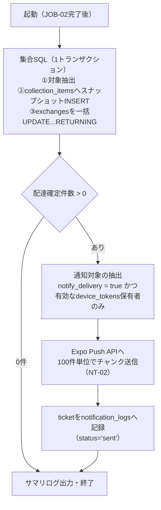

# バッチ・非同期処理設計書

**プロダクト名:** まちびん
**サブタイトル:** 「おすすめ場所」ランダム交換サービス

---

## 改訂履歴

| 版数 | 改訂日 | 改訂者 | 改訂内容 |
| --- | --- | --- | --- |
| 1.0 | 2026-07-12 | Claude | 初版作成 |

## 文書情報

| 項目 | 内容 |
| --- | --- |
| 文書名 | まちびん バッチ・非同期処理設計書 |
| ステータス | ドラフト |
| 実行基盤 | Cloudflare Workers Cron Triggers |
| 関連文書 | 02 アーキテクチャ設計書 §5、04 機能設計書、06 データベース設計書、09 通知設計書 |

---

## 1. 全体方針

### 1.1 なぜバッチ処理か

本サービスの配達（FR-05）は、**意図的にリアルタイムで行わない**。設計上の理由は次の2点であり、これらは互いに補強し合う（02 §5.1・§8.4）。

1. **配達遅延演出（FR-05）** — 「翌朝ポストに入っている」体験がプロダクトの核であり、即時配達はむしろ価値を損なう。投函の受理は同期（NFR-P02: 投函操作自体は待ち時間なく完了）、配達は配達ウィンドウでのバッチ確定とする。
2. **Neonのスケールtoゼロ維持（02 §8.4・AR-07）** — 分単位のポーリングはNeonの自動休止を妨げ、無料枠（100 CU-hours/月）を早期に消費する。DBへのアクセスを1日数回のウィンドウに集約することで、アイドル時間を最大化する。

したがって本設計では、**常駐プロセス・ポーリングを一切行わず**、Cloudflare Workers の Cron Triggers による時刻起動のみでバッチ・非同期処理を構成する。

### 1.2 本書のスコープ

- 対象: Cron Triggers で起動する定期ジョブ（JOB-01〜04）。
- 対象外: API処理内で同期実行される非同期的要素（投函時の抽選=API-20、リアクション通知NT-03の送信=API-43契機）。これらは 04 機能設計書・07 API設計書・09 通知設計書に記載する。

---

## 2. ジョブ一覧

| JOB-ID | 名称 | スケジュール（UTC / JST） | 概要 |
| --- | --- | --- | --- |
| JOB-01 | 配達ジョブ | `0 22 * * *`（翌7:00 JST）/ `0 10 * * *`（19:00 JST） | 配達ウィンドウで `scheduled` かつ `deliver_at <= now()` の交換を配達確定し、場所帳スナップショットを生成、NT-02通知を送信する |
| JOB-02 | マッチング再抽選ジョブ | JOB-01と同一Cron起動内で、**JOB-01の前に実行** | `pending` の交換を再抽選し、成立分を当ウィンドウで配達できるよう `scheduled` 化する |
| JOB-03 | プッシュ通知レシート確認ジョブ | `30 22 * * *`（翌7:30 JST）/ `30 10 * * *`（19:30 JST） | Expo Pushのticketに対するreceiptを確認し、送信結果の確定と無効トークンの失効を行う |
| JOB-04 | クリーンアップジョブ | `0 17 * * *`（翌2:00 JST） | TTL超過データの削除（webhook_events 30日・notification_logs 90日。06 §7.2） |

### 2.1 Cron式とジョブのディスパッチ

Cron Triggers は1つのWorkerに複数のcron式を設定できる。`scheduled` ハンドラで `event.cron` を判定し、対応するジョブ列を実行する。

| cron式（UTC） | JST換算 | 実行ジョブ（実行順） |
| --- | --- | --- |
| `0 22 * * *` | 翌日 7:00 | JOB-02 → JOB-01 |
| `0 10 * * *` | 当日 19:00 | JOB-02 → JOB-01 |
| `30 22 * * *` | 翌日 7:30 | JOB-03 |
| `30 10 * * *` | 当日 19:30 | JOB-03 |
| `0 17 * * *` | 翌日 2:00 | JOB-04 |

> **時差に関する注意（重要）:** Cloudflare Cron Triggers の cron式は**UTCで解釈される**。JSTはUTC+9のため、「毎朝7:00 JSTの配達」はUTCでは**前日の22:00**（`0 22 * * *`）に相当し、日付をまたぐ。Phase 1はすべて毎日実行（日・曜日フィールドが `* *`）のため実害はないが、将来曜日・日付指定を導入する場合はこのズレを必ず考慮すること。

---

## 3. スケジュール全体図

1日のタイムライン（横軸はUTC。JST = UTC+9）。

```mermaid
gantt
    title バッチ実行タイムライン（UTC基準の1日）
    dateFormat HH:mm
    axisFormat %H:%M
    section 夕の配達ウィンドウ（19:00 JST）
    JOB-02→JOB-01（10:00 UTC） :j1, 10:00, 20m
    JOB-03（10:30 UTC）        :j2, 10:30, 15m
    section 深夜メンテナンス（2:00 JST）
    JOB-04（17:00 UTC）        :j3, 17:00, 15m
    section 朝の配達ウィンドウ（翌7:00 JST）
    JOB-02→JOB-01（22:00 UTC） :j4, 22:00, 20m
    JOB-03（22:30 UTC）        :j5, 22:30, 15m
```



- 配達ウィンドウは毎日 7:00 / 19:00 JST の2回（BD-01）。
- JOB-03 は各配達ウィンドウの30分後に実行する。Expo Push側がreceipt（配信結果）を用意するまでのリードタイムを確保するためである。
- JOB-04 はユーザー活動・配達と重ならない深夜帯（2:00 JST）に1日1回実行する。

---

## 4. 共通設計

### 4.1 実行基盤

- 実行基盤は Cloudflare Workers の Cron Triggers とし、APIと同一Worker（またはバッチ専用Worker）の `scheduled` ハンドラで受ける。cron式は `wrangler.toml` の `[triggers] crons` に定義する。
- DBアクセスはAPIと同じく `@neondatabase/serverless`（HTTP）経由とする（02 §6.5）。

### 4.2 タイムゾーン方針

| 項目 | 方針 |
| --- | --- |
| DB保存 | すべて `timestamptz`（UTC）。07 §1.1と同一 |
| cron式 | UTCで記述（§2.1の注意参照） |
| ウィンドウ時刻 | `deliver_at` の算出は配達ウィンドウ（PRM-03。JSTで定義）をUTCへ変換して行う |
| 当回ウィンドウ時刻の取得 | `scheduled` イベントの `scheduledTime`（起動予定時刻）を用いる。`Date.now()` ではなく起動予定時刻を基準にすることで、起動遅延時も判定が揺れない |

### 4.3 実行の重複防止

多重実行の防止は次の2層で担保する。

1. **基盤レイヤ:** Cloudflare Cron Triggers は同一スケジュールの起動を同時多重実行しない前提とする（1起動が終わる前に同一cronの次起動が重なることを想定しない）。
2. **アプリケーションレイヤ（防御的措置）:** 仮に重複実行・再実行が起きても二重処理にならないよう、全ジョブを**ステータスガード付きの冪等な更新**として実装する（`WHERE status = 'scheduled'` 等の条件付きUPDATE、`collection_items.exchange_id` のUNIQUE制約など。各ジョブの「冪等性」欄参照）。分散ロック等の専用機構はPhase 1では導入しない。

### 4.4 設定値の参照

運用調整可能な値は `app_settings`（TBL-09）に保持し、IDは 04 機能設計書のPRM一覧を正とする（README §3.1）。

| 参照するPRM | 内容 | 本書での用途 |
| --- | --- | --- |
| PRM-03 | 配達ウィンドウ（既定: 7:00 / 19:00 JST。BD-01） | API-20での `deliver_at` 算出、JOB-02での再抽選成立時の `deliver_at` 設定 |

> **注意（二重管理）:** cron式は `wrangler.toml` の静的設定であり、`app_settings` からは動的参照できない。PRM-03（配達ウィンドウ）を変更する場合は、**app_settingsの値とcron式の両方**を変更してデプロイする必要がある。ジョブ本体は「現在時刻までに `deliver_at` が到達したものを処理する」実装のため、ウィンドウ回数・時刻の変更でロジック改修は発生しない（§7参照）。

### 4.5 Workers実行制限への対応

Cloudflare Workers には1起動あたりの**サブリクエスト数上限**（無料プランは50、有料プランは1000。Neon HTTPドライバのクエリ・Expo PushへのHTTP呼び出しはいずれもサブリクエストとして計数される）と**CPU時間制限**がある。このため本設計では次を原則とする。

- **対象取得・更新は集合SQLで行う** — 1件ずつのSELECT/UPDATEループを禁止し、CTEによる `INSERT ... SELECT` ＋ `UPDATE ... RETURNING` 等で「対象抽出→スナップショット生成→一括ステータス更新」を少数クエリに集約する（JOB-01 §5.1参照）。処理件数が増えてもクエリ数がほぼ一定になる。
- **外部API呼び出しはチャンク化する** — Expo Pushへの送信は100件単位のチャンクで行い、呼び出し回数を抑える。
- 処理量が上限に近づいた場合は Workers Paid への移行、さらに Cloudflare Queues への分割（§7）で対応する。

### 4.6 共通エラー処理・監視

| 項目 | 方針 |
| --- | --- |
| 1件失敗時 | 当該件をスキップして残りを継続する。スキップ分は状態が変わらないため、次回ウィンドウで自然にリトライされる |
| ジョブ全体失敗時 | Sentryへ通知。対象抽出条件が「now()までに到達したもの」であるため、次回起動で自動キャッチアップされる（§6） |
| 例外通知 | SentryへジョブID・対象件数・失敗件数をコンテキスト付きで送信（NFR-O04） |
| 実行ログ | 処理件数・成功/失敗件数のサマリを構造化ログで出力し、Logpushで収集。Cloudflare ダッシュボードのCron Triggers実行履歴（起動時刻・成否・所要時間）を併用 |
| 指標 | 配達完了数等のプロダクト指標（NFR-O03）はDB集計で取得（バッチ側での別途記録は行わない） |

---

## 5. ジョブ詳細

### 5.1 JOB-01 配達ジョブ

| 項目 | 内容 |
| --- | --- |
| 起動条件 | cron `0 22 * * *`（翌7:00 JST）/ `0 10 * * *`（19:00 JST）。同一起動内でJOB-02の完了後に実行 |
| 目的 | 配達時刻に到達した交換を配達確定し（FR-05）、「もらった場所帳」のスナップショットを生成、受信者へ配達完了通知（NT-02）を送る |
| 出力・後続処理 | `exchanges` を `delivered` 化、`collection_items` 生成、Expo Pushへ送信したticketを `notification_logs` に記録。30分後のJOB-03がreceiptを確認する |

**入力（対象抽出条件のSQL概略）**

```sql
SELECT e.id
FROM exchanges e
JOIN profiles p ON p.id = e.recipient_user_id
JOIN spots s    ON s.id = e.delivered_spot_id
WHERE e.status = 'scheduled'
  AND e.deliver_at <= now()
  AND p.status = 'active'      -- 受信者ガード（下記補足）
  AND s.status = 'active';     -- 割当スポットが非公開化されていないこと
```

- 抽出は IX-04 `(status, deliver_at)` を利用する。
- **受信者ステータスによるスキップ:** 受信者が退会した場合、その未配達交換は退会処理（API-12・06 §7.1）で `cancelled` に更新されるため、本ジョブでは通常抽出されない（`p.status='active'` ガードは退会処理との競合に備えた防御的措置）。受信者が `suspended`（停止）の場合は配達せず、`scheduled` のまま**次回ウィンドウへ持ち越す**（アカウントが `active` に復帰した後のウィンドウで配達される）。
- 割当スポットが配達前に `hidden` / `deleted` となった場合は、同一起動内で先行するJOB-02が `pending` へ差し戻して再抽選するため（§5.2手順1）、本ジョブには原則到達しない。`s.status='active'` ガードは同起動内での競合に備えた防御的措置である。

**処理フロー**



配達確定（フロー②③）は次のCTEを1文・1トランザクションで実行する。件数によらずクエリ数が一定になり、サブリクエスト消費を最小化できる（§4.5）。

```sql
WITH target AS (
  SELECT e.id AS exchange_id, e.recipient_user_id, e.delivered_spot_id
  FROM exchanges e
  JOIN profiles p ON p.id = e.recipient_user_id
  JOIN spots s    ON s.id = e.delivered_spot_id
  WHERE e.status = 'scheduled' AND e.deliver_at <= now()
    AND p.status = 'active' AND s.status = 'active'
),
snap AS (
  INSERT INTO collection_items
    (user_id, exchange_id, spot_id, spot_name, geog, category_code,
     comment, sender_area_label, delivered_at)
  SELECT t.recipient_user_id, t.exchange_id, s.id, s.name, s.geog, s.category_code,
         s.comment,
         CASE WHEN s.kind = 'seed'
              THEN s.seed_area_label
              ELSE author.home_area_label END,
         now()
  FROM target t
  JOIN spots s ON s.id = t.delivered_spot_id
  LEFT JOIN profiles author ON author.id = s.author_user_id
  ON CONFLICT (exchange_id) DO NOTHING
  RETURNING exchange_id
)
UPDATE exchanges e
SET status = 'delivered', delivered_at = now()
FROM snap
WHERE e.id = snap.exchange_id
RETURNING e.id, e.recipient_user_id;
```

- スナップショットにはスポット内容（名称・座標・カテゴリ・コメント）と**差出人エリア**を複製する。差出人エリアは投稿者の `profiles.home_area_label`、シードスポット（`kind='seed'`）は投入時に指定され `spots.seed_area_label` に保存されたエリア（API-60の `senderAreaLabel`）とする（NFR-PR02: 市区町村レベルのみ、差出人個人への参照は持たない）。
- ステータス遷移は `scheduled → delivered` のみ（CD-03）。
- 通知（フロー④⑤）: 受信者の `notify_delivery = true` かつ `disabled_at IS NULL` の `device_tokens` を持つ場合のみNT-02の送信対象に積み、Expo Push APIへ100件単位でチャンク送信、返却されたticketを `notification_logs` に `status='sent'` で記録する。**文面・ペイロード・送信実装の詳細は 09 通知設計書に委譲する。**

**冪等性（再実行しても二重処理にならない根拠）**

| 防御 | 内容 |
| --- | --- |
| ステータスガード | 対象抽出が `status='scheduled'` 限定のため、確定済み（`delivered`）の交換は再実行時に抽出されない |
| UNIQUE制約 | `collection_items.exchange_id` のUNIQUE＋`ON CONFLICT DO NOTHING` により、同一交換のスナップショット二重生成は構造的に不可能 |
| 通知の二重送信 | 通知対象は同一トランザクションで `delivered` 化された交換（RETURNING結果）に限るため、再実行時に再送されない。DB確定後・Push送信前の異常終了時は通知が欠落し得るが、配達自体はアプリ内（API-30/40）で確認できるため許容する（at-most-once。09参照） |

**エラー処理**

- 集合SQLが失敗した場合: Sentry通知のうえ全件を次回ウィンドウへ持ち越す（自然キャッチアップ）。継続的に失敗する場合は100件単位のチャンク実行に分割して問題データを局所化し、失敗チャンク内の当該件のみスキップする。
- Push送信のチャンク単位失敗: 当該チャンクをスキップしSentry通知。配達自体は確定済みのため、影響は通知の欠落のみ。
- 個別のticketエラー（無効トークン等）はJOB-03で回収する。

**処理量見積（MVP）**

| 項目 | 見積 |
| --- | --- |
| 対象件数 | 1ウィンドウあたり数十〜数百件（投函数≒交換数の半日分） |
| DBクエリ数 | 件数によらず数クエリ（対象確定1文＋通知対象抽出＋ログ記録） |
| Push送信 | 100件/チャンク → 数チャンク |
| 制限余裕 | 無料プランのサブリクエスト上限50/起動に対し十分収まる。数千件/ウィンドウ規模でWorkers Paid（上限1000）またはQueues分割（§7）へ |

**監視**

- Cloudflare Cron Triggers実行ログ（起動・成否・所要時間）。
- Sentry例外（ジョブID・失敗件数付き）。
- サマリログ: 配達確定件数・スキップ件数（受信者ステータス別）・Push送信件数。

### 5.2 JOB-02 マッチング再抽選ジョブ

| 項目 | 内容 |
| --- | --- |
| 起動条件 | JOB-01と同一のCron起動（`0 22 * * *` = 翌7:00 JST / `0 10 * * *` = 19:00 JST）内で、**JOB-01の前**に実行 |
| 目的 | 投函時に抽選候補が0件で `pending` となった交換（API-20、CD-03）を再抽選し、在庫回復後に交換を成立させる（FR-04・FR-10のフォールバック） |
| 出力・後続処理 | 成立分は `scheduled`・`deliver_at=当回ウィンドウ時刻` となり、**直後のJOB-01で当ウィンドウ内に配達される**。成立時は交換成立通知（NT-01）の送信対象とする |

**入力（対象抽出条件のSQL概略）**

```sql
SELECT e.id, e.recipient_user_id
FROM exchanges e
JOIN profiles p ON p.id = e.recipient_user_id
WHERE e.status = 'pending'
  AND p.status = 'active';   -- 退会・停止中ユーザーの交換は対象外
```

**処理フロー**

1. **無効化された割当の差し戻し:** 配達予定（`deliver_at <= now()`）の `scheduled` 交換のうち、割当スポットが `active` でなくなったもの（配達前に通報非表示・削除されたもの）を `pending` へ差し戻す（低品質スポットを配達しないため。04 §4.5）。差し戻し分は手順2以降の再抽選対象に含まれる。

   ```sql
   UPDATE exchanges e
   SET status = 'pending', delivered_spot_id = NULL,
       matched_at = NULL, deliver_at = NULL
   FROM spots s
   WHERE s.id = e.delivered_spot_id
     AND e.status = 'scheduled' AND e.deliver_at <= now()
     AND s.status <> 'active';
   ```

2. `pending` の交換を取得する（通常0〜数件。コールドスタート期・在庫枯渇時、および手順1の差し戻し分）。
3. 各交換について、**06 §6.1 の抽選クエリ**（自分の投稿・受信済み・ブロック関係・非公開を除外したランダム1件選出）を再実行する。除外条件が受信者ごとに異なるため、本ジョブのみ件別実行とする（対象が恒常的に少ないため許容。§4.5の例外）。
4. 成立した場合、ステータスガード付きで更新する（1件1トランザクション）。

   ```sql
   UPDATE exchanges
   SET delivered_spot_id = :spot_id,
       status = 'scheduled',
       matched_at = now(),
       deliver_at = :window_time   -- 当回のウィンドウ時刻（scheduledTime）
   WHERE id = :exchange_id AND status = 'pending';
   ```

   `deliver_at` に当回ウィンドウ時刻を設定するため、続けて実行されるJOB-01の抽出条件（`deliver_at <= now()`）に合致し、そのまま配達される。
5. 成立した交換の受信者を NT-01（交換成立）の通知対象に積む（`notify_exchange=true` かつ有効トークン保有者のみ。送信・記録方式はJOB-01の通知と同様で、詳細は 09 通知設計書に委譲。同一起動内で直後にNT-02も送信されるため、集約の要否は09で定める）。
6. 不成立（依然として候補0件）の場合は `pending` のまま何もせず、次回ウィンドウで再々抽選する。

**冪等性**

| 防御 | 内容 |
| --- | --- |
| ステータスガード | UPDATEに `AND status='pending'` を付すため、再実行時に成立済み（`scheduled`）の交換を二重更新しない |
| UNIQUE制約 | `(recipient_user_id, delivered_spot_id)` の部分UNIQUE（IX-05）により、同一ユーザーへの同一スポット再割当はDBレベルで拒否される |

**エラー処理**

- 1件の抽選・更新失敗は当該件をスキップしSentry通知。`pending` のまま残るため次回ウィンドウで自然リトライされる。
- ジョブ全体の失敗時も同様に次回キャッチアップ。JOB-02の失敗はJOB-01の実行を妨げない（失敗を握りつぶさず記録したうえでJOB-01へ進む）。

**処理量見積（MVP）**

- `pending` は在庫不足時のみ発生し、通常0〜数件、多くても数十件。件別クエリでもサブリクエスト上限内に収まる。
- なお在庫補填の一次策はシードスポット投入（FR-10・API-60）であり、本ジョブは安全網である。

**監視**

- `pending` 滞留数をサマリログに出力する。**複数ウィンドウ連続で滞留が解消しない場合は交換在庫不足のシグナル**であり、シードスポット投入（NFR-O02）を促す運用とする。
- Sentry例外、Cron実行ログ（JOB-01と共通の起動）。

### 5.3 JOB-03 プッシュ通知レシート確認ジョブ

| 項目 | 内容 |
| --- | --- |
| 起動条件 | cron `30 22 * * *`（翌7:30 JST）/ `30 10 * * *`（19:30 JST）。配達ウィンドウの30分後（Expo側のreceipt生成リードタイムを確保） |
| 目的 | Expo Pushは ticket（Expoによる受付）と receipt（APNs/FCMへの配信結果）の2段階で結果を返す。ticketだけでは端末不達を検知できないため、receiptを確認して送信結果を確定し、無効トークンを失効させる |
| 出力・後続処理 | `notification_logs.status` の確定（ok / error）、無効トークンの `device_tokens.disabled_at` 設定（以後の送信対象から除外） |

**入力（対象抽出条件のSQL概略）**

```sql
SELECT id, expo_ticket_id, user_id
FROM notification_logs
WHERE status = 'sent'
  AND expo_ticket_id IS NOT NULL
  AND created_at >= now() - interval '24 hours';
```

- IX-13 `(status, created_at)` を利用する。24時間の窓を持たせるのは、前回のJOB-03が失敗した場合やreceipt生成遅延分を次回実行で救済するためである。

**処理フロー**

1. `status='sent'` のticket IDを収集する。
2. Expo Push receipts API へチャンク単位（expo-server-sdkの既定: 300件/リクエスト）で照会する。
3. receiptの結果で `notification_logs` を更新する: 成功 → `status='ok'`、エラー → `status='error'`・`error_detail` にエラー内容を記録。
4. エラーが `DeviceNotRegistered` の場合、該当ユーザーの当該 `device_tokens` に `disabled_at` を設定する（TBL-02。以後のJOB-01通知対象から自動的に除外される）。
5. receiptが未生成のticketは `sent` のまま残し、次回実行（24時間窓内）で再確認する。

エラーコード別の対処（`MessageRateExceeded` 等）・再送方針の詳細は 09 通知設計書に委譲する。

**冪等性**

| 防御 | 内容 |
| --- | --- |
| ステータスガード | 対象は `status='sent'` のみ。ok / error へ確定した行は再実行時に抽出されない |
| 失効処理 | `disabled_at` の設定は再実行しても同値であり副作用がない |

**エラー処理**

- Expo receipts API の呼び出し失敗: 当該チャンクをスキップしSentry通知。対象は `sent` のまま残るため、次回実行（次ウィンドウの30分後）で自然リトライされる。
- 24時間窓を超えて `sent` のまま残った行は確認不能として放置する（実害は統計精度のみ。JOB-04のTTLで最終的に削除される）。

**処理量見積（MVP）**

- 対象は直近ウィンドウの通知送信数と同程度（数十〜数百件）→ receipt照会は1〜2チャンク。サブリクエスト消費は僅少。

**監視**

- Sentry例外、Cloudflare Cron実行ログ。
- サマリログ: 確認件数・ok/error内訳・失効させたトークン数。**DeviceNotRegistered以外のエラー率の上昇は、アプリビルドやプッシュ資格情報の問題を示すシグナル**として監視する。

### 5.4 JOB-04 クリーンアップジョブ

| 項目 | 内容 |
| --- | --- |
| 起動条件 | cron `0 17 * * *`（= 翌2:00 JST）。毎日1回、深夜帯 |
| 目的 | 保持期間（TTL）を超過した運用データの削除（06 §7.2。データ最小化: 11 プライバシー・データ保護設計書） |
| 出力・後続処理 | 対象行の物理削除。後続処理なし |

**入力・処理（SQL概略）**

| 対象テーブル | 条件 | 保持期間（06 §7.2を正とする） |
| --- | --- | --- |
| webhook_events | `processed_at < now() - interval '30 days'` | 30日 |
| notification_logs | `created_at < now() - interval '90 days'` | 90日 |

```sql
DELETE FROM webhook_events
WHERE processed_at < now() - interval '30 days';

DELETE FROM notification_logs
WHERE created_at < now() - interval '90 days';
```

**処理フロー**

1. `webhook_events` のTTL超過行を削除し、削除件数をログ出力する。
2. `notification_logs` のTTL超過行を削除し、削除件数をログ出力する。
3. 削除対象が大量の場合（長期のジョブ停止後の初回等）は、サブクエリ＋LIMITによる1万件単位のバッチ削除に切り替え、長時間ロック・トランザクション肥大を避ける。

**冪等性**

- DELETE文は条件該当行がなければ0件で終わるため、再実行しても二重処理・副作用は発生しない（構造的に冪等）。

**エラー処理**

- 失敗時はSentry通知のみ行い、翌日の定時実行で自然にキャッチアップする（TTLは日単位のため1日の遅延は許容）。

**処理量見積（MVP）**

- webhook_events: ユーザー登録・削除イベント数程度（1日数件〜数十件）。
- notification_logs: 通知数×90日分の減衰分（1日数百件程度）。いずれもインデックス（IX-13等）を用いた軽量な削除で完了する。

**監視**

- Sentry例外、Cloudflare Cron実行ログ、削除件数のサマリログ（削除件数が異常に多い/少ない場合の検知）。

---

## 6. 障害時運用

### 6.1 ウィンドウ丸ごと失敗した場合（自動キャッチアップ）

全ジョブの対象抽出条件は「**現在時刻までに到達したもの**」（`deliver_at <= now()`、`status='pending'`、TTL超過等）であり、特定ウィンドウ専用の絞り込みを持たない。このため、Neon障害・デプロイ事故・Cron不発等でウィンドウが丸ごと失敗しても、**次のウィンドウで未処理分がまとめて自動処理される**。

| 失敗ジョブ | ユーザー影響 | 回復 |
| --- | --- | --- |
| JOB-01 / JOB-02 | 配達・成立が最大半日遅れる（データ欠損なし） | 次ウィンドウで自動キャッチアップ |
| JOB-03 | 通知結果の確定・トークン失効が遅れる | 24時間窓内の次回実行で救済 |
| JOB-04 | TTL削除が1日遅れる | 翌日実行で救済 |

### 6.2 手動再実行手順（wrangler経由）

障害復旧後にウィンドウを待たず処理したい場合は、wranglerで `scheduled` ハンドラを手動トリガーする。

1. `wrangler dev --remote --test-scheduled` で対象Worker（本番環境の設定・シークレット）に接続する。
2. `curl "http://localhost:8787/__scheduled?cron=0+22+*+*+*"` のように、実行したいジョブに対応するcron式を指定して起動する（§2.1のディスパッチ表参照）。
3. サマリログとSentryで処理結果を確認する。

再実行はステータスガード・UNIQUE制約により冪等であるため（§4.3）、処理済み分と重複しても二重配達・二重通知は発生しない。

---

## 7. 拡張方針（Phase 2以降）

| 対象 | 拡張内容 |
| --- | --- |
| 距離連動の可変遅延配達（FR-05・02 §10） | 送信者・受信者間の距離に応じて `deliver_at` を可変算出する。ウィンドウ粒度（半日）を超える細かな配達時刻が必要になった段階で、**Cloudflare Queues**（配達・通知処理の分散）または **Durable Objects Alarms**（交換単位の時限アラーム）へ移行する。CD-03のステータス遷移・スナップショット方式（JOB-01）はそのまま流用できる |
| 毎時配達への変更 | **PRM-03（配達ウィンドウ）の値と `wrangler.toml` のcron式（例: `0 * * * *`）の変更のみ**で対応できる。ジョブ本体は「現在時刻までに到達した対象を処理する」実装のため改修不要。ただしNeonの休止時間が減りCU消費が増えるため、無料枠の残量と併せて判断する（02 §8.4） |
| 処理量の増加 | Workers Paid（サブリクエスト上限1000/起動）へ移行。さらに増加した場合はJOB-01のPush送信部分をQueuesに切り出し、配達確定（DB処理）と通知送信を分離する |
| お題交換（FR-12） | JOB-02の再抽選クエリに同一テーマ条件を追加する（06 §9）。ジョブ構成の変更は不要 |
| 通知のバッチ集約 | 通知種別・頻度が増えた場合の「まとめ通知」（1ウィンドウ1通への集約等）は 09 通知設計書の拡張として検討する |

---

*本書はドラフトであり、基本設計工程・実装工程で内容を精緻化する。cron式・制限値は実装着手時にCloudflareの最新仕様で再確認すること。*
