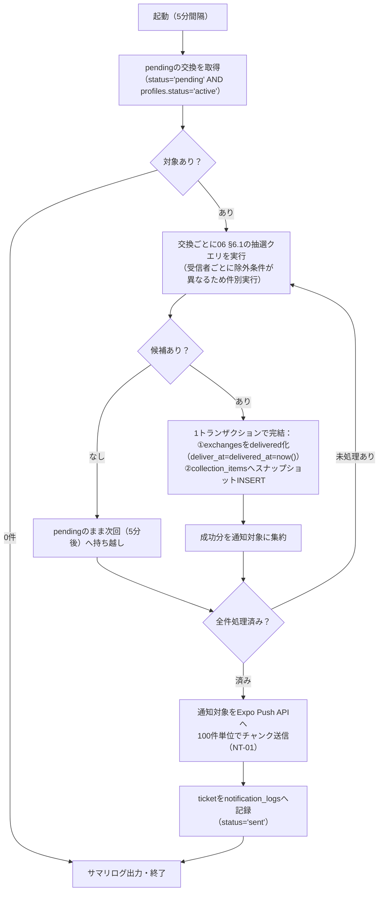

# バッチ・非同期処理設計書

**プロダクト名:** まちびん
**サブタイトル:** 「おすすめ場所」ランダム交換サービス

---

## 改訂履歴

| 版数 | 改訂日 | 改訂者 | 改訂内容 |
| --- | --- | --- | --- |
| 1.0 | 2026-07-12 | Claude | 初版作成 |
| 1.1 | 2026-07-12 | Claude | BD-01改訂により配達バッチ（JOB-01）を廃止。在庫不足時の再抽選ジョブ（JOB-02）に配達確定処理を統合し、独立した高頻度スケジュール（既定5分間隔）に変更。通知をNT-01に統合 |

## 文書情報

| 項目 | 内容 |
| --- | --- |
| 文書名 | まちびん バッチ・非同期処理設計書 |
| ステータス | ドラフト |
| 実行基盤 | Cloudflare Workers Cron Triggers |
| 関連文書 | 02 アーキテクチャ設計書 §5、04 機能設計書、06 データベース設計書、09 通知設計書 |

---

## 1. 全体方針

### 1.1 なぜ非同期処理が必要か（在庫不足時のみ）

配達（FR-05）は**即時配達方式**を原則とする（BD-01）。投函API（API-20）で交換抽選を行い、抽選候補が見つかった場合は**同一トランザクション内で配達まで完了させる**。「投函したらすぐにポストに入っている」体験を提供し、配達に演出上の遅延は設けない（NFR-P02: 投函操作自体は待ち時間なく完了）。

非同期処理が必要になるのは、投函時点で抽選候補が0件（在庫不足）だった場合に限られる。この場合のみ交換を `pending` として保留し、在庫が回復し次第、非同期ジョブ（JOB-02）が再抽選から配達確定までを行う。本書が対象とするCron Triggersベースの非同期処理は、実質的にこの「在庫不足時のフォールバック」（JOB-02）と、その周辺処理（JOB-03: 通知レシート確認、JOB-04: クリーンアップ）に限られる。

この構成は次の2点の根拠と整合する（02 §8.4・AR-07）。

1. **大多数のケースは追加のDBアクセスを生まない** — 在庫があるケースは投函・抽選・配達確定が単一トランザクションで完結するため、配達のために別途ジョブやポーリングを起動する必要がない。
2. **Neonのスケールtoゼロ維持** — アイドル時間を削るのは JOB-02（既定5分間隔）のみであり、これは在庫不足という比較的まれなケースのポーリングに限定される。JOB-02のポーリング間隔（PRM-10）を必要以上に短くしないことが、無料枠（100 CU-hours/月）維持の観点で重要になる。

したがって本設計では、**常駐プロセスを一切用いず**、Cloudflare Workers の Cron Triggers による起動のみで非同期処理を構成する。JOB-02の5分間隔起動は定期ポーリングに相当するが、対象は在庫不足時の交換のみに限定される軽量なものである。

### 1.2 本書のスコープ

- 対象: Cron Triggers で起動する定期ジョブ（JOB-02〜04。JOB-01は廃止・欠番。§5.1）。
- 対象外: API処理内で同期実行される要素（投函時の抽選および在庫がある場合の配達確定＝API-20、リアクション通知NT-03の送信＝API-43契機）。これらは 04 機能設計書・07 API設計書・09 通知設計書に記載する。

---

## 2. ジョブ一覧

| JOB-ID | 名称 | スケジュール（UTC / JST） | 概要 |
| --- | --- | --- | --- |
| JOB-01 | （欠番・廃止） | — | BD-01改訂（即時配達方式）により廃止。配達確定処理はAPI-20の投函処理内、または在庫不足時はJOB-02に統合された（§5.1） |
| JOB-02 | 在庫不足時再抽選・即時配達ジョブ | `*/5 * * * *`（5分間隔・常時） | `pending` の交換を再抽選し、成立した場合はこのジョブ内で配達確定（スナップショット生成含む）まで完了させ、統合後の通知（NT-01）を送信する |
| JOB-03 | プッシュ通知レシート確認ジョブ | `*/15 * * * *`（15分間隔・常時） | Expo Pushのticketに対するreceiptを確認し、送信結果の確定と無効トークンの失効を行う |
| JOB-04 | クリーンアップジョブ | `0 17 * * *`（翌2:00 JST） | TTL超過データの削除（webhook_events 30日・notification_logs 90日。06 §7.2） |

JOB番号は既存文書（06/07/09）からの参照を保つため振り直さない。JOB-01は欠番として扱い、JOB-02〜04はそのまま維持する。

### 2.1 Cron式とジョブのディスパッチ

JOB-02・JOB-03・JOB-04は、それぞれ独立したCronスケジュールで常時起動する（旧JOB-01/JOB-02のような同一起動内での連鎖実行は行わない）。Cron Triggers は1つのWorkerに複数のcron式を設定できる。`scheduled` ハンドラで `event.cron` を判定し、対応するジョブを実行する。

| cron式（UTC） | 意味 | 実行ジョブ |
| --- | --- | --- |
| `*/5 * * * *` | 5分間隔（常時） | JOB-02 |
| `*/15 * * * *` | 15分間隔（常時） | JOB-03 |
| `0 17 * * *` | 翌日 2:00 JST（1日1回） | JOB-04 |

> **時差に関する注意（重要）:** JOB-04のように絶対時刻を指定するcron式は Cloudflare Cron Triggers では**UTCで解釈される**。JSTはUTC+9のため、「深夜2:00 JST」はUTCでは**前日の17:00**（`0 17 * * *`）に相当し、日付をまたぐ。一方、JOB-02・JOB-03の `*/N` 形式（間隔指定）はUTC・JSTどちらの時刻軸で見ても同じ間隔を指すため、時差変換は不要である。将来JOB-04に曜日・日付指定を導入する場合は、このズレを必ず考慮すること。

---

## 3. スケジュール全体図

即時配達方式（BD-01）では固定の配達ウィンドウを持たないため、各ジョブは次のとおり独立した頻度・時刻で実行される。

| ジョブ | 実行間隔・時刻 | 役割 | 備考 |
| --- | --- | --- | --- |
| JOB-02 | 5分間隔・常時（`*/5 * * * *`） | pending交換の再抽選・配達確定 | 既定値。運用調整はPRM-10（§4.4） |
| JOB-03 | 15分間隔・常時（`*/15 * * * *`） | Push配信receiptの確認 | JOB-02がNT-01を送信してから最大15分後に確認される |
| JOB-04 | 1日1回・深夜（`0 17 * * *` = 2:00 JST） | TTL超過データの削除 | ユーザー活動・他ジョブと重ならない深夜帯に実行 |

任意の30分間を例にした実行密度のイメージは次のとおり（JOB-04は1日1回のためこの図には現れない。上表参照）。

```mermaid
gantt
    title バッチ実行タイムライン（任意の30分・常時実行分のみ）
    dateFormat HH:mm
    axisFormat %H:%M
    section JOB-02（5分間隔）
    実行 :j1, 00:00, 1m
    実行 :j2, 00:05, 1m
    実行 :j3, 00:10, 1m
    実行 :j4, 00:15, 1m
    実行 :j5, 00:20, 1m
    実行 :j6, 00:25, 1m
    section JOB-03（15分間隔）
    実行 :k1, 00:00, 1m
    実行 :k2, 00:15, 1m
```



- JOB-02は在庫があるケース（大多数）には関与しない。実行のたびに `pending` が0件であれば即座に終了する軽量なジョブである。
- JOB-03は「配達通知（NT-01）を送った後、Expo側のreceipt生成を待つリードタイム」を確保する目的の定期実行であり、特定の配達ウィンドウには紐づかない。
- JOB-04はユーザー活動・他ジョブと重ならない深夜帯（2:00 JST）に1日1回実行する。

---

## 4. 共通設計

### 4.1 実行基盤

- 実行基盤は Cloudflare Workers の Cron Triggers とし、APIと同一Worker（またはバッチ専用Worker）の `scheduled` ハンドラで受ける。cron式は `wrangler.toml` の `[triggers] crons` に定義する。
- DBアクセスはAPIと同じく `@neondatabase/serverless`（HTTP）経由とする（02 §6.5）。

### 4.2 タイムゾーン方針

| 項目 | 方針 |
| --- | --- |
| DB保存 | すべて `timestamptz`（UTC）。07 §1.1と同一 |
| 即時配達（API-20）の `deliver_at` / `delivered_at` | ともに配達確定時点の `now()`（UTC）を設定する。配達ウィンドウ換算は発生しない（BD-01） |
| JOB-02成立時の `deliver_at` / `delivered_at` | 同様に、このジョブ内で配達確定した時点の `now()` を設定する（§5.2） |
| JOB-02 / JOB-03 のcron式 | `*/N * * * *` の間隔指定であり、絶対時刻を持たないためUTC/JST変換は不要 |
| JOB-04のcron式 | 深夜2:00 JSTという絶対時刻を指定するため、UTCへの変換が必要（§2.1の注意参照） |

### 4.3 実行の重複防止

多重実行の防止は次の2層で担保する。

1. **基盤レイヤ:** Cloudflare Cron Triggers は同一スケジュールの起動を同時多重実行しない前提とする（1起動が終わる前に同一cronの次起動が重なることを想定しない）。
2. **アプリケーションレイヤ（防御的措置）:** 仮に重複実行・再実行が起きても二重処理にならないよう、全ジョブを**ステータスガード付きの冪等な更新**として実装する（`WHERE status = 'pending'` 等の条件付きUPDATE、`collection_items.exchange_id` のUNIQUE制約など。各ジョブの「冪等性」欄参照）。分散ロック等の専用機構はPhase 1では導入しない。

### 4.4 設定値の参照

運用調整可能な値は `app_settings`（TBL-09）に保持し、IDは 04 機能設計書のPRM一覧を正とする（README §3.1）。

| 参照するPRM | 内容 | 本書での用途 |
| --- | --- | --- |
| PRM-10（新設） | 在庫不足時再抽選ジョブの実行間隔（分。既定: 5。`pending_retry_interval_minutes`） | JOB-02のポーリング頻度の運用上の目安値 |

> **注意（二重管理）:** cron式は `wrangler.toml` の静的設定であり、`app_settings` からは動的参照できない。PRM-10は運用上の目安値・監視基準としてapp_settingsに保持するが、JOB-02の**実際の起動間隔はwrangler.tomlのcron式（`*/5 * * * *`）が決定する**。間隔を実際に変更する場合は、**PRM-10の値とcron式の両方**を変更してデプロイする必要がある。ジョブ本体は「その時点で `pending` の対象を処理する」実装のため、間隔の変更でロジック改修は発生しない。

### 4.5 Workers実行制限への対応

Cloudflare Workers には1起動あたりの**サブリクエスト数上限**（無料プランは50、有料プランは1000。Neon HTTPドライバのクエリ・Expo PushへのHTTP呼び出しはいずれもサブリクエストとして計数される）と**CPU時間制限**がある。このため本設計では次を原則とする。

- **対象取得・更新は可能な限り集合SQLで行う** — 1件ずつのSELECT/UPDATEループを禁止し、CTEによる `INSERT ... SELECT` ＋ `UPDATE ... RETURNING` 等で「対象抽出→スナップショット生成→一括ステータス更新」を少数クエリに集約する（JOB-04の一括DELETE等）。処理件数が増えてもクエリ数がほぼ一定になる。
- **例外: JOB-02は件別実行とする** — 06 §6.1の抽選クエリは受信者ごとに除外条件（自分の投稿・受信済み・ブロック関係）が異なるため集合化できない。対象が恒常的に少ない（在庫不足時のみ発生）ため、1件ごとにトランザクションを実行しても上限内に収まる（§5.2）。
- **外部API呼び出しはチャンク化する** — Expo Pushへの送信は100件単位のチャンクで行い、呼び出し回数を抑える。
- 処理量が上限に近づいた場合は Workers Paid への移行、さらに Cloudflare Queues への分割（§7）で対応する。

### 4.6 共通エラー処理・監視

| 項目 | 方針 |
| --- | --- |
| 1件失敗時 | 当該件をスキップして残りを継続する。スキップ分は状態（`pending` / `sent` 等）が変わらないため、次回実行で自然にリトライされる（頻度はジョブにより異なる。§2） |
| ジョブ全体失敗時 | Sentryへ通知。対象抽出条件が現在の状態（`pending` / `sent` / TTL超過等）に基づくため、次回起動で自動キャッチアップされる（§6） |
| 例外通知 | SentryへジョブID・対象件数・失敗件数をコンテキスト付きで送信（NFR-O04） |
| 実行ログ | 処理件数・成功/失敗件数のサマリを構造化ログで出力し、Logpushで収集。Cloudflare ダッシュボードのCron Triggers実行履歴（起動時刻・成否・所要時間）を併用 |
| 指標 | 配達完了数等のプロダクト指標（NFR-O03）はDB集計で取得（即時配達分・JOB-02経由分を区別せず集計する。バッチ側での別途記録は行わない） |

---

## 5. ジョブ詳細

### 5.1 JOB-01（欠番・廃止）

JOB-01（配達ジョブ）はBD-01改訂（即時配達方式）により廃止した。旧JOB-01が担っていた「配達確定＋場所帳スナップショット生成＋通知送信」は、次のいずれかに吸収される。

- **投函時点で抽選候補が見つかった場合:** API-20（投函API）の処理内で、抽選と同一トランザクションのまま配達確定まで完了する。`collection_items` へのスナップショット生成、`exchanges.status='delivered'`・`delivered_at=now()`・`deliver_at=now()` の設定を1トランザクションで行う。`scheduled` を経由しない。プッシュ通知は送らない（投函直後でアプリ内表示のため。09 通知設計書に委譲）。詳細は 04 機能設計書・07 API設計書（API-20）を正とする。
- **投函時点で候補が0件（在庫不足）だった場合:** `pending` のまま保留し、JOB-02（§5.2）が再抽選成立時に配達確定まで行う。

JOB番号自体は振り直さず、JOB-01は欠番として扱う（他文書がJOB-02〜04の番号を参照しているため）。

### 5.2 JOB-02 在庫不足時再抽選・即時配達ジョブ

| 項目 | 内容 |
| --- | --- |
| 起動条件 | cron `*/5 * * * *`（5分間隔・常時）。JOB-03・JOB-04とは独立したCronスケジュール。既定値は運用調整可能（PRM-10。§4.4） |
| 目的 | 投函時に抽選候補が0件で `pending` となった交換（API-20、CD-03）を再抽選し、成立した場合は**このジョブ内で配達確定まで完了させる**（FR-04・FR-10のフォールバック、BD-01） |
| 出力・後続処理 | 成立分は `collection_items` へスナップショットを生成し、`exchanges.status='delivered'`・`matched_at=delivered_at=deliver_at=now()` を設定する。成立した受信者を統合後の交換成立・配達通知（NT-01）の送信対象とする |

**入力（対象抽出条件のSQL概略）**

```sql
SELECT e.id, e.recipient_user_id
FROM exchanges e
JOIN profiles p ON p.id = e.recipient_user_id
WHERE e.status = 'pending'
  AND p.status = 'active';   -- 退会・停止中ユーザーの交換は対象外
```

**処理フロー**



1. `pending` の交換を取得する（通常0〜数件。コールドスタート期・在庫枯渇時）。

   > **旧JOB-02からの変更点:** 旧版にあった「割当スポットが配達前に無効化された場合の `pending` への差し戻し」処理は本ジョブから削除した。即時配達モデルでは抽選成立と配達確定が同一トランザクションで完結するため、「割当は済んだがまだ配達していない」という時間差自体が存在せず、割当後にスポットが無効化される猶予が生じない。抽選クエリ自体の `s.status='active'` 条件（06 §6.1）により、そもそも無効化されたスポットは候補から除外されるため、差し戻し処理は構造的に不要になった。
2. 各交換について、**06 §6.1 の抽選クエリ**（自分の投稿・受信済み・ブロック関係・非公開を除外したランダム1件選出）を再実行する。除外条件が受信者ごとに異なるため、本ジョブのみ件別実行とする（対象が恒常的に少ないため許容。§4.5の例外）。
3. 成立した場合、ステータスガード付きの1トランザクションで**配達確定まで完了させる**（1件1トランザクション。旧JOB-01が行っていたスナップショット生成・ステータス確定をここに統合）。

   ```sql
   WITH picked AS (
     UPDATE exchanges
     SET delivered_spot_id = :spot_id,
         status = 'delivered',
         matched_at = now(),
         deliver_at = now(),
         delivered_at = now()
     WHERE id = :exchange_id AND status = 'pending'
     RETURNING id AS exchange_id, recipient_user_id, delivered_spot_id
   ),
   snap AS (
     INSERT INTO collection_items
       (user_id, exchange_id, spot_id, spot_name, geog, category_code,
        comment, sender_area_label, delivered_at)
     SELECT picked.recipient_user_id, picked.exchange_id, s.id, s.name, s.geog, s.category_code,
            s.comment,
            CASE WHEN s.kind = 'seed'
                 THEN s.seed_area_label
                 ELSE author.home_area_label END,
            now()
     FROM picked
     JOIN spots s ON s.id = picked.delivered_spot_id
     LEFT JOIN profiles author ON author.id = s.author_user_id
     ON CONFLICT (exchange_id) DO NOTHING
     RETURNING exchange_id
   )
   SELECT exchange_id FROM snap;
   ```

   - スナップショットの内容・差出人エリアの複製ルールは旧JOB-01と同一（NFR-PR02: 市区町村レベルのみ）。
   - ステータス遷移は `pending → delivered` のみ（`scheduled` を経由しない。CD-03）。
4. スナップショット生成まで成功した交換の受信者を、統合後のNT-01（交換成立・配達通知）の送信対象に積む（有効な `device_tokens` 保有者のみ。文面・ペイロード・送信実装の詳細は 09 通知設計書に委譲する）。
5. 不成立（依然として候補0件）の場合は `pending` のまま何もせず、次回実行（5分後）で再抽選する。
6. 本ジョブで処理した全件について、通知対象をまとめてExpo Push APIへ100件単位でチャンク送信し、返却されたticketを `notification_logs` に `status='sent'` で記録する。

**冪等性（再実行しても二重処理にならない根拠）**

| 防御 | 内容 |
| --- | --- |
| ステータスガード | UPDATEに `AND status='pending'` を付すため、既に成立・確定済み（`delivered`）の交換を再実行時に二重更新しない |
| UNIQUE制約 | `collection_items.exchange_id` のUNIQUE＋`ON CONFLICT DO NOTHING` により、同一交換のスナップショット二重生成は構造的に不可能 |
| UNIQUE制約 | `(recipient_user_id, delivered_spot_id)` の部分UNIQUE（IX-05）により、同一ユーザーへの同一スポット再割当はDBレベルで拒否される |
| 通知の二重送信 | 通知対象は同一トランザクションで `delivered` 化された交換に限るため、次回実行（5分後）では既に `delivered` のため再抽出されない。DB確定後・Push送信前の異常終了時は通知が欠落し得るが、配達自体はアプリ内（API-30/40）で確認できるため許容する（at-most-once。09参照） |

**エラー処理**

- 1件の抽選・更新失敗は当該件をスキップしSentry通知。`pending` のまま残るため次回実行（5分後）で自然リトライされる。
- ジョブ全体の失敗時も同様に次回実行（5分後）でキャッチアップされる。
- Push送信のチャンク単位失敗: 当該チャンクをスキップしSentry通知。配達自体は確定済みのため、影響は通知の欠落のみ。個別のticketエラー（無効トークン等）はJOB-03で回収する。

**処理量見積（MVP）**

- `pending` は在庫不足時のみ発生し、通常0〜数件、多くても数十件。5分間隔で処理するため、旧来の半日1回のバッチと比べて1回あたりの滞留件数は大幅に少なくなる見込みである。
- 交換1件あたり2〜3クエリ（抽選SELECT＋配達確定のCTE）。件別実行でもサブリクエスト上限内に収まる規模である。
- なお在庫補填の一次策はシードスポット投入（FR-10・API-60）であり、本ジョブは安全網である。

**監視**

- `pending` 滞留数をサマリログに出力する。**複数回（例: 1時間＝12回）連続で滞留が解消しない場合は交換在庫不足のシグナル**であり、シードスポット投入（NFR-O02）を促す運用とする。
- サマリログ: 配達確定件数・不成立件数・Push送信件数。
- Sentry例外、Cron実行ログ。

### 5.3 JOB-03 プッシュ通知レシート確認ジョブ

| 項目 | 内容 |
| --- | --- |
| 起動条件 | cron `*/15 * * * *`（15分間隔・常時）。JOB-02とは独立した定期実行（配達ウィンドウには依存しない） |
| 目的 | Expo Pushは ticket（Expoによる受付）と receipt（APNs/FCMへの配信結果）の2段階で結果を返す。ticketだけでは端末不達を検知できないため、receiptを確認して送信結果を確定し、無効トークンを失効させる |
| 出力・後続処理 | `notification_logs.status` の確定（ok / error）、無効トークンの `device_tokens.disabled_at` 設定（以後の送信対象から除外） |

**入力（対象抽出条件のSQL概略）**

```sql
SELECT id, expo_ticket_id, user_id
FROM notification_logs
WHERE status = 'sent'
  AND expo_ticket_id IS NOT NULL
  AND created_at >= now() - interval '24 hours';
```

- IX-13 `(status, created_at)` を利用する。24時間の窓を持たせるのは、前回のJOB-03が失敗した場合やreceipt生成遅延分を次回実行で救済するためである。
- 対象抽出条件自体（`status='sent'` の `notification_logs`）は旧版から変更していない。送信元はJOB-02（NT-01）のみである（API-20の同期配達はプッシュ通知を送らないため。09 通知設計書に委譲）。

**処理フロー**

1. `status='sent'` のticket IDを収集する。
2. Expo Push receipts API へチャンク単位（expo-server-sdkの既定: 300件/リクエスト）で照会する。
3. receiptの結果で `notification_logs` を更新する: 成功 → `status='ok'`、エラー → `status='error'`・`error_detail` にエラー内容を記録。
4. エラーが `DeviceNotRegistered` の場合、該当ユーザーの当該 `device_tokens` に `disabled_at` を設定する（TBL-02。以後のJOB-02通知対象から自動的に除外される）。
5. receiptが未生成のticketは `sent` のまま残し、次回実行（24時間窓内）で再確認する。

エラーコード別の対処（`MessageRateExceeded` 等）・再送方針の詳細は 09 通知設計書に委譲する。

**冪等性**

| 防御 | 内容 |
| --- | --- |
| ステータスガード | 対象は `status='sent'` のみ。ok / error へ確定した行は再実行時に抽出されない |
| 失効処理 | `disabled_at` の設定は再実行しても同値であり副作用がない |

**エラー処理**

- Expo receipts API の呼び出し失敗: 当該チャンクをスキップしSentry通知。対象は `sent` のまま残るため、次回実行（15分後）で自然リトライされる。
- 24時間窓を超えて `sent` のまま残った行は確認不能として放置する（実害は統計精度のみ。JOB-04のTTLで最終的に削除される）。

**処理量見積（MVP）**

- 対象は直近の送信件数（JOB-02がNT-01を送信した分）と同程度。15分間隔で頻繁に確認するため、旧来の半日1回・ウィンドウ集約型の確認と比べて1回あたりの件数はさらに少なくなる見込みで、receipt照会は1チャンクで収まることが多い。

**監視**

- Sentry例外、Cloudflare Cron実行ログ。
- サマリログ: 確認件数・ok/error内訳・失効させたトークン数。**DeviceNotRegistered以外のエラー率の上昇は、アプリビルドやプッシュ資格情報の問題を示すシグナル**として監視する。

### 5.4 JOB-04 クリーンアップジョブ

| 項目 | 内容 |
| --- | --- |
| 起動条件 | cron `0 17 * * *`（= 翌2:00 JST）。毎日1回、深夜帯 |
| 目的 | 保持期間（TTL）を超過した運用データの削除（06 §7.2。データ最小化: 11 プライバシー・データ保護設計書） |
| 出力・後続処理 | 対象行の物理削除。後続処理なし |

**入力・処理（SQL概略）**

| 対象テーブル | 条件 | 保持期間（06 §7.2を正とする） |
| --- | --- | --- |
| webhook_events | `processed_at < now() - interval '30 days'` | 30日 |
| notification_logs | `created_at < now() - interval '90 days'` | 90日 |

```sql
DELETE FROM webhook_events
WHERE processed_at < now() - interval '30 days';

DELETE FROM notification_logs
WHERE created_at < now() - interval '90 days';
```

**処理フロー**

1. `webhook_events` のTTL超過行を削除し、削除件数をログ出力する。
2. `notification_logs` のTTL超過行を削除し、削除件数をログ出力する。
3. 削除対象が大量の場合（長期のジョブ停止後の初回等）は、サブクエリ＋LIMITによる1万件単位のバッチ削除に切り替え、長時間ロック・トランザクション肥大を避ける。

**冪等性**

- DELETE文は条件該当行がなければ0件で終わるため、再実行しても二重処理・副作用は発生しない（構造的に冪等）。

**エラー処理**

- 失敗時はSentry通知のみ行い、翌日の定時実行で自然にキャッチアップする（TTLは日単位のため1日の遅延は許容）。

**処理量見積（MVP）**

- webhook_events: ユーザー登録・削除イベント数程度（1日数件〜数十件）。
- notification_logs: 通知数×90日分の減衰分（1日数百件程度）。いずれもインデックス（IX-13等）を用いた軽量な削除で完了する。

**監視**

- Sentry例外、Cloudflare Cron実行ログ、削除件数のサマリログ（削除件数が異常に多い/少ない場合の検知）。

---

## 6. 障害時運用

### 6.1 ジョブが一定期間失敗した場合（自動キャッチアップ）

全ジョブの対象抽出条件は「**現在の状態に基づくもの**」（`status='pending'`、`status='sent'`、TTL超過等）であり、特定の起動回にしか処理できない絞り込みを持たない。このため、Neon障害・デプロイ事故・Cron不発等でジョブが一定期間失敗しても、**障害解消後の次回実行で未処理分がまとめて自動処理される**。

| 失敗ジョブ | ユーザー影響 | 回復 |
| --- | --- | --- |
| JOB-02 | 在庫不足の交換の配達成立が、障害が解消し次回実行が回るまで遅れる（データ欠損なし。なお在庫がある大多数の交換はAPI-20の同期処理で完結するため本障害の影響を受けない） | 次回実行（既定5分後）で自動キャッチアップ |
| JOB-03 | 通知結果の確定・トークン失効が遅れる | 24時間窓内の次回実行で救済 |
| JOB-04 | TTL削除が1日遅れる | 翌日実行で救済 |

### 6.2 手動再実行手順（wrangler経由）

障害復旧後に次回実行を待たず処理したい場合は、wranglerで `scheduled` ハンドラを手動トリガーする。

1. `wrangler dev --remote --test-scheduled` で対象Worker（本番環境の設定・シークレット）に接続する。
2. `curl "http://localhost:8787/__scheduled?cron=*/5+*+*+*+*"` のように、実行したいジョブに対応するcron式を指定して起動する（JOB-02の例。§2.1のディスパッチ表参照）。
3. サマリログとSentryで処理結果を確認する。

再実行はステータスガード・UNIQUE制約により冪等であるため（§4.3）、処理済み分と重複しても二重配達・二重通知は発生しない。

---

## 7. 拡張方針（Phase 2以降）

| 対象 | 拡張内容 |
| --- | --- |
| 朝夕ウィンドウ配達モードの復活 | 演出目的で配達に意図的な遅延を持たせたい場合、即時配達（BD-01）をオプション化し、旧来の配達ウィンドウ方式（バッチでの一括配達確定）をPhase 2機能として復活させる。運用フラグ（例: 配達モード切替パラメータ）で即時／ウィンドウを切替可能な設計とし、固定時刻cronの追加と、旧JOB-01相当の一括配達確定ロジックの再実装が必要になる |
| 距離連動演出（配達時間の可変化） | 送信者・受信者間の距離に応じて配達までの体感時間を変える場合、ウィンドウ配達モードの一種として扱う。半日・分単位を超える細かな配達時刻制御が必要になった段階で、**Cloudflare Queues**（配達・通知処理の分散）または **Durable Objects Alarms**（交換単位の時限アラーム）へ移行する。CD-03のステータス遷移・スナップショット方式（§5.2）はそのまま流用できる |
| 処理量の増加 | Workers Paid（サブリクエスト上限1000/起動）へ移行。さらに増加した場合はJOB-02のPush送信部分をQueuesに切り出し、配達確定（DB処理）と通知送信を分離する |
| お題交換（FR-12） | JOB-02の再抽選クエリに同一テーマ条件を追加する（06 §9）。ジョブ構成の変更は不要 |
| 通知のバッチ集約 | 通知種別・頻度が増えた場合の「まとめ通知」（一定期間分の1通への集約等）は 09 通知設計書の拡張として検討する |
| JOB-02のポーリング間隔の調整 | 在庫状況に応じてPRM-10とcron式を変更する（§4.4の二重管理に従う）。間隔を縮めるほどNeonのアイドル時間が減りCU消費が増えるため、無料枠の残量と併せて判断する（02 §8.4） |

---

*本書はドラフトであり、基本設計工程・実装工程で内容を精緻化する。cron式・制限値は実装着手時にCloudflareの最新仕様で再確認すること。*
