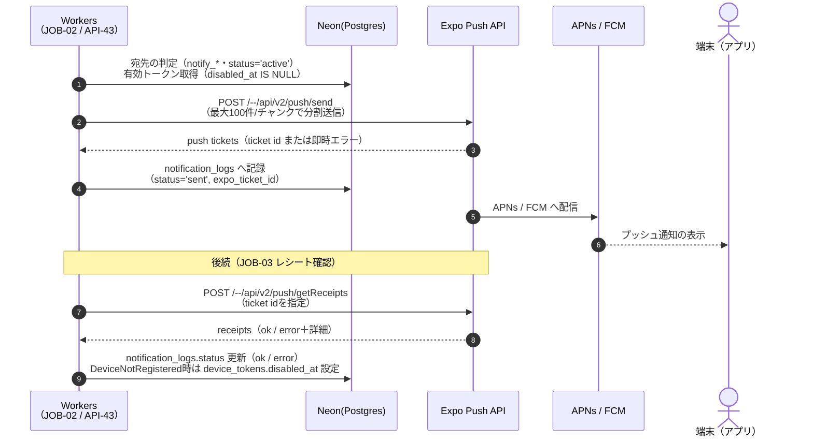
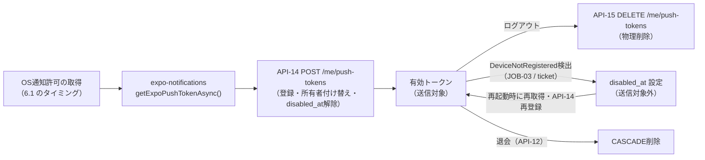

# 通知設計書

**プロダクト名:** まちびん
**サブタイトル:** 「おすすめ場所」ランダム交換サービス

---

## 改訂履歴

| 版数 | 改訂日 | 改訂者 | 改訂内容 |
| --- | --- | --- | --- |
| 1.0 | 2026-07-12 | Claude | 初版作成 |
| 1.1 | 2026-07-12 | Claude | BD-01改訂(即時配達方式)によりNT-01(交換成立)とNT-02(配達完了)を統合。JOB-01廃止に伴う配信アーキテクチャの整理 |

## 文書情報

| 項目 | 内容 |
| --- | --- |
| 文書名 | まちびん 通知設計書 |
| ステータス | ドラフト |
| 配信基盤 | Expo Push（expo-notifications） |
| 関連文書 | 01 要件定義書 FR-09、05 画面設計書、07 API設計書、08 バッチ・非同期処理設計書 |

---

## 1. はじめに

### 1.1 目的

本書は、まちびんのプッシュ通知（FR-09）の設計を定義する。通知の種別・トリガー・文面・ペイロード、配信アーキテクチャ、プッシュトークンのライフサイクル、OS権限・通知設定・ログ監視までを対象とし、実装の基準とする。

### 1.2 スコープ：プッシュ通知とアプリ内表示の役割分担

まちびんの状態伝達は、**プッシュ通知（アプリ外への割り込み）** と **アプリ内表示（ホーム・配達待ち画面等での状態提示）** の2層で行う。両者の役割分担を次のとおり定める。

| 手段 | 役割 | 代表例 |
| --- | --- | --- |
| プッシュ通知 | アプリを開いていないユーザーに、**本人宛ての出来事**が起きたことを知らせる | 交換成立・配達（NT-01）、リアクション着信（NT-03） |
| アプリ内表示 | アプリ利用中のユーザーに状態を提示する。**操作の直後に自明な情報はプッシュを送らずこちらで代替する** | 投函直後の即時配達（SCR-04 配達待ち画面→SCR-05への自動遷移）、ホームの配達状況（API-30） |

この分担に基づき、**API-20（投函）で交換抽選を行い候補が見つかった場合は、同一トランザクション内でスナップショット生成から配達確定（`delivered` 化）まで完了する（即時配達。BD-01）。この場合、ユーザーはアプリを操作中であるためプッシュ通知は送らない。** 投函時点で候補が0件のため `pending` のまま作成された交換のみが、JOB-02（非同期の再抽選ジョブ）の対象となる。JOB-02の再抽選で成立し配達が確定した場合に限り、プッシュ通知（NT-01）を送る（詳細は3.1）。

### 1.3 通知方針（Phase 1）

- 配信はすべて **Expo Push API（無料）** を用いる（02 アーキテクチャ設計書 §3.1）。トークンは ExpoPushToken であり、TBL-02 `device_tokens` で管理する。
- プッシュ通知は本人宛てのイベント通知（NT-01・NT-03）に限定する。**マーケティング・リテンション目的のプッシュ（「そろそろ投函しませんか」等）はPhase 1では送らない。** 検索・ランキング・レコメンドに依存しない「静かな偶然の出会い」という提供価値（01 要件定義書 §2.3）と整合させるためであり、通知もまた「本人宛てに届いた出来事」のみに限る。
- 通知文面には**差出人・リアクション者個人を特定できる情報を含めない**（NFR-PR02。ロック画面への表示も想定した文言とする）。

---

## 2. 通知一覧

| NT-ID | 名称 | トリガー | 宛先 | 設定フラグ（TBL-01） | 送信方式 | タップ時遷移先 |
| --- | --- | --- | --- | --- | --- | --- |
| NT-01 | 交換成立・配達通知 | `pending` だった交換が、JOB-02 の再抽選で成立し配達確定（`pending → delivered`）した瞬間のみ送信する（投函時に同期成立・即時配達した場合は送らない） | 投函者（=受信者） | `notify_delivery` | バッチ（JOB-02） | SCR-05 受信スポット詳細（該当アイテム） |
| NT-03 | リアクション通知 | API-43 でリアクションが付与されたとき（同期送信） | 対象スポットの投稿者 | `notify_reaction` | 同期（API-43） | SCR-11（自分の投函・リアクション確認） |

- **改訂経緯（1.1）**: 版数1.0では「交換成立通知（旧NT-01。`pending → scheduled`）」と「配達完了通知（旧NT-02。JOB-01による`scheduled → delivered`）」を別種としていた。BD-01改訂（即時配達方式）により、投函時に候補があれば投函と同一トランザクションで配達まで完了し、候補が0件の場合のみJOB-02の再抽選が交換成立と配達確定を同時に行う構成になったため、非同期経路で発生する通知は常に「交換成立」と「配達」が同時の出来事となった。よって両者を1つの通知（NT-01 交換成立・配達通知）に統合し、**NT-02は欠番**として以降のIDに再利用しない（3.1参照）。
- 通知IDはNT-01・NT-03の2種で固定とする（NT-02は欠番）。追加はNT-04以降として採番する（9章）。
- 「送信方式」のバッチ／同期は、Expo Push APIへの送信リクエストを発行する主体を指す（4章）。

---

## 3. 通知詳細

### 3.0 共通の抑制条件

すべての通知は、送信直前にサーバー側で次を判定し、いずれかに該当する場合は**送信しない**（クライアント側の出し分けには依存しない）。

| No | 抑制条件 | 判定方法 |
| --- | --- | --- |
| 1 | 設定フラグがOFF | TBL-01 `profiles.notify_*` が false（7章） |
| 2 | 有効トークンなし | TBL-02 `device_tokens` に `disabled_at IS NULL` のレコードがない（IX-14）。OS権限未許可・拒否のユーザーはトークン未登録のためここに含まれる |
| 3 | 対象ユーザーがactiveでない | TBL-01 `profiles.status <> 'active'`（suspended / withdrawn。CD-06） |

抑制した場合は通知ログ（TBL-10）にも記録しない（送信試行が発生しないため）。

### 3.1 NT-01 交換成立・配達通知

**トリガー条件**

- 交換（TBL-04）が **`pending` の状態から、JOB-02（マッチング再抽選ジョブ）の再抽選で成立し、同一ジョブ内で配達確定（`pending → delivered`。場所帳アイテム TBL-05 `collection_items` へのスナップショット生成を含む）まで完了した場合にのみ**送信する。すなわち、投函時点で抽選候補が0件だったために `pending` のまま作成された交換が、後日の非同期再抽選で相手が見つかり、その場で配達まで完了したケースである。
- **設計判断: API-20（投函）で交換抽選を行い候補が見つかった場合は、同一トランザクション内で配達まで完了する（即時配達。BD-01）。この場合はプッシュ通知を送らない。** 投函直後のユーザーはアプリを操作中であり、成立・配達はレスポンスとアプリ内表示（SCR-04の配達演出→SCR-05への自動遷移）で即時に伝わる。操作直後に同内容のプッシュを重ねるのは冗長であり、通知価値の希薄化（通知OFF誘発）を招くため、アプリ内表示で代替する（1.2の役割分担）。
- **改訂経緯（1.1）**: 版数1.0では「交換成立（`pending → scheduled`）」と「配達完了（`scheduled → delivered`。当時はJOB-01が担当）」を別の通知（旧NT-01／旧NT-02）としていた。BD-01改訂（即時配達方式）により、非同期経路（JOB-02の再抽選）で通知が発生する場合は交換成立と配達確定が常に同時に起きるようになったため、両者を本通知に統合した（2章参照）。旧NT-02は欠番とする。
- この結果、NT-01が届くのは「投函したときは候補がなかったが、後からJOB-02の再抽選で相手が見つかり配達された」ユーザーに限られる。アプリ外にいる本人に、新しい場所が届いたことを伝える価値が明確な場面であり、FR-09の通知要件はこの限定で満たすものとする。

**文面**

| 項目 | 内容 |
| --- | --- |
| title | まちびん |
| body | 新しい場所が届きました。ポストを開けてみましょう。 |

- 交換相手・割当スポットの内容・スポット名・差出人エリア等は文面に含めない（配達時の開封体験を損ねないため。差出人特定情報も含めない）。

**ペイロード仕様**

```json
{
  "to": "ExponentPushToken[xxxx]",
  "title": "まちびん",
  "body": "新しい場所が届きました。ポストを開けてみましょう。",
  "sound": "default",
  "channelId": "delivery",
  "data": { "type": "NT-01", "collectionItemId": "uuid" }
}
```

**タップ時遷移**

- `data.type = "NT-01"` を判定し、SCR-05（受信スポット詳細）を `collectionItemId` の該当アイテムで開く（API-41）。
- 版数1.0ではSCR-04（配達待ち画面）への遷移を定めていたが、即時配達方式への移行に伴い、本通知が送られるケースでは投函時のアプリ内表示（SCR-04）を経由しないため、1.1改訂でSCR-05への遷移に一本化した。

**抑制条件**

- 共通条件（3.0）のみ。なお受信者が退会済みの場合、交換自体が配達対象から除外されるため（06 §7.1）、本通知のトリガーに到達しない。
- 送信時点で対象交換が既に `delivered` として処理済み（二重送信）である場合は、4.2-7の冪等性制御により再送しない。

### 3.2 NT-03 リアクション通知

**トリガー条件**

- API-43（リアクション付与）の処理成功時に、**同期的に**送信する（バッチを経由しない）。Expo Push API呼び出しの失敗はAPI-43のレスポンスに影響させない（リアクション登録は成功として返し、送信失敗はログとSentryに記録する）。
- 宛先は**リアクションされたスポットの投稿者**（`collection_items.spot_id → spots.author_user_id` で解決）。
- **原本スポットが存在し、`author_user_id` が有効な場合のみ**送信する。原本が削除済み（`spot_id IS NULL` または `spots.status = 'deleted'`）、あるいは投稿者が退会し `author_user_id` がNULL化（匿名化）されている場合は送らない。

**文面**

| リアクション種別（CD-07） | title | body |
| --- | --- | --- |
| want_to_go | まちびん | あなたが投函した場所に「行ってみたい」が届きました。 |
| visited | まちびん | あなたが投函した場所に「行ってきた」が届きました。 |

- リアクションした受信者を特定できる情報（ニックネーム・エリア等）は文面・ペイロードのいずれにも含めない。報告コメントの本文も文面には載せず、アプリ内（SCR-11）でのみ表示する。

**ペイロード仕様**

```json
{
  "to": "ExponentPushToken[xxxx]",
  "title": "まちびん",
  "body": "あなたが投函した場所に「行ってきた」が届きました。",
  "sound": "default",
  "channelId": "reaction",
  "data": { "type": "NT-03", "spotId": "uuid", "reactionType": "visited" }
}
```

**タップ時遷移**

- `data.type = "NT-03"` を判定し、SCR-11（自分の投函・リアクション確認画面）へ遷移する。`spotId` で該当投函を表示する。

**抑制条件**

- 共通条件（3.0）に加え、上記のとおり原本スポットの削除・投稿者の退会（匿名化）時は送信しない。

### 3.3 ディープリンク遷移の実装方針

- 通知タップ時は expo-notifications のレスポンスリスナーで `data.type` を判定し、対応画面へ遷移する。フォアグラウンド受信時はOS通知を表示せず、アプリ内の状態更新（ホームの再取得等）で反映する。
- キル状態からの起動（コールドスタート）では、最終通知レスポンス（`getLastNotificationResponseAsync`）から遷移を復元する。
- URLスキーム／パス定義（expo-router）は 05 画面設計書の画面遷移定義に合わせて実装時に確定する。

---

## 4. 配信アーキテクチャ

### 4.1 全体フロー

送信主体（JOB-02 / API-43）は、宛先ユーザーの有効トークンを解決してExpo Push APIへ送信する。Expo PushがAPNs / FCMへの配信を仲介するため、**サーバー側はAPNs証明書・FCM鍵を直接管理しない**。JOB-01（旧・配達バッチ）はBD-01改訂（即時配達方式）により廃止した。配達確定はAPI-20の同期処理、またはJOB-02の非同期再抽選のいずれかで完結し、プッシュ通知（NT-01）はJOB-02が成立させたケースでのみ発生する（1.2、3.1参照。ジョブ構成の詳細は08 バッチ設計書）。



### 4.2 送信処理の規約

| No | 規約 | 内容 |
| --- | --- | --- |
| 1 | チャンク送信 | Expo Push APIの上限に合わせ、**1リクエスト最大100メッセージ**に分割して送信する（expo-server-sdkの`chunkPushNotifications`相当） |
| 2 | 複数端末対応 | 1ユーザーが複数の有効トークンを持つ場合、全トークンへ送信する。通知ログは**トークン（メッセージ）単位**で記録する |
| 3 | チケット記録 | 送信ごとに受領したticket idを TBL-10 `notification_logs.expo_ticket_id` に記録する（status='sent'）。ticket時点のエラー（トークン形式不正等）は status='error' として即時記録する |
| 4 | レシート確認 | **JOB-03**（レシート確認ジョブ）が、`status='sent'` のログ（IX-13）を対象にExpo Push APIのgetReceiptsを呼び出し、結果で status を `ok` / `error` に更新する。レシートは送信後15分程度で確定するため、JOB-03は送信ジョブと時間をずらして実行する（スケジュールは 08 バッチ設計書） |
| 5 | 無効トークンの失効 | ticket / receiptで **`DeviceNotRegistered`** を受領した場合、該当する TBL-02 `device_tokens.disabled_at` に検出日時を設定し、以降の送信対象から除外する（IX-14） |
| 6 | 再送しない | Phase 1では送信失敗（error）の自動再送は行わない。NT-01はアプリ内表示（ホーム・場所帳）で内容自体は確認できるため、失敗はログ・監視（8章）で把握するに留める |
| 7 | 冪等性 | バッチ起点の通知（NT-01。JOB-02）は、同一 `exchange_id` × `type` の送信済みログが存在する場合は再送しない（バッチ再実行時の二重通知防止。08 バッチ設計書の冪等性方針に従う） |

---

## 5. トークンライフサイクル

### 5.1 ライフサイクル全体



### 5.2 各場面の挙動

| 場面 | 挙動 |
| --- | --- |
| 取得・登録 | OS通知許可の取得後（6.1）、`getExpoPushTokenAsync()` でExpoPushTokenを取得し、API-14で登録する。以降も**アプリ起動（フォアグラウンド復帰を含む）ごとに再取得し、前回登録値と異なる場合はAPI-14で再登録**する（トークンローテーション対応。ExpoPushTokenは再インストール・OS更新等で変わり得る） |
| 端末の使い回し | API-14は既登録トークンの所有者を現ユーザーに付け替え、`disabled_at` を解除する（07 §API-14。同一端末での別アカウントログインで前ユーザーに誤送信しない） |
| ログアウト | API-15で当該端末のトークンを削除してからClerkセッションを破棄する。API-15の失敗時もログアウト自体は継続し、残存トークンは所有者付け替え（上記）またはDeviceNotRegistered失効で解消する |
| 権限拒否時 | トークンを取得・登録しない（サーバーには何も送らない）。アプリは通常どおり利用可能とし、配達・リアクションはアプリ内表示のみで伝える。SCR-08にOS設定への導線を置き、再許可後の起動時に取得・登録を行う |
| 失効と復帰 | `disabled_at` が設定されたトークンは送信対象外。同一端末でプッシュが再び有効になった場合は、起動時の再登録（API-14）で `disabled_at` が解除される |
| 退会 | API-12の退会処理で `device_tokens` はCASCADE削除される（06 §7.1） |

---

## 6. OS権限・チャネル設計

### 6.1 通知許可のリクエストタイミング

**通知許可は初回起動直後には要求せず、「初回投函の完了直後」（SCR-04 配達待ち画面の初回表示時）に要求する。**

- 文脈のない初回起動直後の許可要求は拒否されやすい。一方、初回投函の直後は「交換した場所がいつ届くか知りたい」という動機が最も強い瞬間であり、「配達をお知らせするために通知を許可してください」という要求理由が自明である。**許可率向上のためのUX判断**として本タイミングを採用する。
- 要求前に、配達待ち画面上でプレプロンプト（要求理由の説明とボタン）を表示してからOSダイアログを出す。プレプロンプトで「あとで」を選んだ場合はOSダイアログを出さず、SCR-08（通知設定）から再度要求できるようにする。
- 許可取得後にトークン登録（5.2）を行う。

### 6.2 Android：通知チャネル

Android 8.0以降の通知チャネルを次の2つで構成する。チャネルは**通知許可の要求前に作成**する（Android 13以降のPOST_NOTIFICATIONSランタイム許可の前提。expo-notificationsの`setNotificationChannelAsync`で作成）。

| チャネルID | 表示名 | importance | 対象通知 | 意図 |
| --- | --- | --- | --- | --- |
| delivery | 配達 | HIGH（音あり・バナー表示） | NT-01 | コア体験（配達）の通知。確実に気づかせる |
| reaction | リアクション | DEFAULT（音あり・バナーなし） | NT-03 | 嬉しいが緊急性は低い。控えめに届ける |

- ユーザーはOS設定でチャネル単位のON/OFFが可能。アプリ内トグル（7章）とは独立に作用する。

### 6.3 iOS：許可オプション

- 要求する許可は **alert ＋ sound** とする。
- **badgeはPhase 1では使用しない**（許可要求にも含めない）。未開封の配達はホーム画面（SCR-02）とアプリ内表示で伝える。バッジ運用（未開封数の同期・クリア制御）はPhase 2以降で検討する（9章）。

---

## 7. 通知設定

SCR-08（プロフィール画面内の通知設定）のトグルと、TBL-01 `profiles` の列、API-13（PUT /me/notification-settings）のフィールドは次のとおり対応する。**既定はすべてON**（06 §TBL-01 の既定値 true）。

| SCR-08 トグル表示 | API-13 フィールド | TBL-01 列 | 対象通知 | 既定 |
| --- | --- | --- | --- | --- |
| 配達のお知らせ | `delivery` | `notify_delivery` | NT-01 | ON |
| リアクションのお知らせ | `reaction` | `notify_reaction` | NT-03 | ON |

- **1通知＝1フラグの原則**により、NT-01（交換成立・配達通知）への統合に伴い「交換成立のお知らせ」トグルは廃止し、NT-01の送信可否は `notify_delivery` のみで判定する。
- `notify_exchange`（TBL-01列／API-13の`exchange`フィールド）は、Phase 1では送信可否判定（3.0）に用いない。旧NT-01（交換成立）が独立した通知として復活する場面、すなわち9章で述べる朝夕ウィンドウ配達モード（定期便）復活時に「交換成立」と「配達」が再び別々の出来事になった場合の再利用を見込んで、列・フィールド自体は残置する想定とする（列削除の要否・移行手順は06 データベース設計書の判断に委ねる）。
- 判定は**送信直前にサーバー側で行う**（3.0）。トグル変更（API-13）は即時に反映され、変更前に発行済みのチケットには影響しない。
- 本トグルはプッシュ通知の送信可否のみを制御する。アプリ内表示（ホームの配達状況・場所帳・リアクション一覧）はトグルOFFでも表示される。
- OSレベルで通知が拒否されている場合、トグルがONでもプッシュは届かない。SCR-08ではOS権限の状態を検出し、拒否時は注意表示とOS設定への導線を示す（5.2）。

---

## 8. ログ・監視

### 8.1 notification_logs（TBL-10）の記録内容

| 記録項目 | 内容 |
| --- | --- |
| 記録単位 | Expo Pushへ送信したメッセージ（＝トークン）単位で1レコード。複数端末ユーザーは通知1件で複数レコードになる |
| user_id / type | 宛先ユーザーと通知種別（NT-01・NT-03。NT-02は1.1改訂での統合により欠番） |
| exchange_id | 関連する交換。NT-01は対象交換、NT-03はリアクション対象の交換を記録する（リアクション・スポットはexchange経由で解決可能） |
| expo_ticket_id | 送信時に受領したチケットID。JOB-03のレシート照会キー |
| status | `sent`（チケット受領）→ `ok`（レシートok）／`error`（チケット即時エラーまたはレシートerror） |
| error_detail | エラー詳細（`DeviceNotRegistered`、`MessageRateExceeded` 等のレシートdetails） |

- 抑制（3.0）により送信しなかった通知は記録しない。
- 保持期間は90日とし、JOB-04（クリーンアップジョブ）で削除する（06 §7.2）。

### 8.2 監視

| 監視項目 | 方法 | 対応 |
| --- | --- | --- |
| 送信失敗率 | `notification_logs` の `status='error'` 比率を日次で集計（type別）。しきい値（初期値: 5%。運用調整）超過で検知 | Sentryへイベント送信しアラート化。error_detailの内訳（DeviceNotRegistered偏重か、それ以外か）で切り分ける |
| Expo Push API呼び出し失敗 | 送信・レシート照会のHTTPエラー／例外をSentryへ送信（02 §9.5） | リトライはJOB側の再実行に委ねる（冪等性は4.2-7で担保） |
| 無効トークン率 | `device_tokens` の `disabled_at` 設定件数の推移をDB集計 | 急増時はアプリ側のトークン再登録処理（5.2）の不具合を疑う |
| バッチ実行の成否 | JOB-02/03の実行結果監視（08 バッチ設計書） | 失敗時はSentry通知。NFR-O04に対応 |

- 通知ログは効果測定（NT-01（交換成立・配達通知）からの開封率等）には利用しない（Phase 1では計測しない。行動計測の拡張は9章）。

---

## 9. 拡張方針（Phase 2以降）

| 対象 | 方針 |
| --- | --- |
| 通知種別の追加 | **NT-04以降として採番**し、本書2章・3章に追記する（NT-02は欠番のため再利用しない）。候補: お題開始通知（FR-12。週替わりテーマの開始時）、旅先モード関連通知（FR-13）。追加時は対応する `profiles.notify_*` 列とSCR-08トグル、Androidチャネルの割当をセットで定義する |
| 朝夕ウィンドウ配達モード（定期便）の復活 | Phase 1はBD-01（即時配達方式）のみだが、距離連動の可変遅延配達等（下記）でPhase 2以降に朝夕ウィンドウ配達（`scheduled` 状態を用いた遅延配達）を再導入する場合、「交換成立」と「配達確定」が再び時間的に分離した別の出来事になり得る。その際は本書のNT-01を再び「交換成立」と「配達完了」の2通知に分割することを検討し、**現在Phase 1では未使用として残置している `notify_exchange`（7章）を交換成立通知向けに再度用いる**。分割時のNT-ID採番・トリガー・チャネル割当は本改訂時点のNT-01の内容を土台に再定義する |
| 配達演出の高度化 | 距離に応じた配達所要時間（FR-05のPhase 2拡張）導入時も、「配達確定時に送信する」という通知トリガーの位置づけ自体は変えない（配達確定処理をAPI-20の同期処理・JOB-02のいずれが担っても、確定直後に送信する構成は共通とする）。「配達中」の中間通知は通知過多を招くため原則追加しない |
| バッジ（iOS） | 未開封の配達数のバッジ表示を検討。導入時は許可オプションへのbadge追加とクリア制御（開封時・起動時）を設計する（6.3） |
| リッチ通知 | 画像投稿（02 §12）導入時に、NT-01への画像添付（通知サービス拡張）を検討する |
| メール通知 | **メールによる通知は当面導入しない**（Phase 1の認証はGoogle・Appleのソーシャルログインのみでありメール送信自体が発生しない。Resendは将来のトランザクションメール用の予約である。03 §1）。配達・リアクションのメール通知は、プッシュとアプリ内表示で十分であり、受信箱への割り込みは「静かな体験」の方針（1.3）に反するため導入しない。休眠ユーザー向けメール等を将来検討する場合も、要件2.3の提供価値との整合を必須条件とする |
| マーケティング通知 | Phase 2以降で導入を検討する場合も、オプトイン（既定OFF）の専用フラグ・専用チャネルを新設し、既存の各通知種別（NT-01・NT-03）と混在させない |

---

*本書はドラフトであり、実装（expo-notifications / Expo Push APIの仕様）と乖離があれば本書を改訂する。文面・しきい値等の運用値は 04 機能設計書の設定パラメータ一覧に従い調整可能とする。*
