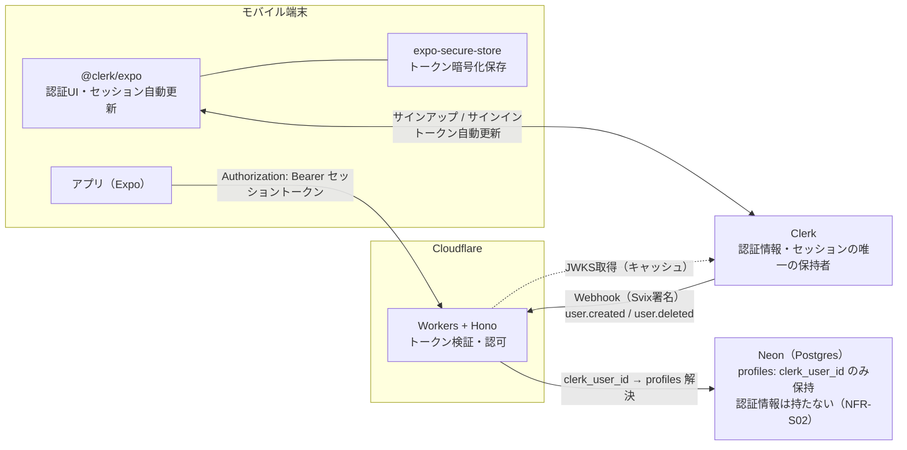
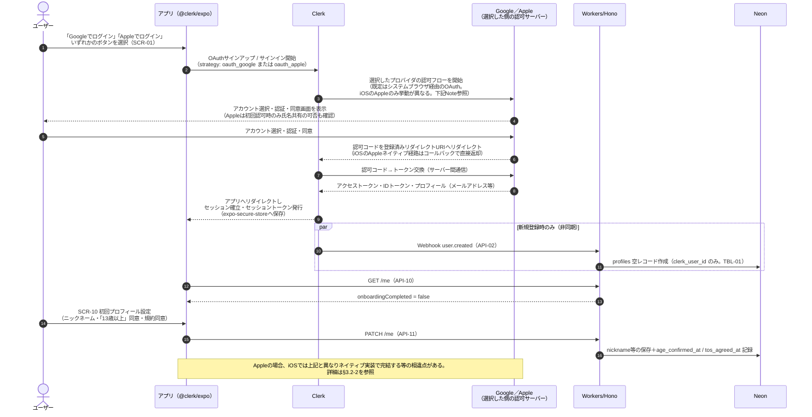
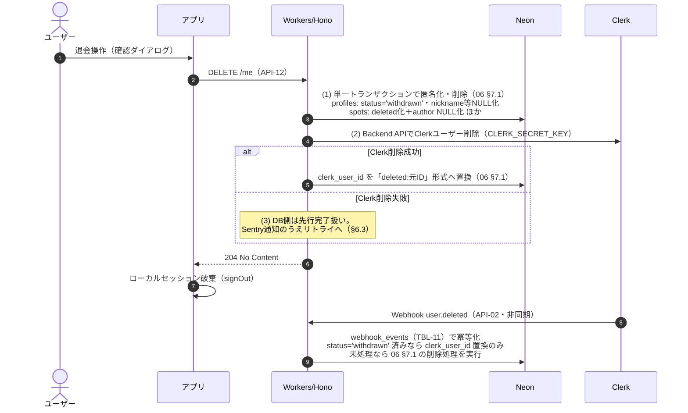

# 認証・認可設計書

**プロダクト名:** まちびん
**サブタイトル:** 「おすすめ場所」ランダム交換サービス

---

## 改訂履歴

| 版数 | 改訂日 | 改訂者 | 改訂内容 |
| --- | --- | --- | --- |
| 1.0 | 2026-07-12 | Claude | 初版作成 |
| 1.1 | 2026-07-12 | Claude | BD-02改訂によりメールOTPを廃止しGoogleソーシャルログインのみへ変更。Sign in with Apple併設義務（iOS）をリスクとして明記。BD-08未成年者の保護者同意論点を追加 |
| 1.2 | 2026-07-12 | Claude | BD-02再改訂によりAppleソーシャルログインを追加し、Phase 1の認証手段をGoogle・Appleの2択に変更。旧RISK-05（Sign in with Apple未対応）を解消 |
| 1.3 | 2026-07-25 | Claude | §7.2にsuspended時の画面誘導（05 SCR-12）への参照を追加し、閲覧系APIも403対象である旨を明記 |

## 文書情報

| 項目 | 内容 |
| --- | --- |
| 文書名 | まちびん 認証・認可設計書 |
| ステータス | ドラフト |
| 認証基盤 | Clerk（クライアント: `@clerk/expo`、サーバー: Cloudflare Workers上でセッショントークン検証） |
| 関連文書 | 02 アーキテクチャ設計書 §3.2・§5.3、06 データベース設計書、07 API設計書、11 プライバシー・データ保護設計書 |

---

## 1. はじめに

### 1.1 目的

本書は、まちびんの認証（本人確認・セッション管理）および認可（ロール・リソースアクセス制御）の設計を定義する。認証基盤にはClerkを採用し（02 §3.2）、トークンの発行・ローテーション・認証情報の保管はClerkに一任する。本書では、アプリ・Cloudflare Workers・Neonの各層がClerkとどう連携するか、および認可の判定規則を定める。

### 1.2 スコープ

| 区分 | 内容 |
| --- | --- |
| 対象 | サインアップ／サインイン、セッション管理、APIでのトークン検証、退会フロー、ロールと認可マトリクス、Webhook認証、Bot対策、シークレット管理 |
| 対象外 | 位置情報のプライバシー保護（11 プライバシー設計書）、プッシュ通知の設計（09 通知設計書）、退会時の各テーブル別データ処理の定義（06 §7.1。本書はフローと順序のみ扱う） |

### 1.3 用語定義

| 用語 | 定義 |
| --- | --- |
| セッショントークン | Clerkが発行する短命のJWT（既定の有効期間60秒）。APIコール時に`Authorization`ヘッダーへ付与する。`@clerk/expo`が自動更新する |
| OTP | One-Time Password。メールで送付される確認コード。**Phase 1では不使用**（BD-02改訂によりメールOTP認証は廃止し、ソーシャルログインのみを採用。旧版1.0時点の唯一の認証手段だった） |
| Google OAuth（ソーシャルログイン） | Googleアカウントの認証情報を用いてClerk経由でサインアップ／サインインする方式。Phase 1で採用する2つの認証手段の1つ（BD-02） |
| Sign in with Apple | Appleアカウントの認証情報を用いてClerk経由でサインアップ／サインインする方式。Phase 1で採用する2つの認証手段の1つ（BD-02再改訂）。Googleのようなシステムブラウザ経由のOAuthではなく、iOSネイティブのAuthenticationServicesフレームワーク（`ASAuthorizationController`）で完結する点が異なる（§3.2）。Androidでは同フレームワークが利用できないため、Web版OAuthフローにフォールバックする（§3.2） |
| JWKS | JSON Web Key Set。セッショントークンの署名検証に用いる公開鍵セット。ClerkのFrontend APIが公開する |
| MRU | Monthly Returning Users（月間復帰ユーザー）。Clerkの課金単位（02 §3.2） |
| Svix | ClerkがWebhook配信に利用する基盤。`svix-id`等の署名ヘッダーを付与する |
| publicMetadata | Clerkユーザーに付与できる公開メタデータ。管理者ロールの判定に使用する（BD-04） |
| クロックスキュー | 検証者と発行者の時計のずれ。`exp`/`nbf`検証時に一定の許容を設ける |

---

## 2. 認証方式の全体像

### 2.1 構成

認証情報（Google／Appleいずれかのプロフィールから取得したメールアドレス・OAuth連携情報・セッション）は**Clerkのみが保持**し、自社DB（Neon）には一切持たない。DB側はClerkが払い出す`clerk_user_id`を`profiles`（TBL-01）に持つのみである。これによりNFR-S02（認証情報の保護）を、ハッシュ化等の自前実装なしに満たす（02 §7）。この方針はBD-02（認証手段をGoogle・Appleのソーシャルログインとする変更）の前後で変わらない。

### 2.2 各層の責務

| 層 | 責務 |
| --- | --- |
| `@clerk/expo`（アプリ） | サインアップ／サインインUI、セッショントークンの保持・自動更新。トークンは`expo-secure-store`（iOS Keychain / Android Keystore）で暗号化保存する |
| Clerk | 認証情報の保管、Google／Apple OAuth連携によるサインアップ／サインイン処理、セッション管理、トークン発行・ローテーション、不正ログイン検知、Botサインアップ抑止 |
| Workers（API） | セッショントークンの検証（§5）、`profiles`解決、ロール・ステータスに基づく認可（§7）、Webhook署名検証（§8） |
| Neon | アプリ固有データの保持。認証に関しては`profiles.clerk_user_id`と`status`のみが関与する |

### 2.3 Phase 1の認証手段（BD-02）

- **Google・Appleの2つのソーシャルログイン**とする。Clerkダッシュボードで**Google OAuthとApple OAuthの両方**を有効化する。
  - Google: OAuthクライアントの発行元はGoogle Cloud Console。Clerk側に認証情報を登録する。
  - Apple: Apple Developer Programにて、Sign in with Apple用の**App ID設定（Capability有効化）とServices IDの発行**、および認証キーの作成が必要。発行した認証情報をClerk側に登録する。
- サインアップ・サインインは「**Googleでログイン**」「**Appleでログイン**」の**2つのボタン**で完結する。パスワード入力欄・メールOTP確認コード入力欄は画面上に一切存在しない。
- **パスワード・メールOTP・マジックリンク・パスキーはPhase 1では提供しない**（旧版1.0はメールOTPのみを前提としていたが、BD-02改訂により全面的に置き換える。将来の拡張は§12）。
- 登録時、Clerkはユーザーが選択したプロバイダ（Google／Apple）のプロフィールからメールアドレスを取得して保持する。取得した認証情報は引き続き**Clerkのみが保持**し、Neonには一切保存しない（NFR-S02。§2.1の既存方針は変更なし）。氏名・アバター画像等のプロフィール情報も、アプリのプロフィール（`profiles`）へは転記しない（ニックネーム等はSCR-10でユーザーが別途入力する。匿名志向の方針・02 §3.2と整合）。
- 収集する情報がメールアドレスのみである点は変わらないため、要件（FR-01「最小限の情報」）との整合も維持される。
- **Appleのプライバシー機能に関する注記。** Appleは「メールを非公開」オプションを提供しており、ユーザーがこれを選択した場合、実在のメールアドレスの代わりに**プライベートリレーアドレス**（`@privaterelay.appleid.com`形式）がClerkへ渡される。まちびんはメールアドレスを認証目的以外に用いないため、この場合も動作に支障はない。また、Appleは氏名情報を**初回の認可時にのみ**返却し、以降の再ログインでは返却しない仕様のため、Clerkは初回取得時の情報を内部で保持する。まちびんはニックネームをSCR-10で別途入力させる方針のため、この氏名情報自体は利用しない。

> **iOS審査対応（App Store審査ガイドライン4.8 Login Services）:** サードパーティのソーシャルログインをiOSアプリで提供する場合、同ガイドラインによりSign in with Appleの併設が求められるところ、**Phase 1からGoogleに加えてAppleログインを提供することで、この要件に対応する**（旧版1.1でRISK-05として記録していた未対応課題は、本改訂により解消。§11）。対応にあたっては、**iOSでは「Googleでログイン」「Appleでログイン」の両ボタンを同等以上の視認性・操作性で提供する必要がある**点に留意する（05 画面設計書 SCR-01）。

---

## 3. サインアップ／サインインフロー

### 3.1 フロー

### 3.2 補足事項

1. **新規・既存の判定はClerk側で行う。** 既存ユーザーのサインインも同一のUIフロー（「Googleでログイン」または「Appleでログイン」→選択したプロバイダ側での認証・同意→Clerkセッション確立）であり、アプリは両者を区別する実装を持たない。既存ユーザーの場合、図中の`user.created` Webhookと初回設定（SCR-10）はスキップされる。同一のGoogleまたはAppleアカウントでの再ログインは、Clerk側でそのプロバイダの外部アカウントIDに紐づく既存のClerkユーザーへ解決される。
2. **プロバイダ認証・同意はアプリ外の認可フローで行う（Apple／iOSは例外）。** `@clerk/expo`のOAuthフロー（`useOAuth`等。`strategy: 'oauth_google'`または`'oauth_apple'`）が、既定では端末のシステムブラウザ（iOS: `ASWebAuthenticationSession`、Android: Custom Tabs）を起動してプロバイダの認証・同意画面へ遷移する。同意完了後、事前にプロバイダ／Clerkへ登録済みのリダイレクトURI（カスタムスキーム）でアプリへ復帰し、Clerkがセッションを確立する。**アプリ自身がGoogle・Appleいずれのパスワード等の認証情報を扱うことは一切ない。** ただしAppleのみ、プラットフォームにより経路が分岐する。
   - **iOS:** システムブラウザ経由のOAuthではなく、**ネイティブのAuthenticationServices（`ASAuthorizationController`）**で完結する。ブラウザ遷移を伴わないため、Googleより認証体験（画面遷移・待ち時間）が短い。
   - **Android:** ネイティブの Sign in with Apple SDK が存在しないため、Googleと同様に**Clerkが提供する汎用OAuth Webフロー**（システムブラウザ経由）にフォールバックする。
   - **氏名情報の扱い:** Appleは氏名情報を**初回の認可時にのみ**返却し、以降の再ログインでは返却しない。Clerkは初回取得時の情報を内部に保持することでこれに対応する。まちびんはニックネームをSCR-10で別途入力させる方針のため、この氏名情報自体は利用しない（§2.3）。
3. **ユーザーがプロバイダ側で同意をキャンセル・拒否した場合、あるいは認可フローが失敗した場合。** アプリはSCR-01へ留まり、サインアップ／サインインが未完了である旨を案内する（自動リトライはしない。ユーザーが再度いずれかのボタンを押下する）。
4. **年齢確認（BD-03）はClerkの機能・プロバイダのプロフィールのいずれにも依存しない。** 生年月日はGoogle・Appleいずれのプロフィールからも取得・収集せず、初回プロフィール設定（SCR-10）での「13歳以上」同意チェックを`profiles.age_confirmed_at`に記録する。API-10の`onboardingCompleted`が`false`の間、アプリは初回設定画面から先へ進ませない。
5. **Webhook到達遅延への備え（レース対策）。** `user.created` Webhookは非同期であり、アプリの初回APIコール（API-10）が先着し得る。トークン検証後に`profiles`が未作成の場合、APIは**オンデマンドで空レコードを作成**する（`clerk_user_id`のUNIQUE制約＋`ON CONFLICT DO NOTHING`でWebhookとの二重作成を防止）。これにより`profiles`作成の一次経路はWebhook、二次経路はオンデマンド作成の二重化となる。この挙動はGoogle・Appleいずれのサインアップでも共通である。

### 3.3 未成年者の保護者同意に関する論点（BD-08）

年齢確認の方針自体（BD-03: 生年月日を収集せず「13歳以上」の自己申告のみとする）は変更しない。その上で、規約同意の実効性について次の論点と対処方針を定める。

| 項目 | 内容 |
| --- | --- |
| 論点 | 2022年4月施行の民法改正により成年年齢が18歳へ引き下げられたため、13〜17歳のユーザーは法律上の未成年者にあたる。未成年者が法定代理人（保護者）の同意なく利用規約に同意（＝契約）した場合、民法5条により本人または保護者が事後にその同意を取り消し得る |
| 対処方針 | **利用規約に「未成年者は保護者の同意を得た上で利用すること」という一文を追加する。** システム上の実装変更は行わず、規約文言の追加のみで対応する |
| SCR-10との関係 | 規約同意チェック（`tos_agreed_at`に記録。§3.2-4）は、上記一文を含む改訂後の利用規約への同意として扱う。同意チェック自体のUI・データ項目に変更はない |
| 残存リスク | 保護者が実際に同意しているかをシステム的に検証する手段は持たないため、本対処は取消しリスクを完全には排除しない。取消し事案が発生した場合の運用対応、および将来的にシステム的な保護者同意取得が必要かどうかは、運用実績を踏まえて改めて検討する（§12） |

---

## 4. セッション管理

### 4.1 トークンのライフサイクル

| 項目 | 内容 |
| --- | --- |
| トークン形式 | Clerkセッショントークン（短命JWT。既定の有効期間60秒） |
| 更新 | `@clerk/expo`が自動更新する。アプリ側にリフレッシュ実装は持たない（02 §5.3） |
| 保存場所 | `expo-secure-store`（iOS Keychain / Android Keystore）。アプリ独自のストレージ（AsyncStorage等）にトークンを複製しない |
| APIコール時 | 毎回`getToken()`で最新トークンを取得し、`Authorization: Bearer <token>`ヘッダーに付与する。トークンを変数等に長期キャッシュしない |
| セッション自体の有効期限 | Clerkの既定値に従う（非アクティブ期限・絶対期限ともClerkダッシュボードで管理） |

### 4.2 ログアウト（失効）

ログアウト時は次の順で処理する。

1. **API-15（DELETE /me/push-tokens）**で当該端末のプッシュトークンを削除する（トークンが有効なうちに先に実行する。09 通知設計書）。
2. `@clerk/expo`の`signOut()`でClerkセッションを終了する。以降、当該セッションのトークンは発行されない。
3. `expo-secure-store`上のトークンはSDKが破棄する。

短命JWTのため、発行済みトークンは失効後も最長60秒程度は検証を通過し得る。この残存時間は許容する（被害範囲は自分のリソース参照に限られる）。

### 4.3 複数端末

- 同一アカウントの**複数端末での同時サインインは許容**する（Clerkのマルチセッションの既定動作）。
- 端末ごとに`device_tokens`（TBL-02）を登録し、通知は有効な全端末に配信する。
- 運営処分等でセッションを強制失効させる場合は、Clerkダッシュボードから当該ユーザーのセッションを終了（またはロック）できる。ただしアカウント停止（suspended）の実効性はAPI側の認可（§7）で担保し、Clerk側操作には依存しない。

---

## 5. APIでのトークン検証

### 5.1 検証手順

Workersの認証ミドルウェア（Hono）は、認証必須APIへのリクエストに対し次の順で検証する。実装は`@clerk/backend`（または`jose`＋JWKS）を用いる。

| 手順 | 内容 | 失敗時 |
| --- | --- | --- |
| 1 | `Authorization: Bearer`ヘッダーからトークンを抽出 | 401 UNAUTHORIZED |
| 2 | JWKSで署名検証（RS256。鍵は§5.2のキャッシュから取得） | 401 UNAUTHORIZED |
| 3 | クレーム検証: `iss`（自インスタンスのClerk Frontend API URL）、`azp`（許可したauthorized partiesに一致）、`exp`/`nbf`（クロックスキュー許容: 5秒） | 401 UNAUTHORIZED |
| 4 | `sub`クレームから`clerk_user_id`を取得 | 401 UNAUTHORIZED |
| 5 | `profiles`を`clerk_user_id`で解決し、`profiles.id`をコンテキストへ設定。未作成ならオンデマンド作成（§3.2-5） | — |
| 6 | ユーザーステータス確認: `withdrawn`は**401 UNAUTHORIZED**（退会済みを秘匿し、無効トークンと区別しない）、`suspended`は認可マトリクスの制限付きで続行（§7.3）、`active`は通常続行 | 401 / 403 |
| 7 | `role`クレーム（§7.1）をコンテキストへ設定 | — |

- 検証失敗の応答は一律`401 UNAUTHORIZED`とし、失敗理由の詳細（署名不正・期限切れ等）はレスポンスに含めない（内部ログのみ）。エラー形式は07 §1.3に従う。
- トークン文字列そのものをログ・Sentryに出力しない（§11）。

### 5.2 JWKSのキャッシュ方針

| 項目 | 方針 |
| --- | --- |
| 取得元 | ClerkインスタンスのJWKSエンドポイント（`/.well-known/jwks.json`） |
| キャッシュ | Workersのisolateメモリ＋Cache APIに保持。TTLは1時間を目安とする |
| 未知の`kid` | トークンの`kid`がキャッシュに無い場合は即時再取得する（Clerk側の鍵ローテーション追従） |
| 取得失敗時 | TTL内の旧キャッシュがあれば継続使用する（Clerk障害時の検証継続性。§11 RISK-01） |

---

## 6. 退会フロー

### 6.1 処理順序の設計

退会（API-12）は「**DB側の匿名化・削除を先行**し、その後にClerkユーザーを削除する」順序とする（BD-06、NFR-PR05）。

- DB先行の理由: ユーザーデータの削除（NFR-PR05）を確実に完了させるため。逆順（Clerk先行）では、認証手段を失った後にDB処理が失敗した場合、本人が再サインインして削除を完了させる手段がなくなる。
- Clerk削除が失敗しても、本人のアプリデータはDBから既に削除・匿名化済みであり、残るのはClerk上の認証情報（メールアドレス）のみである。これはリトライで解消する。

### 6.2 フロー

### 6.3 Clerk削除失敗時のリトライと冪等性

- API-12はDBトランザクション完了時点で退会成立とみなし、Clerk削除の成否に関わらず`204`を返す。失敗はSentryへ通知する。
- 失敗した`clerk_user_id`はリトライ対象とする。リトライは(a)クリーンアップジョブ（JOB-04）での再試行、(b)運営がClerkダッシュボードから手動削除、のいずれでもよい。(b)の場合も`user.deleted` Webhookで下記の合流処理が走る。
- リトライ完了までの間、当該ユーザーのトークンは署名上有効だが、`status='withdrawn'`のため全APIで401となる（§5.1手順6）。
- **冪等性の担保:**
  - **Webhookの再送**は`webhook_events`（TBL-11）への`svix-id`記録で排除する（§8）。
  - **API-12起点とWebhook起点の重複**は`profiles.status`によるステータスガードで排除する。`user.deleted`受信時に`status='withdrawn'`であれば削除処理済みと判定し、`clerk_user_id`の置換（未置換の場合）のみ行う。

### 6.4 Clerkダッシュボード起点の削除

運営がClerkダッシュボードでユーザーを削除した場合も、`user.deleted` Webhook（API-02）を受けて**API-12と同一の削除処理（06 §7.1）に合流**する。この場合はステータスガードに掛からない（`status`が`withdrawn`以外）ため、Webhookハンドラ内で匿名化・削除の全処理を実行する。

---

## 7. 認可設計

### 7.1 ロール定義（BD-04）

| ロール | 付与方法 | 想定 |
| --- | --- | --- |
| user | 既定。サインアップしたすべてのユーザー | 一般ユーザー |
| admin | Clerkダッシュボードで`publicMetadata.role = 'admin'`を**手動設定** | 運営者（Phase 1では開発者本人のみ） |

- **DB側にロール列は持たない**（TBL-01）。ロールはClerkのセッショントークンのカスタムクレームで判定する。Clerkダッシュボードのセッショントークンカスタマイズで `{"role": "{{user.public_metadata.role}}"}` を設定し、Workers側は`role`クレームが`'admin'`かどうかのみを見る。
- 付与・剥奪はClerkダッシュボード操作のみで完結する（管理者管理のためのAPIや画面は作らない）。`publicMetadata`変更は次回発行されるトークンから反映される（短命JWTのため実質1分以内）。
- adminも通常ユーザーと同様に`profiles`レコードを持ち、userの全操作を行える。

### 7.2 リソースアクセスの原則

1. **自分のリソースのみ。** すべてのuser向けAPIは、トークンから解決した`profiles.id`を検索キーに含める。パスパラメータのIDが他人のリソースを指す場合も**404 NOT_FOUND**を返し、リソースの存在自体を秘匿する（07 §1.3）。403は返さない（IDの実在が推測できるため）。
2. **ステータスによる制限。** `active`は全user APIを利用可。`suspended`（運営処分）は**API-10（自分の状態確認）・API-12（退会）・API-15（ログアウト時のプッシュトークン削除）のみ**許可し、他は`403 ACCOUNT_SUSPENDED`（ホーム・場所帳等の閲覧系APIも含む）。`withdrawn`は全APIで401（§5.1）。クライアント側はAPI-10の`status`フィールド（07 API-10）でsuspendedを検知し、専用画面へ誘導する（05 SCR-12）。
3. **admin APIはロールのみで判定。** `role='admin'`でない場合は`403 FORBIDDEN`。admin APIは他ユーザーのリソースを対象とするため原則1の例外だが、操作は07 §3に定義されたステータス変更等に限る。

### 7.3 認可マトリクス

07 §2の全エンドポイントについて、ロール・ステータス別の可否を定める。

| API-ID | エンドポイント | 未認証 | user（active） | user（suspended） | admin |
| --- | --- | --- | --- | --- | --- |
| API-01 | GET /health | ○ | ○ | ○ | ○ |
| API-02 | POST /webhooks/clerk | ※1 | ※1 | ※1 | ※1 |
| API-10 | GET /me | × | ○ | ○ | ○ |
| API-11 | PATCH /me | × | ○ | × | ○ |
| API-12 | DELETE /me | × | ○ | ○ | ○ |
| API-13 | PUT /me/notification-settings | × | ○ | × | ○ |
| API-14 | POST /me/push-tokens | × | ○ | × | ○ |
| API-15 | DELETE /me/push-tokens | × | ○ | ○ | ○ |
| API-20 | POST /spots | × | ○ | × | ○ |
| API-21 | GET /me/spots | × | ○ | × | ○ |
| API-30 | GET /home | × | ○ | × | ○ |
| API-40 | GET /collection | × | ○ | × | ○ |
| API-41 | GET /collection/{id} | × | ○ | × | ○ |
| API-42 | PATCH /collection/{id} | × | ○ | × | ○ |
| API-43 | POST /collection/{id}/reactions | × | ○ | × | ○ |
| API-50 | POST /reports | × | ○ | × | ○ |
| API-60 | POST /admin/seed-spots | × | × | × | ○ |
| API-61 | GET /admin/reports | × | × | × | ○ |
| API-62 | PATCH /admin/reports/{id} | × | × | × | ○ |
| API-63 | PATCH /admin/spots/{id} | × | × | × | ○ |
| API-64 | PATCH /admin/users/{id} | × | × | × | ○ |

- ※1: ユーザー認証ではなく**Svix署名検証**で保護する（§8）。セッショントークンでの呼び出しは想定しない。
- ×の応答: 未認証＝`401 UNAUTHORIZED`、suspendedの制限＝`403 ACCOUNT_SUSPENDED`、非adminによるadmin API＝`403 FORBIDDEN`（いずれも07 §1.3）。
- ○でも、他人のリソースIDを指定した場合は`404 NOT_FOUND`（§7.2-1）。

---

## 8. Webhook認証（API-02）

ClerkのWebhook（`user.created` / `user.deleted`）はSvix経由で配信される。ユーザーのセッショントークンとは独立した、以下の検証を行う。

### 8.1 Svix署名検証の手順

1. `svix-id`・`svix-timestamp`・`svix-signature`の3ヘッダーを取得する。欠落時は`400`を返す。
2. `CLERK_WEBHOOK_SIGNING_SECRET`（§10）を鍵として、`svix-id`・`svix-timestamp`・リクエストボディからHMAC-SHA256署名を計算し、`svix-signature`と照合する（実装は`svix`ライブラリの`Webhook.verify()`を使用）。
3. `svix-timestamp`が現在時刻から**±5分（Svix既定の許容窓）**を超える場合は拒否し、リプレイ攻撃を防ぐ。
4. 検証失敗は`400`を返す（Svixは非2xx応答を指数バックオフで再送する）。

### 8.2 冪等化（TBL-11）

- 検証通過後、`svix-id`を`webhook_events`（TBL-11）へ`INSERT ... ON CONFLICT DO NOTHING`で記録する。既に存在する場合は**処理をスキップして`204`**を返す（07 API-02「処理済みイベントの再送も204」）。
- `webhook_events`の保持期間は30日（06 §7.2）であり、Svixの再送期間より十分長い。
- イベント種別ごとの処理は07 API-02の表に従う。購読対象外のイベント種別を受信した場合は、署名検証・冪等記録のみ行い`204`で無視する。

---

## 9. Bot・不正利用対策（NFR-S03）

認証・認可に関わるBot対策は、レイヤごとに次のとおり役割分担する。

| レイヤ | 対策 | 防ぐもの |
| --- | --- | --- |
| サインアップ | **Clerkのbot protection**（Clerk標準のBotサインアップ検知。サインアップフローがClerk内で完結するため、保護もClerk側機能を用いる） | アカウントの大量自動作成 |
| 投函・通報 | **Turnstileトークン検証**。API-20（投函）・API-50（通報）はリクエストに`turnstileToken`を必須とし、Workersが`TURNSTILE_SECRET_KEY`でsiteverify APIに照会する。失敗時は`403 TURNSTILE_FAILED`（07 §1.3） | スクリプトによる自動投函・通報爆撃（プール汚染・通報制度の悪用） |
| 全APIの流量 | **Cloudflare Rate Limiting / WAF**（07 §1.5の制限値） | 連投・ブルートフォース・DoS |
| アプリケーション | 1日の投函上限（PRM-05）・コメント最低文字数（PRM-01） | 低品質投稿の量産 |

- **パスワード・OTPへの総当たり攻撃は認証手段から存在自体が排除される。** Phase 1の認証はGoogle・Appleのソーシャルログインのみであり（BD-02）、アプリ・Clerkのいずれもパスワードや確認コードといった「推測・総当たり可能な秘密情報」を保持しないため、この種の攻撃は成立しない。サインアップの自動化（Bot大量作成）に対する対策はClerkのbot protectionに委ねる（上表）。
- Turnstileはユーザー操作を起点とするAPIのみに課し、認証済みの読み取り系API（API-30・API-40等）には課さない（Rate Limitingで足りる）。

---

## 10. シークレット・鍵管理

### 10.1 管理対象

サーバー側のシークレットはすべて**Wrangler Secrets**（Cloudflare環境変数）で管理し、リポジトリ・ログに含めない（02 §9.4、NFR-S04）。

| 名称 | 用途 | 保管場所 |
| --- | --- | --- |
| CLERK_SECRET_KEY | `@clerk/backend`によるトークン検証補助・Backend API（退会時のユーザー削除等） | Wrangler Secrets |
| CLERK_WEBHOOK_SIGNING_SECRET | Svix署名検証（§8） | Wrangler Secrets |
| DATABASE_URL | Neon接続文字列 | Wrangler Secrets |
| TURNSTILE_SECRET_KEY | Turnstile siteverify照会（§9） | Wrangler Secrets |
| RESEND_API_KEY | トランザクションメール送信（Resend） | Wrangler Secrets |
| CLERK_PUBLISHABLE_KEY | クライアント初期化用の公開キー（機密ではないが環境別に管理） | アプリのビルド設定（EAS）／Workers環境変数 |

- 環境（dev / staging / 本番）ごとにClerkインスタンス（development / production）・Neonブランチ・シークレット一式を分離する（02 §9.2）。

### 10.2 ローテーション方針

| 対象 | 方針 |
| --- | --- |
| CLERK_SECRET_KEY | 漏えい疑い時は即時ローテーション（Clerkダッシュボードで再生成→Wrangler Secrets更新→デプロイ）。定期は年1回を目安 |
| CLERK_WEBHOOK_SIGNING_SECRET | Svixのシークレットローテーション機能を用いる（新旧鍵の併用期間があるため無停止で切替可能） |
| セッショントークン署名鍵（JWKS） | Clerk管理。ローテーション時はWorkers側がJWKS再取得（§5.2の未知`kid`対応）で自動追従する |
| DATABASE_URL ほか | 漏えい疑い時に即時再発行。Neonはロール単位でパスワード再発行が可能 |

---

## 11. リスクと対策

| No | リスク | 影響 | 対策 |
| --- | --- | --- | --- |
| RISK-01 | Clerk障害（02 AR-08） | サインイン（Google／Apple OAuth連携含む）が不可。セッショントークンは60秒毎の更新をClerkに依存するため、**既存ユーザーのAPI利用も概ね1分以内に不可**となり、サービス全体が実質停止する | Clerkステータスページの監視（NFR-O04）、アプリ内の障害案内文言の準備。JWKSキャッシュにより検証自体は継続可（§5.2）。トークン有効期間の延長やキャッシュ済みセッションの一時許容は、失効の即時性とのトレードオフのためPhase 1では導入せず、02 AR-08の検討事項として残す |
| RISK-02 | セッショントークン漏えい | 本人になりすましたAPI操作 | `expo-secure-store`保存（平文ストレージに置かない）、全通信TLS必須（NFR-S01）、**ログ・Sentry・エラーレスポンスにトークン／Authorizationヘッダーを出力しない**（マスキングを共通ミドルウェアで実施）、短命JWT（60秒）により漏えい時の悪用可能時間を最小化 |
| RISK-03 | Webhook署名シークレット漏えい | 偽の`user.deleted`等により退会処理を強制される | 署名検証の必須化（§8）、シークレットのローテーション（§10.2）、`webhook_events`とステータスガードで再送・重複を排除 |
| RISK-04 | admin権限の誤付与・乗っ取り | 管理API経由での全ユーザー操作 | 付与はClerkダッシュボードの手動操作のみ（BD-04）、ダッシュボードアカウントの2FA有効化、admin APIの操作ログをLogpushで保全 |
| RISK-05 | 【**解消済み**】iOS版でSign in with Appleを併設していない（旧リスク。v1.1で計上） | （旧リスク）サードパーティのソーシャルログイン（Google）のみを提供した状態でiOSアプリをApp Storeへ申請すると、App Store審査ガイドライン**4.8 Login Services**への抵触によりリジェクトされる可能性が高かった。開発終盤で発覚すると申請スケジュールに直結する懸念があった | **v1.2（本改訂・BD-02再改訂）によりPhase 1からSign in with Appleを実装し、Googleと同等の位置づけで併設することとしたため解消。** 詳細は§2.3・§3。iOSで両ボタンを同等以上の視認性・操作性で提供する要件は05画面設計書 SCR-01で担保する |

---

## 12. 拡張方針（Phase 2以降）

| 対象 | 方針 |
| --- | --- |
| Google・Apple以外のソーシャルログイン追加 | Clerkダッシュボードでの有効化のみで追加できる（`profiles`は`clerk_user_id`基準のため変更不要）。Phase 1でGoogle・Appleの2プロバイダを提供済み（§2.3。旧RISK-05は解消・§11）のため、今後追加を検討する場合はそれ以外のプロバイダ（例: LINE等）が対象となる。追加後も、iOSでは各ボタンを同等の視認性・操作性で提供する方針（05 SCR-01）を維持する |
| パスワード／パスキー／メールOTPの復活検討 | Google・Appleいずれのアカウントも持たない・使いたくないユーザーの救済手段として、需要が顕在化した場合に検討する。Clerk側の有効化のみで追加でき、認証手段が増えてもトークン検証（§5）・認可（§7）は変更不要。復活する場合も認証情報はClerkのみが保持する方針（NFR-S02）は維持する |
| 管理画面 | Phase 1は管理APIのみ（BD-04）。管理画面（Web）を作る場合は同一Clerkインスタンスを用い、`role='admin'`のユーザーのみアクセス可能とする。加えてCloudflare Accessによるネットワーク層の二重防御を検討する |
| 停止アカウントの精緻化 | suspended中の許可範囲（場所帳の閲覧可否等）を運用実績に応じて再定義する。変更時は§7.3と07 §4を同時改訂する |

---

*本書はドラフトであり、基本設計工程で内容を精緻化する。Clerkの既定値（トークン有効期間・Google／Apple OAuthのリダイレクトURI設定等）は実装着手時に最新仕様を再確認すること。*
