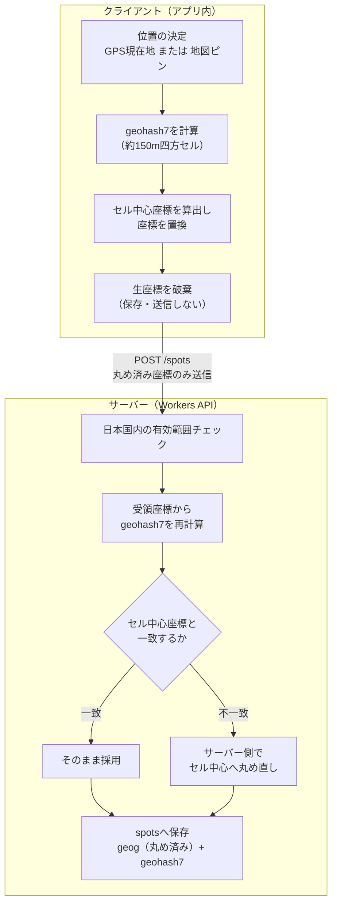
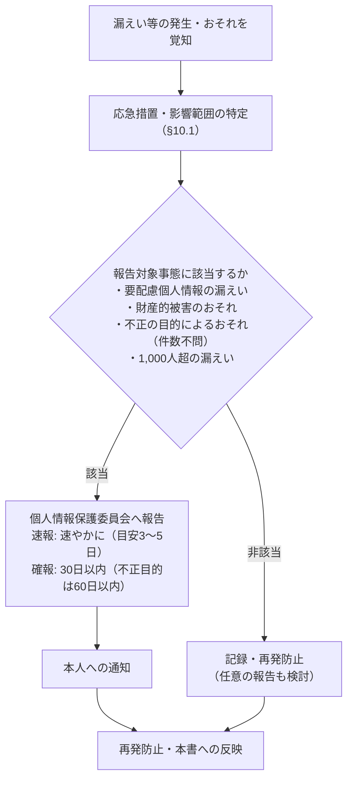

# プライバシー・データ保護設計書

**プロダクト名:** まちびん
**サブタイトル:** 「おすすめ場所」ランダム交換サービス

---

## 改訂履歴

| 版数 | 改訂日 | 改訂者 | 改訂内容 |
| --- | --- | --- | --- |
| 1.0 | 2026-07-12 | Claude | 初版作成 |
| 1.1 | 2026-07-12 | Claude | BD-02改訂（Googleソーシャルログインのみ）によるデータ取り扱いの整理、BD-08未成年者の保護者同意方針を追加 |
| 1.2 | 2026-07-12 | Claude | BD-02再改訂によりAppleソーシャルログインを追加。Appleのプライベートリレーアドレス・氏名情報の取り扱いを整理 |

## 文書情報

| 項目 | 内容 |
| --- | --- |
| 文書名 | まちびん プライバシー・データ保護設計書 |
| ステータス | ドラフト |
| 関連文書 | 01 要件定義書 §5.4、06 データベース設計書 §7、10 認証・認可設計書 |

---

## 1. はじめに

### 1.1 目的

本書は、まちびんにおける個人情報・位置情報の保護に関する設計を定義する。位置情報の丸め方式、取り扱うデータの棚卸しと分類、匿名性の担保、削除・ユーザーの権利、第三者提供・委託の整理、法令対応、およびインシデント対応の方針を明確化し、実装・運用・プライバシーポリシー作成の基準とすることを目的とする。

### 1.2 プライバシーを最優先制約とする理由

まちびんは、ユーザーのお気に入りの場所——すなわち生活圏や行動範囲を推定させ得る位置情報——を見知らぬ他者へ届けるサービスである。要件定義書 §8 の前提・制約条件は「位置情報を扱うサービスであるため、プライバシー保護（自宅特定防止・匿名性）を最優先の制約とする」と定めており、本書はこの制約を具体的な設計へ落とし込むものである。関連リスクは 01 R-03（プライバシー侵害：位置情報から自宅等が特定される懸念）および R-04（安全性：位置情報の悪用・迷惑行為）として識別済みであり、技術リスクとしては 02 AR-05（丸め不足による自宅推定）に対応する。

### 1.3 本書の位置づけ

- 要件 NFR-PR01〜05（01 §5.4）の実現方式を定義する、基本設計工程の文書である。
- データベース上の削除・匿名化の具体的な処理は 06 データベース設計書 §7 を、退会の処理フローは 10 認証・認可設計書 §6 を正とし、本書は利用者・法令の視点からそれらを整理する。
- プライバシーポリシー・利用規約（Cloudflare Pagesに掲載。02 §4.2）の記載内容は本書を基に作成する。

---

## 2. 保護方針

### 2.1 3原則

| 原則 | 内容 |
| --- | --- |
| データ最小化 | サービス提供に不要な個人情報は取得しない。取得する情報も必要最小限の粒度（座標は約150mセル、エリアは市区町村）に落として保持する。 |
| 目的限定 | 取得した情報は、交換体験の提供・不正対策・障害対応のためにのみ利用する。広告目的の利用・第三者提供は行わない（01 §8）。 |
| 匿名性 | ユーザー同士は互いに個人を特定できない。受信者に開示される差出人情報は市区町村レベルのエリア表示のみとする。 |

### 2.2 要件へのマッピング

| 要件ID | 要件概要 | 対応する原則 | 本書での実現方式 |
| --- | --- | --- | --- |
| NFR-PR01 | 投稿位置は施設・公共スポット単位にスナップし、番地レベルの精度で保存・表示しない | データ最小化 | ジオハッシュ precision 7 セル中心への丸め（§3）。生の端末座標はサーバーへ送信・保存しない |
| NFR-PR02 | 差出人の個人情報を受信者に開示しない。エリア情報は市区町村レベルまで | 匿名性 | 受信者への開示項目の限定列挙（§5.1）、`sender_area_label` は市区町村ラベルのみ（TBL-05） |
| NFR-PR03 | 位置情報の取得は明示的な許可に基づく。未許可でも地図ピン指定で投稿可能 | データ最小化 | フォアグラウンド限定の許可フロー（§3.4）。許可拒否時は地図ピンへフォールバック |
| NFR-PR04 | 個人情報保護法・関連ガイドラインの遵守、プライバシーポリシーの整備・掲示 | 目的限定 | 法令対応表・ポリシー記載必須項目（§9） |
| NFR-PR05 | ユーザーは自身のデータの削除（退会時を含む）を要求できる | データ最小化 | 退会フローとデータ別処理（§6） |

### 2.3 データ最小化の具体的な設計判断（確定事項）

| No | 判断 | 根拠 |
| --- | --- | --- |
| 1 | 生年月日・本名・住所は収集しない。年齢は「13歳以上」の自己申告チェックのみ（`age_confirmed_at` に同意日時のみ記録） | BD-03 |
| 2 | メールアドレスはClerkのみが保持し、自社DB（Neon）には保存しない。Neon側はClerkの `user_id` を識別子として持つのみ | 02 §3.2、06 設計方針4 |
| 3 | 居住エリアは市区町村レベル（JIS X 0402 5桁コード）まで。番地レベルの住所情報は項目として存在しない | FR-02、TBL-01 |
| 4 | アバターはプリセット選択式とし、顔写真等のアップロードを受け付けない | BD-07 |
| 5 | 位置情報の権限はフォアグラウンド（使用中のみ）のみ要求する。バックグラウンド位置情報・広告トラッキングは使用しない | §3.4 |
| 6 | 場所帳スナップショット（`collection_items`）は差出人個人への参照を持たない | BD-06、TBL-05 |

---

## 3. 位置情報の保護設計

本章が本書の中核である。まちびんが保持・表示する座標は、すべて本章の丸め処理を通過した「丸め済み座標」のみである。

### 3.1 丸めアルゴリズム（ジオハッシュ precision 7 セル中心スナップ）

**方式:** 座標を、ジオハッシュ precision 7（約150m四方のセル）のセル中心座標へスナップする。丸めはクライアントで行い、サーバーは受領時に再検証する。生の端末座標はサーバーへ送信・保存しない（02 §6.2）。

**クライアント処理（投函画面 SCR-03）**

1. 位置を決定する（GPSワンショット取得、または地図ピン指定）。
2. 決定した座標からジオハッシュ（precision 7、7文字）を計算する。
3. そのジオハッシュセルの境界ボックスの中心座標（緯度・経度の中点）を算出し、投函に用いる座標をセル中心座標で**置換**する。
4. 生座標はこの時点で破棄する。端末内に永続化せず、API送信ペイロードにも含めない。地図プレビューにも丸め後のピン位置を表示し、投稿される位置をユーザーに確認させる。
5. `POST /spots`（API-20）で丸め済み座標のみを送信する。

**サーバー処理（API-20 受領時の再検証）**

1. 受領した `latitude` / `longitude` が日本国内の有効範囲であることを検証する（API-20 バリデーション）。
2. 受領座標からジオハッシュ precision 7 を**再計算**し、そのセル中心座標を算出する。
3. 受領座標がセル中心と一致するか比較する（許容誤差は浮動小数点表現差のみ。例: 1e-6度）。
4. 一致しない場合（改造クライアント・古いクライアント・計算差異）は、**サーバー側でセル中心へ丸め直す**。エラーとせず丸め直して受理することで、丸め済みでない座標がいかなる経路でも保存されないことを保証する。
5. `spots.geog`（丸め済み座標）と `spots.geohash7`（丸めセル）を保存する（TBL-03）。

- シードスポット投入（API-60）にも通常投稿と同一の丸め検証を適用する（FR-10）。
- Phase 2 の旅先モード等で現在地をリクエストに付与する場合も、同一の丸め処理を通した座標のみを送信する（07 §5）。

### 3.2 precision 7 を選定した根拠

| precision | セルサイズ（目安） | 評価 |
| --- | --- | --- |
| 6 | 約1.2km × 0.6km | 施設の識別が困難になりすぎ、「行ってみる」体験が成立しない |
| **7（採用）** | **約153m × 153m** | 個人宅のピンポイント特定を困難にしつつ、街区レベルで場所を案内できる |
| 8 | 約38m × 19m | 建物単位に近く、住宅地では自宅特定のリスクが高い |

- 約153m四方のセルには、市街地では通常複数の建物・施設が含まれ、座標だけから特定の個人宅を指すことはできない。
- 一方、丸めにより施設単位の識別性は座標では担保されないが、これはユーザーが入力する**場所名（施設・公共スポット名）**で担保する（02 §6.2「座標は保護、名称で識別」）。受信者は「丸め済み座標＋場所名」の組で目的地へたどり着ける。

### 3.3 セル中心スナップを採用する理由

- グリッド内のランダムオフセット方式と異なり、**決定的（同一入力→同一出力）**であるため、サーバー再検証（受領座標＝セル中心の確認）が単純な再計算で行える。
- 同一施設に対する投稿が同一座標へ収束し、座標から元の端末位置を逆算する余地（丸め誤差の分布からの推定）が生じない。
- `geohash7` カラムをそのまま重複判定・集計の補助に使える（TBL-03）。

### 3.4 現在地取得の許可フロー（NFR-PR03）

| 項目 | 方針 |
| --- | --- |
| 権限の種類 | **フォアグラウンド（使用中のみ）のみ**要求する。iOSは When In Use（`NSLocationWhenInUseUsageDescription`）、Androidは `ACCESS_FINE_LOCATION`（使用中のみ）。バックグラウンド位置情報の権限は**要求しない**（Info.plist / Manifest に宣言自体を含めない） |
| 取得方式 | ワンショット取得のみ。継続的な位置追跡（watch）は行わない |
| 要求タイミング | 起動時ではなく、投函画面（SCR-03）でユーザーが「現在地から選ぶ」を初めてタップした時点で、利用目的の説明とともにOSダイアログを表示する |
| 拒否時のフォールバック | 地図ピン指定で投稿可能（NFR-PR03）。機能制限やダイアログの再表示による再要求の強要はしない |
| 広告トラッキング | 行わない。広告SDKを搭載せず、IDFA/広告IDを取得しないため、**iOSのATT（App Tracking Transparency）許可ダイアログは不要**な設計である |

### 3.5 受信者に見える位置は丸め済み座標のみである保証

受信者へ座標を返すAPIは API-40 / API-41（場所帳）のみであり、その座標源は `collection_items.geog`——配達時に `spots.geog` から複製されたスナップショット——である。§3.1 のとおり `spots.geog` には丸め済み座標しか保存されないため、**データベースのどこにも生座標が存在せず、いかなるAPIレスポンスにも生座標が現れ得ない**。これは実装者の注意に依存する運用上の保証ではなく、保存時点で丸め済みデータしか存在しないことによる構造的な保証である。

### 3.6 残存リスクと限界

丸めは万能ではない。以下の残存リスクを認識し、多層的に対処する。

| リスク | 内容 | 対処 |
| --- | --- | --- |
| 過疎地・郊外での推定 | 建物密度が低い地域では、約150mセル内に住宅が1軒しかない場合があり、丸めても自宅が推定され得る | 投函画面（SCR-03）に「自宅や知人宅など、個人の住まいがわかる場所は投稿しないでください」という注意文言を常時表示し、住宅地・自宅付近の投稿を控えるよう促す（FR-03「明らかに不適切な位置への投稿を抑制する仕組み」への対応） |
| コメント・場所名による位置の補完 | 「◯◯さんの家の隣」等の記載で座標保護が無意味化する | §5.3 のコメント注意文言・通報・運営非表示で対応 |
| 悪意ある投稿（他人の自宅の暴露） | 丸めでは防げない、意図的な私有地の投稿 | 通報理由 `location_abuse`（CD-04「位置情報の悪用（自宅など私有地の暴露等）」）による事後対応。通報しきい値による自動非表示（API-50）、運営による非表示・アカウント停止（API-62〜64） |
| 丸め方式の限界そのもの | セル中心スナップは「約150mの不確かさ」を与えるのみで、匿名化（非特定化）を保証する技術ではない | Phase 2 で近傍POIスナップ（施設・公共スポットの座標へ吸着）を導入し、「住宅の座標がそもそも保存されない」状態へ強化する（§11.1、02 §6.2） |

---

## 4. 取り扱うデータの棚卸しと分類

サービスが取り扱う全データ項目を、保管場所・個人情報該当性・利用目的・保持期間の観点で棚卸しする。保持期間の削除処理の詳細は 06 §7 を正とする。

| データ項目 | 保管場所 | 個人情報該当性 | 利用目的 | 保持期間・削除 |
| --- | --- | --- | --- | --- |
| メールアドレス | **Clerkのみ**（自社DB非保存） | 個人情報 | 認証（Google／Appleいずれかのアカウントに紐づくメールアドレスをOAuth経由で取得。Clerk経由のソーシャルログイン、BD-02）、Clerkからの認証関連通知。Apple利用時は本人が「メールを非公開」を選んだ場合、実メールアドレスの代わりにAppleのプライベートリレーアドレスが渡される場合がある | 退会時にClerkユーザー削除APIで削除（10 §6） |
| Google／Appleプロフィール情報（氏名・プロフィール画像URL等） | **Clerkのみ**（自社DB非保存） | 個人情報 | OAuth認証時にGoogle／AppleからClerkへ付随的に渡され得る情報。認証・アカウント同定以外の目的には用いない。Appleの氏名情報は初回認可時のみ提供され、以降の再ログインでは提供されない | 退会時にClerkユーザー削除APIで削除（10 §6） |
| セッショントークン（Clerk JWT） | 端末（expo-secure-storeで暗号化保存） | 認証情報 | APIコールの認証 | ログアウト時に破棄 |
| ニックネーム・アバターID | Neon（profiles） | 単体では個人特定性は低いが、他情報との組合せで個人情報となり得るものとして扱う | プロフィール表示 | 退会時にNULL化（06 §7.1） |
| 居住エリア（市区町村コード・ラベル） | Neon（profiles） | 市区町村粒度に制限した個人関連情報 | 差出人エリア表示の元データ（配達時にスナップショット） | 退会時にNULL化 |
| ひとこと自己紹介（bio） | Neon（profiles） | 本人の記載内容に依存 | プロフィール表示 | 退会時にNULL化 |
| 年齢確認・規約同意日時 | Neon（profiles） | 同意の証跡 | 同意記録の保全（BD-03） | 退会後も匿名化済みレコード上に残る（clerk_user_id置換により個人との紐付けは消失） |
| 丸め済み座標（geog / geohash7）・場所名 | Neon（spots、collection_items） | 番地特定不能へ丸め済み。投稿者アカウントと紐づく間は個人に関連する情報として扱う | スポット表示・交換抽選・場所帳の地図表示 | 退会時: spotsは `status='deleted'`＋投稿者NULL化。他者の場所帳スナップショットは匿名のまま残置（BD-06） |
| おすすめコメント・報告コメント | Neon（spots、reactions） | 本人が個人情報を書き込み得る（対策は§5.3） | スポット表示・リアクション | spotsは退会時に上記と同様。スナップショット・リアクションは匿名で残置 |
| リアクション（種別・日時） | Neon（reactions） | 低 | 差出人への通知・「行ってきた」累計の本人表示 | サービス提供期間中保持 |
| 通報内容（理由・補足detail） | Neon（reports） | 通報文面に依存 | 不正対策・運営対応（NFR-O01） | 退会後も残置（正当化理由は§6.4） |
| マッチ除外関係 | Neon（blocks） | 低 | マッチ永久除外（FR-08） | 退会後も残置（§6.4） |
| ExpoPushToken | Neon（device_tokens） | 端末識別子（個人関連情報） | プッシュ通知配信（FR-09） | ログアウト時に削除（API-15）、退会時にCASCADE削除、配信不能検出時に無効化 |
| 通知送信ログ | Neon（notification_logs） | 低（トークン本文は含めずチケットIDのみ） | 配信不能の検出・障害調査 | 90日（06 §7.2、JOB-04） |
| Webhookイベント ID | Neon（webhook_events） | なし | 冪等性管理 | 30日（06 §7.2） |
| IPアドレス・アクセスログ | Cloudflare（WAF / Analytics / Logpush） | 個人関連情報 | セキュリティ（DDoS防御・レート制限・Bot対策）、障害調査 | 短期保持。Logpush転送先での保持は30日を上限に設定（§8.3） |
| クラッシュ・エラー情報 | Sentry | 端末情報等を含み得る（PIIスクラビングを適用。§8.2） | 障害検知・修正（NFR-O04） | Sentryの保持期間（既定90日） |

**Google／Appleプロフィール情報の取り扱い（BD-02改訂に伴う整理）:** Phase 1の認証はGoogle・Appleの2つのソーシャルログインのみ（Clerk経由のOAuth）とする。OAuth時にGoogle／AppleからClerkへ氏名・プロフィール画像URL等のプロフィール情報が渡され得るが、これらはClerk側が認証情報として保持するにとどまり、まちびんのアプリ側プロフィール（Neon: profiles。ニックネーム・プリセットアバター）へは転記・保存しない。実名・実写真とアプリ内のニックネーム・プリセットアバターとの間に紐付けを作らないことで、データ最小化・匿名性の方針（§2.1）を維持する。

**取得しないデータ（明示）:** 生年月日、本名、住所（番地レベル）、電話番号、顔写真、生の端末座標、バックグラウンド位置情報、広告ID（IDFA/AAID）、連絡先・写真等の端末内データ。

---

## 5. 匿名性の担保

### 5.1 受信者に開示される差出人関連情報の全列挙

受信者が受け取るスポット（API-41）に含まれる情報は、以下が**すべて**である。これ以外の差出人情報はAPIレスポンスに含めない（NFR-PR02）。

| 開示項目 | 内容 | 出所 |
| --- | --- | --- |
| 場所名 | 施設・公共スポット名 | collection_items.spot_name（スナップショット） |
| 座標 | **丸め済み座標のみ**（§3.5） | collection_items.geog |
| カテゴリ | CD-01 | collection_items.category_code |
| コメント | おすすめコメント本文 | collection_items.comment |
| 差出人エリア | **市区町村レベルのラベルのみ**（例:「東京都荒川区」） | collection_items.sender_area_label |

差出人のニックネーム・アバター・bio・ユーザーIDは開示しない。投函日時そのものは表示せず、配達日時（場所帳での受信表示上の日時）のみを表示する。ただし即時配達を基本とする設計（在庫不足時のみ非同期配信。BD-01）のもとでは配達日時は投函日時とほぼ一致するため、日時表示のずらしによる時間差保護の効果は限定的であり、居場所の時間推定リスクへの主たる対処は§3の位置丸めおよび5.2の構造的設計に依る。場所帳スナップショットは差出人個人への参照（ユーザーIDの外部キー）自体を持たず（BD-06、TBL-05）、原本 `spots` への参照も退会・削除時にNULL化されるため、後から差出人を辿る経路が存在しない。

### 5.2 悪用防止に寄与する構造的設計（01 R-04）

| 設計 | 悪用防止への寄与 |
| --- | --- |
| DM・チャット非提供（01 §3.2・§8） | 受信者から差出人へ（またはその逆へ）接触する手段が存在せず、つきまとい・ハラスメントの経路を構造的に断つ。交流は定型リアクション＋短文の報告コメントに限定される（FR-06） |
| 即時配達を基本とする設計（在庫不足時のみ非同期配信。BD-01） | 丸め済み座標（§3）による位置の不確かさ・ランダム交換・DM非提供により、「今この瞬間そこにいる人」の追跡・攻撃利用は引き続き困難である。ただしBD-01の即時配達化により、従来の配達ウィンドウ方式が持っていた投函〜配達間の時間差による緩和効果は縮小するため、時間差に依存しない位置の丸め（§3）等の対策の重要性が相対的に増す（01 R-04） |
| ランダム交換（FR-04） | 差出人は受信者を選べず、特定個人へ位置情報を届けることによる攻撃（おびき出し等）に利用できない |
| 通報起点のマッチ永久除外（FR-08、TBL-07） | 一度でも不適切と判断した相手とは以後双方向にマッチしない |

### 5.3 コメント本文への個人情報書き込みリスクへの対策

コメント・場所名・bioは自由入力であり、投稿者自身が氏名・住所・連絡先等を書き込むリスク（自己開示および他者の情報の暴露）は丸め処理では防げない。次の3層で対応する。

1. **予防（UI）:** 投函画面（SCR-03）のコメント欄近傍に「本名・住所・連絡先など、個人がわかる情報は書かないでください」という注意文言を常時表示する。プロフィール編集画面（bio）にも同様の注意を表示する。
2. **事後検知（通報）:** 受信者は `inappropriate_content` / `location_abuse` 等の理由で通報できる（API-50、CD-04）。同一スポットへの通報がしきい値（PRM-06）以上で自動非表示となる。
3. **運営対応:** 運営は通報を確認し、スポット非表示（CD-02: hidden）・アカウント停止（CD-06: suspended）を実行できる（API-62〜64、NFR-O01）。

---

## 6. データ削除・ユーザーの権利

### 6.1 退会フロー（NFR-PR05）

退会はアプリ内から `DELETE /me`（API-12）で実行できる。処理順序・失敗時の扱いは 10 認証・認可設計書 §6 を正とする。概要は次のとおり。

1. Neon側のデータ削除・匿名化（06 §7.1）を実行する。
2. Clerk Backend APIでClerkユーザー（メールアドレスを含む認証情報）を削除する。
3. Clerkダッシュボード起点の削除（`user.deleted` Webhook）でも同一のデータ処理が実行される（API-02）。

### 6.2 退会時のデータ別処理（利用者視点の整理）

06 §7.1 の処理を、利用者から見た結果で整理する（BD-06）。

| 区分 | 対象データ | 利用者から見た結果 |
| --- | --- | --- |
| **削除される** | メールアドレス（Clerk）、自分の場所帳（collection_items）、プッシュトークン（device_tokens）、通知ログ（notification_logs） | 完全に削除される。受信してストックした場所帳も本人分はすべて消える |
| **匿名化される** | プロフィール（ニックネーム・bio・居住エリアをNULL化、clerk_user_idを `deleted:<元ID>` 形式へ置換）、投稿スポット（`status='deleted'` でプールから除外、投稿者参照をNULL化） | 個人と紐づく情報は消え、アカウントと投稿の関連も辿れなくなる。未配達の交換は配達されない |
| **残置される** | 他ユーザーの場所帳に配達済みのスナップショット（場所名・丸め済み座標・カテゴリ・コメント・市区町村エリアラベル） | 手紙と同じく「すでに届いたもの」は受信者の手元に残る。ただしスナップショットは差出人個人への参照を持たず（BD-06）、退会後に本人へ辿る手段はない |
| **残置される（不正対策）** | 通報（reports）・マッチ除外（blocks） | §6.4 参照 |

### 6.3 バックアップ・PITRからの消滅

Neonはポイントインタイムリカバリ（PITR）用の履歴（restore window）を保持するため、削除済みデータも履歴保持期間中は復元操作により技術的に復元可能な状態にある。履歴保持期間（無料プランでは既定約1日、有償プランでも最長数十日）の経過をもって履歴からも消滅し、以後は運営を含め**いかなる手段でも復元不能**となる。プライバシーポリシーには「削除後もバックアップから一定期間内は消去が完了しない場合がある」旨を記載する（§9.2）。履歴保持期間を意図的に延長する場合は、本書とポリシーの記載を再確認する。

### 6.4 reports / blocks を残置する正当化理由

通報記録とマッチ除外関係は、退会後も削除しない（06 §7.1）。理由は次のとおりである。

- **不正対策という利用目的の達成に必要な範囲の保持である。** 通報履歴を退会で消せるなら、処分逃れのための退会・再登録が容易になる。マッチ永久除外（FR-08）の実効性維持と、運営対応の証跡保全のために保持する。
- **残置されるレコードの個人特定性は退会処理により大きく低下する。** reports / blocks が参照する profiles レコードは匿名化済み（ニックネーム等NULL化・clerk_user_id置換）であり、メールアドレス等の連絡先はClerk側で削除済みである。
- 利用規約・プライバシーポリシーに、不正対策目的で通報・除外記録を退会後も保持する旨を明記する（§9.2）。

### 6.5 退会以外のユーザーの権利への対応

| 権利 | 対応 |
| --- | --- |
| 開示請求 | 保有するデータは本人がアプリ内で閲覧可能な範囲（プロフィール・自分の投函・場所帳）とほぼ一致する。法令に基づく開示等請求はポリシー記載の窓口で受け付け、運営が手動で対応する（Phase 1では専用機能を作らない） |
| 訂正 | プロフィールはアプリ内で随時変更可能（API-11）。投稿スポットの編集はPhase 1では提供しないため、削除・再投函を案内する |
| 利用停止・消去 | 退会（§6.1）で実現する。個別データの消去要求は窓口対応とする |

---

## 7. 第三者提供・委託の整理

### 7.1 方針

- **広告目的の第三者提供は行わない**（01 §8）。個人データの第三者への提供は、以下の**委託に伴う提供**（外部サービスの利用）に限る。
- 各委託先とはDPA（データ処理契約）または利用規約上の同等条項を確認し、委託先の監督（個人情報保護法25条）として、セキュリティ認証（SOC 2等）の取得状況・データ処理内容を選定時および年1回確認する。

### 7.2 委託先一覧と越境移転の整理

| 事業者 | 委託内容（取り扱う個人データ） | 所在国 | 法上の整理と対応 |
| --- | --- | --- | --- |
| Clerk | 認証・セッション管理（**メールアドレスの保管**、認証ログ、Google／Apple OAuthによるソーシャルログインの仲介。BD-02） | 米国 | 委託に伴う提供＋外国にある第三者への提供（法28条）。DPA・移転メカニズムを確認し、基準適合体制（相当措置の継続的実施体制）に基づく移転として整理。ポリシーで情報提供（§7.3） |
| Neon | データベースホスティング（§4のNeon保管データ全般） | 米国 | 同上。リージョンはアジア圏（AWS東京等）の選択を検討するが、事業者所在地が外国である以上、28条の整理は必要 |
| Cloudflare | API実行基盤・CDN・WAF・ログ処理（**IPアドレス**、通信メタデータ） | 米国 | 同上 |
| Expo | プッシュ通知配信（**ExpoPushToken**、通知ペイロード） | 米国 | 同上。通知ペイロードには個人情報・位置情報・コメント本文を含めない設計とする（09 通知設計書） |
| Resend | トランザクションメール送信（**メールアドレス**）。Phase 1は認証をGoogle・Appleのソーシャルログインのみとするため、Resendによるメール送信（OTP等）は行わない。将来お知らせ等の通知メールで利用する可能性がある | 米国 | 同上（実際に送信を開始する場合に本表・ポリシーの記載を見直す） |
| Sentry | エラー・クラッシュ情報の収集（端末情報等。PIIスクラビング適用後） | 米国 | 同上。§8.2の設定により送信する個人データ自体を最小化 |

**Google／Apple（OAuthプロバイダ）の位置づけ:** Phase 1の認証はGoogle・Appleいずれかのアカウントによるソーシャルログイン（BD-02）のみとする。認証時、ユーザーは各プロバイダ自身の認証・同意画面上でアカウント情報（メールアドレス等）をClerkへ提供することに同意し、その結果としてClerkがプロフィール情報を受け取る構成である。まちびん（運営）がGoogle・Appleとの間で直接のデータ処理委託契約（DPA等）を締結する関係にはなく、両社は実装上「Clerkが利用するOAuthプロバイダ」として内部的に介在するにとどまる。したがって上表の委託先一覧にはGoogle・Appleを独立の行として掲載せず、Clerkの委託内容（認証・セッション管理）にOAuthの仲介を含めて整理する。なお、各プロバイダ自身がOAuthの過程で取得・保持する情報（ユーザーのアカウント利用履歴等）は、各社のプライバシーポリシーに基づき各社が管理するものであり、まちびんの管理下にはない。

### 7.3 外国にある第三者への提供に関する情報提供義務への対応

上記委託先はいずれも外国（主に米国）に所在するため、個人情報保護法28条および施行規則に基づき、次の方針で対応する。

1. 本人同意に依拠する方式ではなく、**委託先が相当措置を継続的に講ずるために必要な体制を整備している**こと（基準適合体制）の確認に依拠する。各社のDPA・標準契約条項相当の条項・認証（SOC 2 Type II、ISO 27001等）を確認・記録する。
2. プライバシーポリシーに、**移転先の国名（米国）、当該国の個人情報保護制度の概要、委託先が講ずる措置の概要**を記載し、求めに応じて情報提供できるようにする。
3. 委託先の変更・追加時は本章の表を改訂し、ポリシーの記載を更新する。

---

## 8. ログ・テレメトリのプライバシー

### 8.1 APIログの出力方針

Workers上のAPIログ（構造化ログ）には、次の項目を**出力しない**。

| 出力禁止項目 | 理由 |
| --- | --- |
| 座標（丸め済みを含む）・geohash | ログ経路への位置情報の拡散防止。デバッグにはスポットIDで足りる |
| コメント本文・場所名・bio・ニックネーム | 本文中に個人情報が含まれ得るため |
| Authorizationヘッダー・セッショントークン・ExpoPushToken | 認証情報・端末識別子の漏えい防止 |
| メールアドレス | そもそもAPIレイヤで扱わない（Clerkのみ保持） |

ログに出力するのは、リクエストID・APIパス・ステータスコード・所要時間・ユーザーID（内部UUID）・各種リソースIDまでとする。エラー時も同様であり、リクエストボディ全体のダンプ出力は行わない。

### 8.2 SentryのPIIスクラビング設定

| 設定 | 値 | 効果 |
| --- | --- | --- |
| `sendDefaultPii` | **false（既定のまま無効）** | IPアドレス・ユーザー情報の自動付与を抑止 |
| IPアドレス | 保存しない（プロジェクト設定でIPを収集対象から除外・マスク） | イベントと個人の紐付けを抑止 |
| `beforeSend` フック | リクエストボディ・URLクエリから座標・コメント等の項目を除去 | 例外に添付されるコンテキストからの漏えい防止 |
| Data Scrubbing（サーバー側） | 有効（既定の機微パターンに加え `latitude` / `longitude` / `comment` / `token` 等をカスタムルールに追加） | クライアントの取りこぼしをSentry側で二重に除去 |
| ユーザー識別 | 内部UUIDのみ設定可（メール・ニックネームは設定しない） | 障害調査に必要な最小限の識別性のみ確保 |

### 8.3 Cloudflareログの保持

- Cloudflare上のアクセスログ（WAF・Analytics）はセキュリティ・障害調査目的に限定して参照する。
- Logpushで外部保存する場合、転送先での保持期間は**30日を上限**に設定し、期限経過分は自動削除する。転送対象フィールドは調査に必要な最小限（タイムスタンプ・パス・ステータス・IP・レイテンシ等）とし、リクエストボディは含めない。

---

## 9. 法令・ガイドライン対応

> 本章は設計上の対応方針であり、法的助言ではない。公開前に必要に応じて専門家（弁護士等）のレビューを受ける（§9.5）。

### 9.1 個人情報保護法の主要義務への対応

| 義務 | 対応 |
| --- | --- |
| 利用目的の特定・通知/公表 | 利用目的（サービス提供・不正対策・障害対応）をプライバシーポリシーに明記しPagesで公表（NFR-PR04）。目的外利用は行わない |
| 適正な取得 | 取得項目を§4の棚卸しに限定。偽りその他不正の手段による取得なし。位置情報はOS許可ダイアログを経てのみ取得（§3.4） |
| データ内容の正確性・消去努力 | 保持期間（§4・06 §7.2）を定め、期限経過データはジョブで削除。不要となったデータを保持し続けない |
| 安全管理措置 | TLS全面化（NFR-S01）、認証情報のClerk委譲（NFR-S02）、最小権限（NFR-S04）、シークレット管理（02 §9.4）、ログの出力制限（§8） |
| 委託先の監督 | §7.1・§7.2の確認プロセス |
| 第三者提供の制限 | 広告目的提供なし。委託に伴う提供のみ（§7） |
| 外国にある第三者への提供 | 基準適合体制の確認＋ポリシーでの情報提供（§7.3） |
| 漏えい等の報告・本人通知 | §10のインシデント対応手順 |
| 保有個人データの開示・訂正・利用停止 | §6.5の窓口対応・退会機能 |

### 9.2 プライバシーポリシーへの記載必須項目（Pages掲載）

1. 事業者の名称・住所・代表者（または運営者情報）
2. 取得する情報の項目（§4の棚卸しに基づく）と利用目的
3. **位置情報の取り扱い**: 丸め処理（約150m四方への精度制限）の説明、生座標を送信・保存しないこと、フォアグラウンドのみの取得、拒否時も地図ピンで利用可能なこと
4. 第三者提供を行わないこと（広告目的の提供なし）、および委託先一覧（§7.2）
5. 外国にある第三者への提供に関する情報（移転先国名・制度概要・講ずる措置。§7.3）
6. 保持期間と削除: 退会時の削除・匿名化・残置の内訳（§6.2）、バックアップからの消滅時期（§6.3）、通報・除外記録の退会後保持（§6.4）
7. 開示等請求の手続きと問い合わせ窓口
8. 13歳未満は利用できないこと。あわせて、13〜17歳の未成年者は保護者の同意を得た上で利用する必要がある旨（BD-08、§9.4）
9. Cookie等・端末識別子（ExpoPushToken）・アクセスログの利用
10. ポリシー改定の手続きと告知方法

### 9.3 位置情報に関するガイドライン等への対応

- 総務省「位置情報プライバシーレポート」および「電気通信事業における個人情報保護に関するガイドライン」の位置情報の取り扱いに関する考え方（本人の認識・同意、精度の制限、保存期間の限定）を参照し、§3の設計（明示同意・丸め・ワンショット取得）で対応する。
- 電気通信事業法の**外部送信規律**（いわゆる情報送信指令通信の規律）について、アプリから第三者（Sentry等）へ利用者情報を送信する構成が対象となるかを確認し、該当する場合は送信先・送信情報・利用目的の公表（ポリシーまたはアプリ内表示）で対応する。※該当性の確認は§9.5の専門家レビュー事項とする。

### 9.4 年齢制限とストア対応

| 項目 | 対応 |
| --- | --- |
| 利用規約（年齢） | **13歳未満は利用不可**を明記（BD-03）。登録時に13歳以上であることの同意チェックを必須とし、`age_confirmed_at` に記録。生年月日は収集しない |
| 利用規約（保護者同意） | 「未成年者は保護者の同意を得た上で利用すること」の一文を利用規約に追加する（BD-08）。年齢確認自体は引き続き13歳以上の自己申告のみとし（BD-03を維持）、保護者の実在確認や同意取得の専用フローは設けない |
| App Store | 年齢レーティング質問票で位置共有を伴うSNS的機能を正しく申告し、13歳以上と整合するレーティング（12+目安）を設定。App Privacy（プライバシーラベル）で「位置情報（おおよその位置）・トラッキングなし」を申告 |
| Google Play | IARCレーティング質問票・対象年齢（13歳以上）・データセーフティフォームで位置情報の収集（おおよそ・共有あり/広告なし）を正しく申告 |

**保護者同意文言の法的位置づけ（BD-08）:** 2022年4月の民法改正により成年年齢が18歳に引き下げられたため、13〜17歳のユーザーは法律上の未成年者である。法定代理人（保護者）の同意なく利用規約に同意（＝契約）した場合、本人または法定代理人により後日その同意・契約を取り消され得る（民法5条）。本条項の追加は、保護者の実在確認や同意取得の実効的な仕組みを伴わない自己申告ベースの年齢確認（BD-03）を前提とするため、**取消しリスクを法的に完全に解消するものではなく**、利用者・保護者への注意喚起と、無断利用に起因するトラブル発生時の実務上の説明材料としての緩和策と位置づける。取消しリスクのより本質的な低減（保護者の同意取得を実効化する仕組み等）は将来の検討課題とし、公開前に§9.5の専門家レビュー対象に含める。

### 9.5 専門家レビュー事項

公開前に、少なくとも次の点について専門家レビューを受ける: (1) プライバシーポリシー・利用規約の全文、(2) 外部送信規律・電気通信事業法上の届出要否の該当性、(3) §7.3 の越境移転整理の妥当性、(4) 13歳以上の自己申告方式の妥当性、(5) §9.4 の保護者同意文言による未成年者契約取消しリスクの緩和効果の妥当性。

---

## 10. インシデント対応

### 10.1 初動手順

漏えい（システム起因）と自宅特定被害（投稿起因。通報 `location_abuse` 等）の双方を対象とする。

1. **検知・受付:** Sentry/監視アラート（NFR-O04）、通報（API-50）、外部からの連絡のいずれかで覚知する。
2. **応急措置:** 被害拡大を止める。投稿起因の場合は該当スポットを即時 `hidden` 化（API-63）し、悪質な場合は投稿者アカウントを停止（API-64）。システム起因の場合は該当APIの停止・キーのローテーション等。
3. **影響範囲の特定:** 対象データの項目・件数・期間を特定する（§4の棚卸し表を単位とする）。
4. **記録:** 発生日時・内容・対応を時系列で記録する（reportsのaction_code・運営の対応記録）。
5. **本人への対応:** 被害者（自宅特定被害の通報者等）へ状況と対応を連絡する。生命・身体への危険が疑われる場合は警察への相談を案内する。
6. **再発防止:** 原因分析と本書・実装への反映。

### 10.2 個人情報保護委員会への報告要否の判断（概要）

- まちびんは要配慮個人情報を取得しない設計だが、**不正アクセスによる漏えいは「不正の目的によるおそれ」として件数を問わず報告対象**となり得る点に留意する。
- 判断に迷う場合は報告する方向で倒し、§9.5の専門家に速やかに相談する。

---

## 11. 拡張方針（Phase 2以降）

### 11.1 POIスナップによる精度制御の強化（Phase 2）

- OSM/ジオコーダ（Photon等の自ホスト、Geoapify等の無料枠）による**近傍POIスナップ**を導入し、投稿位置を「セル中心」ではなく「実在する施設・公共スポットの座標」へ吸着させる（02 §6.2、01 用語定義「スナップ」）。
- これにより、住宅の座標がそもそも保存されない状態となり、過疎地の残存リスク（§3.6）を低減する。近傍に適切なPOIがない位置は投稿不可（または警告）とする設計を検討する。
- 導入後もgeohash7丸めはサーバー側の下限保証として維持する（POIスナップ失敗時のフォールバック）。

### 11.2 画像投稿導入時のEXIF除去（時期未定。02 §12）

- 画像投稿を導入する場合、**EXIF位置情報（GPSタグ）の除去を必須**とする。クライアントでアップロード前に全EXIFメタデータ（GPS・撮影日時・機材情報）を除去し、サーバー（R2保存前）でも再検証・再除去する二段構えとする（§3.1と同じクライアント処理＋サーバー再検証の原則）。
- 画像に写り込む表札・住所等への対策として、モデレーション設計（02 §12）とセットで導入する。

### 11.3 距離モード・旅先モード（Phase 2〜3）

- 交換リクエストに現在地を付与する場合も、丸め済み座標のみを送信する（07 §5）。リクエスト中の現在地は抽選条件にのみ使用し、**保存しない**。

---

*本書はドラフトであり、実装・運用開始前に内容を精緻化する。本書は法的助言ではなく設計文書であり、プライバシーポリシー等の公開前に必要に応じて弁護士等の専門家レビューを受けること。*
