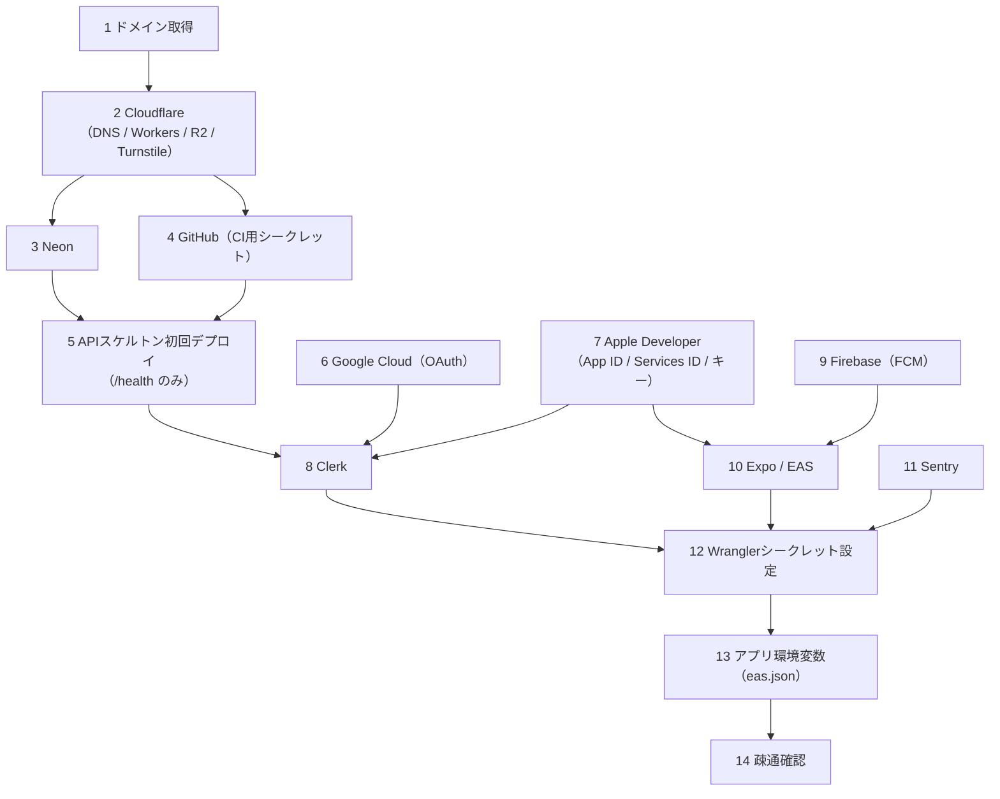

# 環境構築手順書（外部サービスセットアップRunbook）

**プロダクト名:** まちびん
**サブタイトル:** 「おすすめ場所」ランダム交換サービス

---

## 改訂履歴

| 版数 | 改訂日 | 改訂者 | 改訂内容 |
| --- | --- | --- | --- |
| 1.0 | 2026-07-21 | Claude | 初版作成 |

## 文書情報

| 項目 | 内容 |
| --- | --- |
| 文書名 | まちびん 環境構築手順書 |
| ステータス | ドラフト |
| 位置づけ | 03 §3.1のリソース一覧を、作成手順・設定値・確認方法に落としたRunbook |
| 関連文書 | 02 アーキテクチャ設計書、03 システム構成設計書、10 認証・認可設計書（§10 シークレット）、12 開発標準、15 地図タイル配信設計書 |

> 各サービスの管理画面の文言・配置はUI変更で変わり得る。本書は**目的・設定値・確認方法**を正とし、画面操作の細部は各サービスの最新ドキュメントに従うこと。ドメイン `machibin.app`・Bundle ID等の識別子は仮であり、取得・確定時に本書へ反映する。

---

## 1. 事前準備

### 1.1 必要なアカウントと費用

| アカウント | 用途 | 費用 |
| --- | --- | --- |
| Cloudflare | Workers / R2 / Pages / Turnstile / DNS | 無料枠（02 §8.1） |
| ドメインレジストラ（Cloudflare Registrar推奨） | `machibin.app`（仮）の取得 | 約$10〜15/年 |
| Neon | Postgres + PostGIS | 無料枠 |
| Clerk | 認証 | 無料枠 |
| Google Cloud | Google OAuthクライアント発行 | 無料 |
| Apple Developer Program | Sign in with Apple・iOS配信・APNs | **$99/年（有料。個人）** |
| Google Play Console | Android配信 | **$25（初回のみ）** |
| Firebase | FCM資格情報（Android Push用。他機能は使わない） | 無料 |
| Expo | EAS Build / Submit / Update / Push | 無料枠 |
| Sentry | エラー監視 | 無料枠 |
| GitHub | リポジトリ・Actions | 無料枠 |

### 1.2 ローカルツール

Node 22＋pnpm（corepack）、wrangler、EAS CLI（`npm i -g eas-cli`）、（タイル作業時）pmtiles CLI・rclone。バージョン方針は12 §2。

### 1.3 識別子の決定（最初に確定させる）

| 識別子 | 値（案） | 注意 |
| --- | --- | --- |
| ドメイン | `machibin.app` | 取得できなければ03 §3.2ごと見直し |
| Bundle ID / パッケージ名 | `app.machibin.mobile`（iOS/Android共通） | **ストア公開後は変更不可**。ドメイン確定後に決定する |
| Apple Services ID | `app.machibin.signin` | Sign in with Apple用（App IDとは別の識別子が必要） |

---

## 2. 構築順序

依存関係があるため、次の順で進める。**Clerk WebhookはWorkerのURLが必要になるため、先にAPIの骨組みをデプロイする（鶏卵の解消）。**



---

## 3. Cloudflare

**目的:** DNS・API実行基盤・R2・Bot対策の土台を作る（03 §3.1）。

1. アカウント作成後、`machibin.app` をゾーン追加（Registrarで取得すればDNS自動設定）。
2. **R2**: バケット `machibin-tiles` を作成（ロケーション: APAC）。`machibin-media` はPhase 1では作成しない（03 §3.1の予約のみ）。
3. **Turnstile**: ウィジェットを2つ作成（03 §3.1）。
   - `machibin-post`（投函用・API-20）／`machibin-report`（通報用・API-50）。
   - モードは「Invisible」。ホスト名にはアプリのWebViewが使うオリジン（SP-01の検証結果に従う）を登録。
   - 各サイトキー／シークレットキーを記録（シークレットは§12でWorkersへ）。
4. **Rate Limiting**: 07 §1.5の初期値でルールを作成。ユーザー単位制限の実現方式はSP-06の決定に従う（それまではIPベース＋アプリ内の日次上限PRM-05で代替）。
5. **CI用APIトークン**: プロファイル→API Tokens で作成。権限は最小権限で `Account: Workers Scripts (Edit)` ＋ `Account: Account Settings (Read)`。タイルアップロード用にはR2専用トークン（`Object Read & Write`、対象バケット限定）を別途作成。
6. Pagesプロジェクト `machibin-web`（LP・規約掲載。docs/legal の公開先）を作成し、`machibin.app` / `www` を割り当てる。

**記録するもの:** アカウントID、R2アクセスキー（タイル用）、Turnstileキー4種、APIトークン2種。

**確認:** ダッシュボードでゾーンがActive、`dig machibin.app` がCloudflareのNSを返す。

---

## 4. Neon

**目的:** 本番DBと環境別ブランチの用意（02 §9.2、03 §4）。

1. プロジェクト `machibin` を作成。リージョンは**AWS東京（選択可能な場合）**、なければシンガポール（ap-southeast-1）（11 §7.2の方針）。Postgres 16。
2. ブランチ構成: `main`（本番）から `staging`・`dev` を作成（03 §4）。
3. 各ブランチの接続文字列を取得。**マイグレーション（drizzle-kit）用は非プール接続、アプリ（HTTPドライバ）用はそのままの接続文字列**を使い分ける。
4. PostGIS拡張は初回マイグレーション内の `CREATE EXTENSION IF NOT EXISTS postgis;` で有効化する（06 §8。手動実行しない）。
5. CI用に **Neon APIキー**を発行（PRごとのテストブランチ作成・削除。13 §4.1）。

**記録するもの:** 接続文字列（main / staging / dev）、NEON_API_KEY、プロジェクトID。

**確認:** `dev` ブランチへ `psql` 接続し `select version();`。

---

## 5. GitHub

**目的:** ブランチ保護とCIシークレット（詳細なワークフローは17で設計）。

1. ブランチ保護: `main`・`develop` にPR必須＋ステータスチェック必須を設定（12 §6）。
2. Actionsシークレットを登録:

| シークレット | 用途 |
| --- | --- |
| `CLOUDFLARE_API_TOKEN` / `CLOUDFLARE_ACCOUNT_ID` | wrangler deploy |
| `DATABASE_URL_STAGING` / `DATABASE_URL_PRODUCTION` | drizzle-kitマイグレーション適用（非プール接続） |
| `NEON_API_KEY` | PRごとのテストブランチ作成（13 §4.1） |
| `EXPO_TOKEN` | EAS Build / Update |
| `SENTRY_AUTH_TOKEN` | ソースマップアップロード |

3. `.github/PULL_REQUEST_TEMPLATE.md` を12 §6.3の項目で作成。

---

## 6. APIスケルトンの初回デプロイ

**目的:** Clerk Webhook設定に必要なURLを先に用意する。

1. `apps/api` にAPI-01（GET /health）のみのHonoアプリを用意し、`wrangler.toml` に staging / production 環境と Cron（08 §2.1の3本）を定義。
2. `pnpm --filter api exec wrangler deploy --env staging` でデプロイ（この時点では workers.dev URLでよい）。
3. production環境もデプロイし、カスタムドメイン `api.machibin.app` を割り当てる（03 §3.2。tiles.machibin.appは15の実装時に追加）。

**確認:** `curl https://api.machibin.app/api/v1/health` → 200。

---

## 7. Google Cloud（Google OAuth）

**目的:** Clerk本番インスタンス用のGoogle OAuthクライアント発行（10 §2.3）。

1. プロジェクト `machibin` を作成。
2. OAuth同意画面: External、アプリ名「まちびん」、スコープは `openid` / `email` / `profile` のみ（センシティブスコープなし＝Google審査不要）。公開ステータスを「本番」にする。
3. 認証情報→OAuthクライアントID（種類: **ウェブアプリケーション**）を作成。リダイレクトURIには**Clerkダッシュボードが表示する値**を登録する（本番: `https://clerk.machibin.app/v1/oauth_callback` 形式。§9で確定）。
4. クライアントID／シークレットを記録（Clerkに登録する。Workersには不要）。

> 開発（ClerkのDevelopmentインスタンス）ではClerk共有クレデンシャルで代替できるため、本手順は本番インスタンス構成時までに完了していればよい。

---

## 8. Apple Developer（Sign in with Apple・配信）

**目的:** BD-02のAppleログインとiOS配信・APNsの前提（10 §2.3）。

1. Apple Developer Programへ登録（個人。反映まで最大48時間程度見込む）。
2. **App ID** を作成: `app.machibin.mobile`。Capabilities: **Sign In with Apple**・Push Notifications を有効化。
3. **Services ID** を作成: `app.machibin.signin`（Clerkのウェブ/AndroidフローのOAuthクライアントに相当）。「Sign In with Apple」を構成し、Primary App ID に上記App ID、**Domains / Return URLs にClerkダッシュボードが表示する値**を登録する。
4. **Key** を作成: 「Sign in with Apple」を有効にしたキーを発行し、`.p8` をダウンロード（**再ダウンロード不可。直ちに§15の保管先へ**）。Key ID・Team IDを記録。
5. APNs用キーは別途作らなくてよい（EASに任せる。§11）。

**記録するもの:** Team ID、App ID、Services ID、SIWA Key ID＋`.p8`。

---

## 9. Clerk

**目的:** 認証基盤の構成（10 認証・認可設計書の実体化）。

1. アプリケーション `machibin` を作成（Developmentインスタンスが自動生成される）。
2. **認証手段（BD-02）**: SSOプロバイダで **GoogleとAppleのみ**を有効化し、Email・Password・Phone等は**すべて無効化**する。Developmentは共有クレデンシャルで動作確認可。
3. **セッショントークンのカスタムクレーム**（10 §7.1）: Sessions設定で次を追加。

   ```json
   { "role": "{{user.public_metadata.role}}" }
   ```

4. **Webhook**（10 §8）: エンドポイント `https://<staging WorkerのURL>/api/v1/webhooks/clerk` を登録し、`user.created`・`user.deleted` のみ購読。Signing Secret（`whsec_...`）を記録。
5. **Productionインスタンス**を作成し、以下を実施:
   - ドメイン検証: Clerkが指示するCNAME群（`clerk.machibin.app` 等。03 §3.2）をCloudflare DNSへ追加（**プロキシOFF/DNS onlyで登録**）。
   - Google: §7のクライアントID／シークレットを登録（表示されるリダイレクトURIを§7-3へ反映）。
   - Apple: §8のServices ID・Team ID・Key ID・`.p8` を登録（表示されるDomains/Return URLsを§8-3へ反映）。
   - Webhook: `https://api.machibin.app/api/v1/webhooks/clerk` で再作成し、本番用Signing Secretを記録。
6. **管理者ロール（BD-04）**: 自分のユーザーの `publicMetadata` に `{ "role": "admin" }` をダッシュボードから設定（10 §7.1）。
7. Publishable Key（`pk_test_` / `pk_live_`）とSecret Key（`sk_test_` / `sk_live_`）を環境別に記録。

**確認:** ダッシュボードの「Send test event」で `user.created` を送信→ staging APIが204を返し、`profiles`・`webhook_events` に行が作られる（実装後）。

---

## 10. Firebase（FCM資格情報のみ）

**目的:** AndroidへのExpo Push配信にはFCM V1資格情報が必要（09 §1.3の前提）。Firebaseの他機能は使用しない。

1. Firebaseプロジェクト `machibin` を作成（Googleアナリティクスは無効）。
2. Androidアプリを追加: パッケージ名 `app.machibin.mobile`。`google-services.json` をダウンロードし `apps/mobile` に配置（app configの `android.googleServicesFile` で参照）。
3. プロジェクト設定→サービスアカウント→**新しい秘密鍵を生成**（JSON）。§11でEASへアップロードする。

---

## 11. Expo / EAS

**目的:** ビルド・配信・OTA・Pushの基盤（02 §9.1、03 §4）。

1. Expoアカウント作成→`eas init` でEASプロジェクト `machibin` を作成（projectIdをapp configへ）。
2. `eas.json` にプロファイル `development` / `preview` / `production` を定義し、EAS Updateチャネルを `preview` / `production` に対応付け（03 §4）。
3. **iOS資格情報**: `eas credentials` からApple Developerアカウントにログインし、配布証明書・プロビジョニング・**APNsキーをEAS管理で自動生成**。App IDに§8のSIWA Capabilityが付与されていることを確認。
4. **Android資格情報**: keystoreはEAS管理。**FCM V1サービスアカウントキー**（§10-3のJSON）を `eas credentials` → Google Service Account Key としてアップロード。
5. **Expoアクセストークン**（03 C-07）: expo.devのAccess Tokensで発行→Workersシークレット `EXPO_ACCESS_TOKEN`（§12）とGitHub `EXPO_TOKEN`（§5）に設定。

**確認:** `eas build --profile development --platform ios`（または `--platform android`）が完走し、実機にインストールできる。

---

## 12. Sentry

**目的:** 例外監視（NFR-O04、11 §8.2）。

1. プロジェクトを2つ作成: `machibin-api`（Platform: JavaScript/Cloudflare Workers）、`machibin-app`（React Native）。
2. **PII設定（11 §8.2を必ず適用）**: 各プロジェクトで
   - 「Prevent Storing of IP Addresses」を有効化。
   - Data Scrubbing有効＋Additional Sensitive Fieldsに `latitude` `longitude` `comment` `token` を追加。
3. DSN2種を記録。ソースマップ用のAuth Tokenを発行（§5へ）。

---

## 13. Wranglerシークレット設定

10 §10.1の一覧を環境別に設定する。値が揃った時点でまとめて実施。

```bash
# staging（--env staging）と production（--env production）それぞれに実行
wrangler secret put CLERK_SECRET_KEY            --env production
wrangler secret put CLERK_WEBHOOK_SIGNING_SECRET --env production
wrangler secret put DATABASE_URL                --env production
wrangler secret put TURNSTILE_SECRET_KEY_POST   --env production
wrangler secret put TURNSTILE_SECRET_KEY_REPORT --env production
wrangler secret put EXPO_ACCESS_TOKEN           --env production
wrangler secret put SENTRY_DSN                  --env production
```

| シークレット | staging値 | production値 |
| --- | --- | --- |
| CLERK_SECRET_KEY | `sk_test_...`（Development） | `sk_live_...`（Production） |
| CLERK_WEBHOOK_SIGNING_SECRET | Developmentインスタンスの値 | Productionインスタンスの値 |
| DATABASE_URL | Neon `staging` ブランチ | Neon `main` ブランチ |
| TURNSTILE_SECRET_KEY_POST / _REPORT | 本物（またはテスト用ダミー`1x...`） | 本物 |
| EXPO_ACCESS_TOKEN | 共通でよい | 同左 |
| SENTRY_DSN | machibin-api のDSN | 同左 |

> `RESEND_API_KEY`（10 §10.1）はPhase 1では未使用のため**設定しない**（Resendのドメイン設定・SPF/DKIMも、メール送信を開始するときに実施する。03 §1）。

---

## 14. アプリ環境変数（eas.json プロファイル別）

12 §7.2の規約に従い、`EXPO_PUBLIC_*` のみ。秘密情報は置かない。

| 変数 | development | preview（staging） | production |
| --- | --- | --- | --- |
| EXPO_PUBLIC_API_URL | `http://localhost:8787/api/v1` | staging WorkerのURL + `/api/v1` | `https://api.machibin.app/api/v1` |
| EXPO_PUBLIC_CLERK_PUBLISHABLE_KEY | `pk_test_...` | `pk_test_...` | `pk_live_...` |
| EXPO_PUBLIC_MAP_STYLE_URL | stagingのスタイルURL（15 §6） | 同left | `https://tiles.machibin.app/styles/main/style.json` |
| EXPO_PUBLIC_SENTRY_DSN | （空＝無効） | machibin-app のDSN | 同左 |
| EXPO_PUBLIC_TURNSTILE_SITE_KEY_POST / _REPORT | ダミー（`1x00000000000000000000BB`） | 本物 | 本物 |

---

## 15. 資格情報の保管

- `.p8`（SIWAキー）、各Secret Key、APIトークン、FCMサービスアカウントJSONは**パスワードマネージャ（1Password等）に単一の「machibin」Vault**として保管し、リポジトリ・端末のダウンロードフォルダに残さない。
- ローテーション方針は10 §10.2に従う。棚卸しは年1回（§17のチェックリストに含める）。

---

## 16. 疎通確認チェックリスト

全手順完了後（および実装が進んだ時点）で以下を順に確認する。

| No | 項目 | 手順 | 期待結果 |
| --- | --- | --- | --- |
| K-01 | API死活 | `curl https://api.machibin.app/api/v1/health` | 200（API-01） |
| K-02 | DB接続 | stagingへ疎通するAPI（実装後はAPI-10） | Neon `staging` に接続、コールドスタート後も成功 |
| K-03 | Clerkサインイン | development buildでGoogle・Apple両方のログイン | セッション確立、`GET /me` が200 |
| K-04 | Webhook | Clerkダッシュボードからテストイベント送信 | 204。`webhook_events` に記録（再送で重複しない） |
| K-05 | Turnstile | ダミーキー`1x`/`2x`で投函API | `1x`成功／`2x`が403 TURNSTILE_FAILED |
| K-06 | Push | Expoのpush toolへ実機トークンを入力し送信 | 実機に通知が届く（iOS/Android両方） |
| K-07 | レシート | JOB-03を手動実行（08 §6.2） | notification_logsがok/errorへ確定 |
| K-08 | Cron | `wrangler dev --remote --test-scheduled` でJOB-02〜04を起動 | 各ジョブがディスパッチされサマリログが出る |
| K-09 | タイル | `curl -I https://tiles.machibin.app/...`（15実装後） | 200＋Cache-Controlヘッダ（15 §5） |
| K-10 | Sentry | 意図的にテスト例外を送出 | 両プロジェクトにイベント到達。IP・座標等が含まれない（11 §8.2） |
| K-11 | 使用量アラート | Cloudflare/Neon/Clerkの使用量通知設定（02 AR-02） | 通知先メールが設定済み |

---

## 17. トラブルシュート

| 症状 | 原因の見立て | 対処 |
| --- | --- | --- |
| Webhookが常に400 | Signing Secretの取り違え（Development/Productionインスタンス） | 環境とシークレットの対応（§13の表）を確認 |
| Appleログインが「invalid_client」 | Services IDのDomains/Return URLs未登録・`.p8`のKey ID/Team ID誤り | §8-3とClerkの表示値を突合 |
| Googleログインがredirect_uri_mismatch | §7-3のリダイレクトURIがClerk表示値と不一致 | Clerkダッシュボードの値をコピーし直す |
| `clerk.machibin.app` が解決しない | CloudflareでCNAMEがプロキシONになっている | DNS only（グレー雲）へ変更 |
| drizzle-kitがタイムアウト | プール接続文字列を使っている | 非プール接続（§4-3）へ切替 |
| Android実機にPushが届かない | FCM V1キー未登録／google-services.json不一致 | §10-2/3と`eas credentials`を確認 |
| Neonコールドスタートで初回のみ遅い | 仕様（02 AR-01） | 対処不要。K-02は2回目の応答で判定 |

---

*本書はドラフトであり、実際の構築作業で確定した値・手順の差分を随時反映する。UI手順の細部は各サービスの公式ドキュメントを正とする。*
