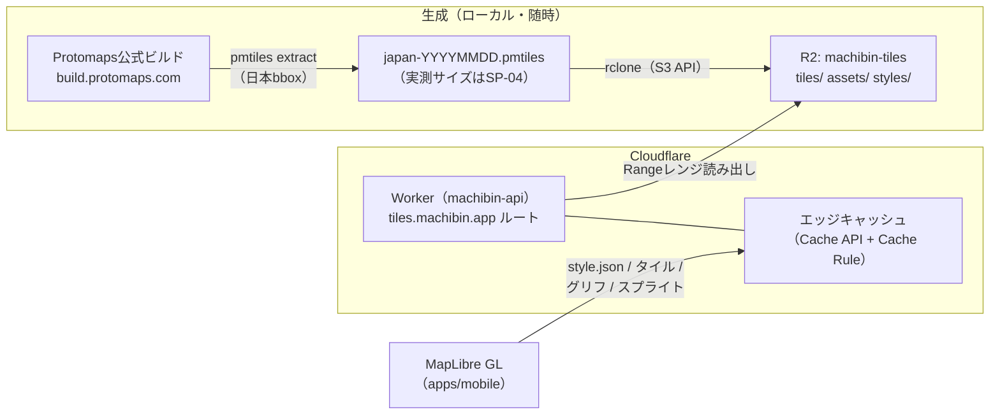
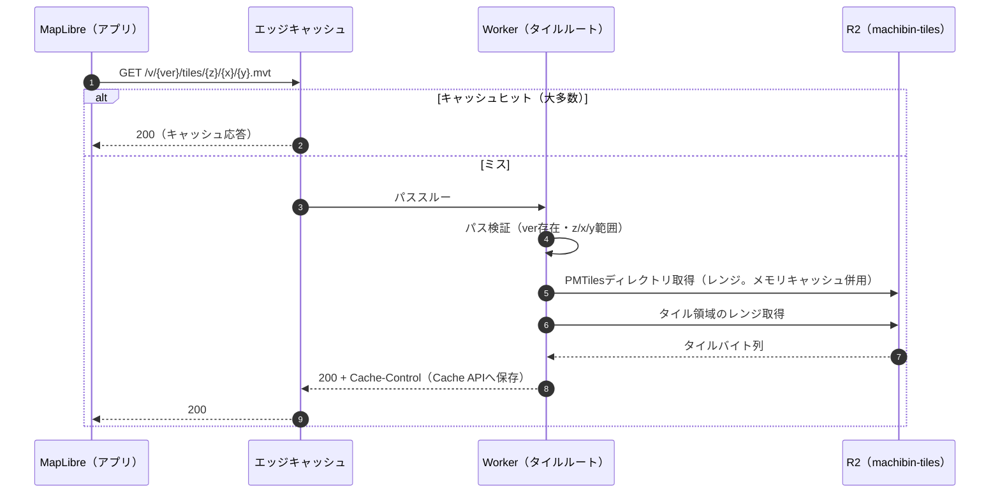

# 地図タイル配信設計書

**プロダクト名:** まちびん
**サブタイトル:** 「おすすめ場所」ランダム交換サービス

---

## 改訂履歴

| 版数 | 改訂日 | 改訂者 | 改訂内容 |
| --- | --- | --- | --- |
| 1.0 | 2026-07-21 | Claude | 初版作成 |

## 文書情報

| 項目 | 内容 |
| --- | --- |
| 文書名 | まちびん 地図タイル配信設計書 |
| ステータス | ドラフト |
| 位置づけ | 02 §3.1・§5.2の地図方式（MapLibre + Protomaps + R2）と、02 AR-03（タイル整備・更新の運用リスク）を受けた詳細設計 |
| 関連文書 | 02 アーキテクチャ設計書、03 システム構成設計書、05 画面設計書（SCR-03/05/06）、12 開発標準（SP-04）、14 環境構築手順書 |

---

## 1. はじめに

本書は、地図表示に関わる一連の要素——**タイルデータの生成（PMTiles）→ R2への配置 → Workerによる配信 → MapLibreによる描画**——の設計と運用手順を定義する。目的は02の方針どおり「地図の従量課金をゼロ化」しつつ（R2下り無料）、個人開発で維持できる運用に落とすことである。

### 1.1 設計判断サマリ

| 論点 | 決定 | 理由 |
| --- | --- | --- |
| タイルデータの調達 | **Protomapsの公式デイリービルド（全球PMTiles）から日本領域を `pmtiles extract` で切り出す** | 自前ビルド（Planetiler）不要で、コマンド1本・数分で最新データを取得できる。カスタムレイヤが必要になるまで自前ビルドはしない |
| データセットの管理 | ファイル名にビルド日付を含め（`japan-YYYYMMDD.pmtiles`）、**URLパスにデータセット版を含める** | 版をURLに含めることでキャッシュを恒久化（immutable）でき、切替・ロールバックがstyle.jsonの書き換えだけで済む |
| 配信Worker | **machibin-api Workerに同居**させ、ホスト名（`tiles.machibin.app`）でルーティング | 03 §3.1の構成どおり。個人開発でWorkerを増やさない |
| スタイル | `@protomaps/basemaps` の light フレーバー＋日本語ラベル（lang=ja）を**サーバー配信**（アプリ同梱にしない） | アプリのストア審査を経ずに地図の見た目・データセット版を更新できる |
| フォント・スプライト | Protomaps公式のbasemaps-assets（Noto Sans系グリフ・スプライト）を**R2に自己ホスト** | 外部CDN依存を排し、可用性とコストをCloudflare内に閉じる（P-2） |

---

## 2. 全体構成



- リクエストの大部分はエッジキャッシュで応答し、キャッシュミス時のみWorkerがPMTilesのディレクトリ／タイル領域をR2からレンジ取得して返す。
- R2は下り転送無料のため、コストはストレージ（無料枠10GB）と読み取りオペレーション数のみ（02 §8.1）。

---

## 3. タイル生成パイプライン

### 3.1 データソースとライセンス

| 項目 | 内容 |
| --- | --- |
| 元データ | OpenStreetMap（Protomapsのデイリービルド経由） |
| ライセンス | ODbL。**「© OpenStreetMap contributors」の帰属表示が必須**（§6.4）。Protomapsのクレジット表示も併記する |
| フォント | Noto Sans系（OFL）。basemaps-assetsのグリフPBFを使用 |

### 3.2 抽出手順（初回・更新共通）

```bash
# 1. 公式ビルド一覧から最新の日付を確認（https://maps.protomaps.com/builds/）
# 2. 日本領域を切り出す（bboxは全島嶼をカバーする余裕を持った範囲）
pmtiles extract https://build.protomaps.com/<YYYYMMDD>.pmtiles \
  japan-<YYYYMMDD>.pmtiles \
  --bbox=122.5,20.0,154.5,46.0

# 3. 内容確認（メタデータ・ズーム範囲・サイズ）
pmtiles show japan-<YYYYMMDD>.pmtiles

# 4. R2へアップロード（数GBのためwrangler putではなくrclone/S3 APIを使う）
rclone copy japan-<YYYYMMDD>.pmtiles r2:machibin-tiles/tiles/
```

- bbox `122.5,20.0,154.5,46.0`（西端: 与那国島、南端: 沖ノ鳥島、東端: 南鳥島、北端: 択捉島を包含）。
- 抽出後の最大ズームは元ビルドに従う（z15。ベクタータイルのためクライアント側のオーバーズームで高ズーム表示に対応する。§6.2）。
- ファイルサイズの実測と無料枠整合の確認はSP-04で行う（想定: 数GB。02 §8.1）。

### 3.3 スタイル・アセットの生成

`tools/tiles/` に以下のスクリプトを置く。

| スクリプト | 内容 |
| --- | --- |
| `build-style.ts` | `@protomaps/basemaps` から light フレーバー・`lang: "ja"` でレイヤ定義を生成し、タイル・グリフ・スプライトのURL（§4.1のパス）とデータセット版を埋め込んだ `style.json` を出力する |
| `sync-assets.sh` | Protomaps basemaps-assets（フォントグリフPBF・スプライト）を取得し、`assets/` プレフィックスでR2へ同期する（初回とアセット更新時のみ） |

- スタイルはブランド調整（アクセントカラー・ラベル濃度）を最小限のオーバーライドとして `build-style.ts` 内に持つ。手書きのstyle.json直接編集はしない（再生成で消えるため）。

---

## 4. 配信Worker設計

### 4.1 エンドポイント

`tiles.machibin.app`（03 §3.2）で受けるパスを次のとおり定める。`{ver}` はデータセット版（例: `20260701`）。

| パス | 内容 | キャッシュ（ブラウザ/エッジ） |
| --- | --- | --- |
| `GET /styles/main/style.json` | 現行スタイル（内部で `{ver}` 付きURLを参照する切替ポイント） | `max-age=300` / エッジ1時間 |
| `GET /v/{ver}/tiles/{z}/{x}/{y}.mvt` | ベクタータイル本体（PMTilesからレンジ読み出し） | `max-age=86400, immutable` / エッジ30日 |
| `GET /assets/fonts/{fontstack}/{range}.pbf` | グリフ（Noto Sans系） | `max-age=86400, immutable` / エッジ30日 |
| `GET /assets/sprites/{name}` | スプライト（json / png） | 同上 |

- **版をパスに含むリソースはimmutable**とし、更新は新しい `{ver}` パスの発行＋style.json書き換えで行う（キャッシュパージ不要）。
- 認証なし・公開（03 C-03）。CORSは `Access-Control-Allow-Origin: *` を返す（ネイティブアプリでは不要だが、開発時のWebデバッグ用。公開データのため問題ない）。

### 4.2 処理フロー



### 4.3 実装方針

| 項目 | 方針 |
| --- | --- |
| ライブラリ | `pmtiles` npmパッケージを使用し、R2の `get(key, { range })` を用いたカスタムSourceを実装する |
| ディレクトリキャッシュ | PMTilesのヘッダ・ディレクトリはisolateメモリにキャッシュし、タイル1件あたりのR2読み取りを実質1回に抑える |
| 範囲外・空タイル | データなしは**204**を返す（MapLibreは空として扱う）。zが最大ズーム超のリクエストは400（スタイル側でオーバーズームするため本来発生しない） |
| 不正パス | 未知の `{ver}`・非数値のz/x/yは404/400。パストラバーサルはキーをホワイトリスト形式（`tiles/japan-{ver}.pmtiles`）で組み立てて構造的に防ぐ |
| エラー | R2エラー時は1回リトライ後502。Sentryへはサンプリング（同一障害での大量送信を避けるためレート制御） |
| ログ | 11 §8.1に従う（座標を含まない。z/x/yはタイル座標であり個人の位置ではないため記録可。ただしIPと組み合わせた分析はしない） |
| Rate Limiting | 03 §3.1のとおりCloudflare Rate Limitingで保護（初期値: 600req/分/IP。運用調整） |

---

## 5. R2バケット構成

```text
machibin-tiles/
├── tiles/
│   ├── japan-20260701.pmtiles     # 現行版
│   └── japan-20260401.pmtiles     # 前版（ロールバック用に1世代保持）
├── assets/
│   ├── fonts/<fontstack>/<range>.pbf
│   └── sprites/...
└── styles/
    └── main/style.json            # Workerが返す現行スタイル
```

| 運用ルール | 内容 |
| --- | --- |
| 世代管理 | タイルは**現行＋前版の2世代のみ**保持し、切替の安定確認後に古い版を削除する（無料枠10GBとの整合。サイズ実測がSP-04で大きい場合は1世代に縮小） |
| 命名 | `japan-<公式ビルド日付>.pmtiles`。URLの `{ver}` はこの日付を用いる |
| style.jsonの正 | R2上の `styles/main/style.json` を配信の正とし、生成元（`tools/tiles/build-style.ts`）をリポジトリで管理する |

---

## 6. クライアント描画設計（MapLibre / apps/mobile）

### 6.1 基本設定

| 項目 | 内容 |
| --- | --- |
| ライブラリ | `@maplibre/maplibre-react-native`（02 §3.1） |
| スタイルURL | `EXPO_PUBLIC_MAP_STYLE_URL`（14 §14）。環境別にstaging/productionのスタイルを参照 |
| 表示範囲 | カメラの`maxBounds`を日本周辺（§3.2のbboxに余白を加えた範囲）に制限。minZoom 4／maxZoom 18 |
| オーバーズーム | ソースのmaxzoomは15（データセットに一致）。それ以上はベクターデータの拡大描画で表示する |
| オフライン | Phase 1では非対応。タイル取得失敗時は地図領域をグレー表示とし、05 §4.1のオフラインバナーに委ねる |

### 6.2 画面別の使用仕様（05 画面設計書との対応）

| 画面 | 地図の挙動 |
| --- | --- |
| SCR-03 投函 | **画面中央固定のピンオーバーレイ＋地図側を動かして位置調整**（マーカーのドラッグは実装しない。05 §5.4）。初期位置は現在地（許可時）または既定（居住エリア→未設定時は東京駅周辺）。既定ズーム16 |
| SCR-05 受信詳細 | 受信スポットを中心に単一ピン表示。操作は拡大縮小のみ（05 §5.6） |
| SCR-06 場所帳（地図） | 最大200件のピン表示（未訪問=プライマリ色／訪問済み=達成色＋スタンプ。05 §5.7）。地図移動は300msデバウンスでAPI-40 bbox再取得。Phase 1ではクラスタリングなし（200件上限で許容） |

### 6.3 現在地表示

- 現在地パック（青点）は位置情報権限の許可時のみ有効化する。権限要求のタイミング・フォールバックは11 §3.4に従う（本書では扱わない）。

### 6.4 帰属表示（ライセンス遵守・必須）

| 項目 | 内容 |
| --- | --- |
| 地図上の表示 | 全地図表示画面の右下に「© OpenStreetMap contributors」を常時表示（MapLibreのattribution機能または独自オーバーレイ。折りたたみ可だがアクセス可能であること） |
| クレジット画面 | SCR-08「その他」に「地図データについて」項目を追加し、OpenStreetMap（ODbL）・Protomaps・Noto Fonts（OFL）のクレジットとリンクを記載する。**→ 05 §5.9への項目追加を要改訂として提起する（12 §11.2に準ずる軽微改訂）** |

---

## 7. 更新・ロールバック運用（Runbook）

### 7.1 データセット更新（目安: 3ヶ月ごと、または不具合報告時）

1. §3.2の手順で新版 `japan-<新日付>.pmtiles` を生成し、`pmtiles show` とローカル確認（`pmtiles serve` でプレビュー）を行う。
2. R2 `tiles/` へアップロード（既存版はそのまま）。
3. **staging**のstyle.jsonを新 `{ver}` で再生成・配置し、実機で表示確認（都市部・郊外・沿岸のスポットチェック、日本語ラベル、SCR-03/05/06の3画面）。
4. **production**のstyle.jsonを更新（Workerの応答が新版タイルを指す。エッジのstyle.jsonキャッシュは最長1時間で入れ替わる）。
5. 1週間の安定確認後、2世代より古いタイルをR2から削除し、実施記録（日付・サイズ）を本書§9の実測表に追記する。

### 7.2 ロールバック

- style.jsonの `{ver}` を前版に戻して再配置するのみ（前版タイルは保持済みのため即時に切り戻る）。

### 7.3 監視

| 項目 | 方法 | 目安 |
| --- | --- | --- |
| キャッシュヒット率 | Cloudflareアナリティクス（tiles.machibin.appホスト） | 90%以上（下回る場合はTTL・スタイルのソース設定を見直す） |
| R2読み取りオペレーション | R2メトリクス | 無料枠（読み取り月1,000万）に対する消費率 |
| ストレージ | R2メトリクス | 10GB枠の8割で世代整理 |
| エラー率 | Workerメトリクス＋Sentry | 5xxが継続したらR2・Workerの障害切り分け |

---

## 8. セキュリティ・プライバシー

- タイルは公開データであり認証を設けない（03 C-03）。保護はRate Limitingのみ。
- タイルアクセスログから利用者の閲覧地域が推定できるため、ログの保持・分析は11 §8.3（30日上限・最小フィールド）に従い、**タイル座標とユーザー・IPを突合する分析は行わない**。
- アプリ→タイルへのリクエストに認証情報・カスタムヘッダを付与しない（Authorizationヘッダが公開エンドポイントへ漏れる構成を作らない）。

---

## 9. 性能・容量目標（SP-04で実測・確定）

| 項目 | 目標（暫定） |
| --- | --- |
| タイル応答（キャッシュヒット） | p50 < 50ms |
| タイル応答（ミス・Worker経由） | p95 < 300ms |
| japan.pmtiles サイズ | 実測して記載（想定2〜4GB。4GB超なら保持世代を1に変更） |
| 初期表示（SCR-06、通常回線） | 地図の初回描画完了 < 2秒（NFR-P01の内数） |

| 実測記録（更新時に追記） | 日付 | サイズ | 備考 |
| --- | --- | --- | --- |
| （初回抽出時に記入） | — | — | — |

---

## 10. リスクと対策

| No | リスク | 対策 |
| --- | --- | --- |
| T-01 | キャッシュミス集中時のWorker CPU・R2読み取り増（コールドスタート的な負荷） | 版付きURL＋immutableで恒久キャッシュ。リリース直後はstagingで主要都市圏をひと通り表示してエッジを温める |
| T-02 | 抽出サイズが想定超過し無料枠を圧迫 | SP-04で実測し、保持世代削減またはR2有償化（$0.015/GB/月）を許容判断 |
| T-03 | Protomaps公式ビルドの提供形態変更・停止 | Planetilerによる自前ビルド手順へ切替（Geofabrik japan-latest.osm.pbf から生成）。§1.1の代替として温存 |
| T-04 | MapLibre RNの不具合・実装難航 | 02 §3.2の代替案どおり `react-native-maps`（Apple Maps / Google Maps）へ切替。タイル配信一式は不要になるが、Androidの従量課金が発生する。SP-04の結果で早期判断 |
| T-05 | 帰属表示漏れによるライセンス違反 | §6.4を実装レビューのチェック項目（12 §6.3）に含める |

---

## 11. 拡張方針（Phase 2以降）

| 対象 | 方針 |
| --- | --- |
| POIスナップ（11 §11.1） | ジオコーダ（Photon自ホスト等）導入時も、タイル配信とは独立したサービスとして追加する（本書の構成に変更なし） |
| ピンのクラスタリング | 場所帳の件数増加時にMapLibreのクラスタ機能を有効化 |
| ダークモードスタイル | `@protomaps/basemaps` のdarkフレーバーを `/styles/dark/style.json` として追加配信 |
| 多地域対応 | bbox拡張または地域別PMTiles分割。`{ver}` パス設計はそのまま流用できる |

---

*本書はドラフトであり、SP-04（サイズ・性能実測）の結果と実装で確定した仕様を反映して改訂する。*
