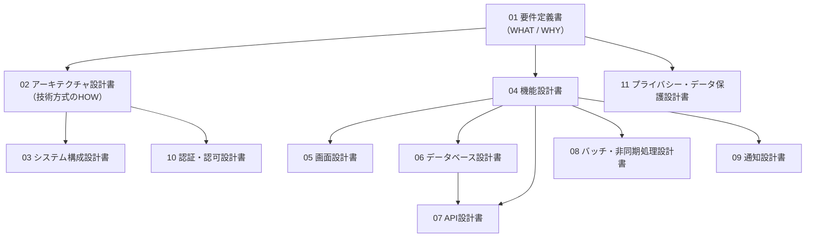

# まちびん 設計ドキュメント

**プロダクト名:** まちびん
**サブタイトル:** 「おすすめ場所」ランダム交換サービス

本ディレクトリは、まちびんの要件定義・設計ドキュメント一式を管理する。本書はその目次であり、各文書の位置づけ・記載ルールを定める。

---

## 1. ドキュメント一覧

| No | 文書 | 内容 | 工程 |
| --- | --- | --- | --- |
| 01 | [要件定義書](./01_requirements.md) | 提供価値、機能要件（FR-01〜14）、非機能要件（NFR）、データ要件、外部IF要件 | 要件定義 |
| 02 | [アーキテクチャ設計書](./02_architecture.md) | 技術スタック選定、システム構成、主要データフロー、コスト試算、スケール戦略 | 方式設計 |
| 03 | [システム構成設計書](./03_system_configuration.md) | システム関連図、アーキテクチャ構成図、インフラ構成図、環境定義 | 基本設計 |
| 04 | [機能設計書](./04_functional_design.md) | FR-01〜10の処理仕様（入力/処理/出力/例外）、業務ルール、設定パラメータ | 基本設計 |
| 05 | [画面設計書](./05_screen_design.md) | 画面遷移図、画面レイアウト、表示・入力項目、入力チェック | 基本設計 |
| 06 | [データベース設計書](./06_database_design.md) | ER図、テーブル定義、コード定義、インデックス方針 | 基本設計 |
| 07 | [API設計書](./07_api_design.md) | REST APIエンドポイント仕様、認証、エラーコード、レート制限 | 基本設計 |
| 08 | [バッチ・非同期処理設計書](./08_batch_design.md) | 配達バッチ等のジョブ定義、スケジュール、冪等性、リトライ | 基本設計 |
| 09 | [通知設計書](./09_notification_design.md) | プッシュ通知の種別・文面・ペイロード、通知設定、トークン管理 | 基本設計 |
| 10 | [認証・認可設計書](./10_auth_design.md) | Clerk認証フロー、JWT検証、ロール・権限マトリクス、退会処理 | 基本設計 |
| 11 | [プライバシー・データ保護設計書](./11_privacy_design.md) | 位置情報丸め、データ分類・保持期間、削除フロー、法令対応 | 基本設計 |

### 文書間の関係

---

## 2. 基本設計の前提（暫定決定事項）

要件定義書・アーキテクチャ設計書で「基本設計で決定する」とされていた事項のうち、以下は基本設計の前提として**暫定決定**した。変更する場合は関連文書を改訂する。

| No | 決定事項 | 内容 | 主な関連文書 |
| --- | --- | --- | --- |
| BD-01 | 配達ウィンドウ | **朝・夕の1日2回（7:00 / 19:00 JST）**。投函後、次のウィンドウで配達。Neonのスケールtoゼロ維持と「翌朝ポストに届く」体験を両立 | 04, 08, 09 |
| BD-02 | 認証手段 | **メールアドレス＋確認コード（OTP）のみ**（Clerk）。最小情報での登録により匿名性方針と整合 | 05, 10 |
| BD-03 | 年齢方針 | **13歳以上・自己申告**。登録時に13歳以上であることの同意チェックのみ行い、生年月日は収集しない（データ最小化） | 04, 10, 11 |
| BD-04 | 運営機能の形態 | **管理者ロール付きの管理APIのみ**（Phase 1では管理画面を作らない）。シード投入・通報対応はAPIで運用 | 04, 07, 10 |
| BD-05 | 対応OS下限 | iOS 15.1以上 / Android 7.0（API 24）以上（Expo SDKのサポート範囲に準拠。実装時のSDKバージョンで再確認） | 03, 05 |
| BD-06 | 退会時データの扱い | 本人データ・投稿スポットは削除、配達済みスポットは**受信者の場所帳にスナップショットとして匿名化残置** | 06, 10, 11 |
| BD-07 | アバター | Phase 1は**プリセット選択式**（画像アップロードなし。モデレーション不要化） | 04, 05 |

---

## 3. 記載ルール

### 3.1 文書の共通構成

各設計書は次の構成に従う。

1. 冒頭に「改訂履歴」「文書情報」（文書名／ステータス／関連文書）を置く。
2. 図は Mermaid、定義は表で記載する。
3. Phase 1（MVP）の仕様を主として記述し、Phase 2以降は「拡張方針」として区別する。
4. 運用で調整可能な値は、機能設計書の設定パラメータ一覧（PRM-xx）を正とし、他文書からはIDで参照する。

### 3.2 ID体系

| プレフィックス | 意味 | 定義元 |
| --- | --- | --- |
| FR-xx | 機能要件 | 01 要件定義書 |
| NFR-xx | 非機能要件 | 01 要件定義書 |
| UC-xx | ユースケース | 01 要件定義書 |
| SCR-xx | 画面 | 05 画面設計書 |
| TBL-xx | テーブル | 06 データベース設計書 |
| CD-xx | コード（区分値） | 06 データベース設計書 |
| API-xx | APIエンドポイント | 07 API設計書 |
| JOB-xx | バッチジョブ | 08 バッチ・非同期処理設計書 |
| NT-xx | 通知 | 09 通知設計書 |
| PRM-xx | 設定パラメータ | 04 機能設計書 |
| BD-xx | 基本設計の暫定決定事項 | 本書 |

---

*本目次は文書の追加・改訂にあわせて更新する。*
