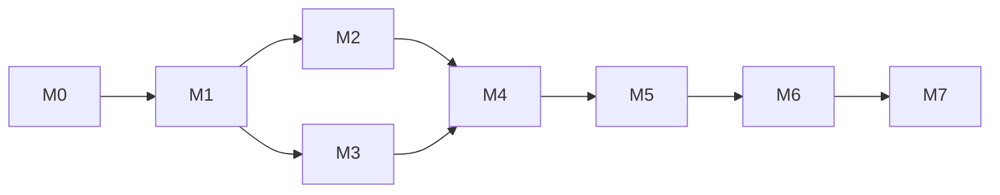

# Phase 1（MVP）実装計画

**プロダクト名:** まちびん
**サブタイトル:** 「おすすめ場所」ランダム交換サービス

---

## 改訂履歴

| 版数 | 改訂日 | 改訂者 | 改訂内容 |
| --- | --- | --- | --- |
| 1.0 | 2026-07-26 | Claude | 初版作成（M0着手時点） |

## 文書情報

| 項目 | 内容 |
| --- | --- |
| 文書名 | まちびん Phase 1（MVP）実装計画 |
| ステータス | 運用中（各マイルストーン完了時に§2の状態と実績を更新する） |
| 位置づけ | 設計書01〜15を実装に落とすためのマイルストーン計画。仕様の正は各設計書、作り方の正は12 開発標準、テストの正は13 テスト設計書 |
| 関連文書 | docs/README.md、12 開発標準、13 テスト設計書、14 環境構築手順書、15 地図タイル配信設計書 |

---

## 1. 前提

| No | 前提 | 補足 |
| --- | --- | --- |
| P-01 | 外部サービスアカウントは計画開始時点ですべて未取得。**GitHubのみ利用中**（origin: yasudaProduct/machibin） | CI（GitHub Actions）はM0から利用可能。各アカウントの必要時期は§4で管理 |
| P-02 | ローカル完結できる作業から着手する | `wrangler dev`（ローカルモード）はCloudflareアカウント不要。`expo start`・ローカルdevelopment buildはExpoアカウント不要 |
| P-03 | Git運用は feature/* → develop のPR（12 §6.1）。1マイルストーン＝1〜複数PR、**マージはユーザーが実施** | コミットはConventional Commits＋日本語要約（12 §6.2） |
| P-04 | 各マイルストーンは「単独で動作確認できる縦切り」とし、DoD（完了条件）に検証方法を必ず持つ | 12 §12 Definition of Done に準拠 |
| P-05 | マイルストーン冒頭に、そのマイルストーンが依存する設計書改訂（§5）を先に実施する | 「文書が直っていないまま実装に入らない」ためのルール |

---

## 2. マイルストーン全体像

| M | 名称 | ゴール（1文） | 必要アカウント | 状態 |
| --- | --- | --- | --- | --- |
| M0 | 開発基盤（ウォーキングスケルトン） | モノレポがローカル・CI双方で lint / typecheck / test を通過し、API・アプリ双方が「起動する」 | なし | 進行中 |
| M1 | 共有基盤・DBスキーマ・テストハーネス | 共有ロジック・Drizzleスキーマ・L2テスト基盤が揃い、CIで安定動作する（SP-02/03消化） | Neon | 未着手 |
| M2 | 認証・オンボーディング | Googleログイン→SCR-10→（空の）ホーム到達、TC-A自動テストが揃う | Clerk（＋Apple Dev申込済み） | 未着手 |
| M3 | 地図タイル基盤 | 自前タイルで日本地図が描画でき、T-04（MapLibre継続可否）を判断済み（SP-04消化） | Cloudflare | 未着手 |
| M4 | コア交換体験 | UC-01（投函→抽選→即時配達→受信詳細）一気通貫＋JOB-02回復経路＋API-60シード投入 | — | 未着手 |
| M5 | 場所帳・リアクション・通知 | 場所帳・リアクション完成、NT-01/NT-03が実機着信、JOB-03 | Expo/EAS・Firebase・Apple Dev加入完了 | 未着手 |
| M6 | 通報・管理・退会 | 通報→自動非表示→運営対応、停止、退会（Clerk連携込み）、JOB-04 | — | 未着手 |
| M7 | リリース準備 | 本番構築・SP-05/06消化・13 §7リリースゲート通過・ストア申請 | ドメイン・Clerk本番・GCP・Play Console・Sentry | 未着手 |

依存関係（M3はM2と並行可能。ただしMapLibre描画確認はM2のdevelopment build確立後）:

**モバイルのビルド方式の切替点**: M0〜M1＝Expo Go可（ネイティブモジュールなし）→ M2以降＝ローカルdevelopment build（`expo prebuild`。ADR記録）→ M5以降＝実機必須（プッシュ通知）→ M7＝EAS Build。

---

## 3. マイルストーン詳細

### M0 開発基盤（ウォーキングスケルトン）

| 項目 | 内容 |
| --- | --- |
| ゴール | 12 §2〜§9に準拠したモノレポが、ローカルとCIの双方で lint / typecheck / test を通過し、API・アプリ双方が「起動する」状態になる |
| 前提 | 外部アカウント: **不要**。文書改訂: 12 §9（PR必須チェックにL1'追加）・12 §2（pnpm 10系へ更新）を同PRで実施 |

| # | タスク | 参照 |
| --- | --- | --- |
| 1 | pnpmモノレポscaffold（ルート設定・ワークスペース定義） | 12 §3.1 |
| 2 | packages/config（共有tsconfig・ESLint 9 flat・Prettier） | 12 §5.2 |
| 3 | packages/schema プレースホルダ＋Vitest最小テスト（L1疎通） | 12 §4 |
| 4 | apps/api: API-01 /health のみのHonoアプリ＋wrangler.toml骨格＋`app.request()`テスト | 07 API-01、13 §2.2 |
| 5 | apps/mobile: create-expo-app（最新安定SDK）→12 §3.1構成へ整理＋jest-expo＋RNTLサンプルテスト。BD-05とのOS下限突合 | 05 §1.3、BD-05 |
| 6 | tools/tiles スタブ | 15 |
| 7 | CI（lint / typecheck / test:unit / test:mobile）＋PRテンプレート | 12 §6.3/§9、13 §9 |
| 8 | CLAUDE.md＋docs/adr/テンプレート＋ADR-001（Expo SDK選定・ビルド運用） | 12 §10.3/10.4 |
| 9 | 本計画のdocs/plans格納＋README参照追記 | — |

**DoD**: (1) クリーン環境相当で `pnpm install && pnpm lint && pnpm typecheck && pnpm test` 成功。(2) `pnpm --filter @machibin/api dev` で `GET http://localhost:8787/api/v1/health` が200。(3) `pnpm --filter @machibin/mobile dev` でシミュレータ（Expo Go可）にプレースホルダ画面表示。(4) PR（feature/m0-scaffold→develop）のCIがgreen。

### M1 共有基盤・DBスキーマ・テストハーネス

| 項目 | 内容 |
| --- | --- |
| ゴール | 全マイルストーンが依存する共有ロジック・スキーマ・テスト基盤が揃い、L2（Neonテストブランチ）テストがCIで安定動作する |
| 前提 | アカウント: **Neon**（U-03。dev/staging/testブランチ、NEON_API_KEY、GitHubシークレット）。文書改訂: **06 TBL-10へ送信先device_tokens識別列を追加**（JOB-03の失効処理の前提。§5） |

| # | タスク | 参照 |
| --- | --- | --- |
| 1 | 06改訂（TBL-10 `device_token_id`列＋FK方針） | 06 TBL-10、08 JOB-03、09 §8.1 |
| 2 | packages/schema: エラーコードユニオン・CD-01〜09定数・PRM既定値ミラー | 07 §1.3、06 §4、04 §3 |
| 3 | packages/schema: `countGraphemes()`（**SP-03**: Intl.Segmenter非依存の純JS実装でHermes差異を構造的に排除）＋TC-H03/H04 | 04 G-01、05 V-01〜03 |
| 4 | packages/schema: `roundToCellCenter()`（geohash precision=PRM-04）＋TC-H01/H02 | 11 §3、12 C-02 |
| 5 | packages/schema: JST日界ユーティリティ＋TC-H05 | 04 G-02 |
| 6 | apps/api: `AppError`＋エラーMW（07 §1.3形式）＋TC-H06、loggerマスキング（11 §8.1）＋TC-H07 | 12 C-04/C-05 |
| 7 | apps/api: wrangler.toml本整備（env別vars、[triggers] crons 3本） | 03 §4、08 §2.1 |
| 8 | Drizzleスキーマ TBL-01〜11＋初期マイグレーション（PostGIS拡張・geography・部分UNIQUEはカスタムSQL） | 06 §3/§5/§8 |
| 9 | L2テストハーネス（`app.request()`＋`x-test-user`注入＋TRUNCATEリセット＋factories）、**SP-02**（CI: PRごとNeonブランチ作成→削除） | 13 §3/§4 |
| 10 | CIへ test:api（L2）追加、db:generate / db:migrate スクリプト | 12 §8/§9 |

**DoD**: (1) devブランチへマイグレーション適用済みで全テーブル＋IX-01〜15が存在。(2) TC-H01〜H07がL1で全パス。(3) factories経由のL2雛形テストがローカル・CI双方で安定パス（SP-02完了）。(4) SP-02/SP-03の結果をADR記録。

### M2 認証・オンボーディング

| 項目 | 内容 |
| --- | --- |
| ゴール | シミュレータ/実機でGoogleログイン→初回設定→（空の）ホームに到達でき、認証・認可・Webhookの自動テスト（TC-A）が揃う |
| 前提 | アカウント: **Clerk**（U-04。Devインスタンス・共有クレデンシャル可）。**Apple Developer申込をM2開始までに済ませる**（U-01。加入が間に合わない場合、Appleログイン確認は後追い）。確定事項: **アバタープリセット枚数（U-11）・市区町村マスタ出典**→05/06/07へ反映（§5） |

| # | タスク | 参照 |
| --- | --- | --- |
| 1 | 認証MW（JWKS検証・iss/azp/exp・スキュー5秒・profiles解決・オンデマンド作成・status判定・roleクレーム） | 10 §5、TC-A01〜A06 |
| 2 | API-02 Webhook（Svix署名・±5分窓・TBL-11冪等化・user.created） | 10 §8、TC-A10〜A12 |
| 3 | API-10 / API-11（onboardingCompleted・ageConfirmed/tosAgreed記録） | 07、04 §4.1/4.2、TC-I01〜I03 |
| 4 | development build移行（`expo prebuild`。Bundle IDはU-02確定値。ADR化） | 14 §1.3 |
| 5 | expo-router構成（認証/停止/オンボーディング/タブ3領域）＋ガード遷移G-01〜G-04 | 05 §3、TC-J05 |
| 6 | `@clerk/expo`＋expo-secure-store統合、api-client（getToken毎回・safeParse・V-09マッピング） | 10 §4.1、12 §4、05 §4.5 |
| 7 | SCR-01（Apple上・Google下）、SCR-10、SCR-12、SCR-08（表示＋編集＋ログアウトのみ） | 05 §5.1/5.2/5.9/5.12 |
| 8 | 市区町村マスタJSON生成スクリプト＋アプリ同梱 | 05 SCR-10 |

**DoD**: (1) TC-A全件＋TC-I01〜03＋TC-J03/J05がCIでパス。(2) Googleログイン→SCR-10→「はじめる」→タブ表示を実演。(3) DBで`status='suspended'`にしたユーザーがSCR-12へ誘導される。(4) 後追い項目: Appleログイン実機確認（Apple Dev加入後）。

### M3 地図タイル基盤

| 項目 | 内容 |
| --- | --- |
| ゴール | 自前タイル（PMTiles＋配信Worker＋MapLibre）で日本地図が描画でき、T-04（MapLibre継続 or react-native-maps切替）を判断済みになる |
| 前提 | アカウント: **Cloudflare**（U-05。R2・stagingデプロイ。SP-04実測に必須）。ドメイン未取得ならworkers.dev URLで代替可。ローカル先行: 小領域PMTiles＋wrangler devローカルR2でアカウント取得前でも実装可 |

| # | タスク | 参照 |
| --- | --- | --- |
| 1 | tools/tiles: `pmtiles extract`スクリプト化（日本bbox）＋サイズ実測 | 15 §3.2、SP-04 |
| 2 | tools/tiles: `build-style.ts`（light・lang=ja・{ver}埋込）・`sync-assets.sh` | 15 §3.3 |
| 3 | 配信Workerルート（/styles /v/{ver}/tiles /assets、レンジ読出・204/400/404・Cache-Control） | 15 §4 |
| 4 | R2アップロード＋stagingデプロイ＋キャッシュ動作確認 | 15 §5、14 §3/§6 |
| 5 | MapLibre統合（config plugin・maxBounds・zoom制限）＋検証用地図画面 | 15 §6.1 |
| 6 | 帰属表示コンポーネント（© OpenStreetMap contributors） | 15 §6.4 |
| 7 | SP-04計測→15 §9実測表へ記入、**T-04 go/no-go判断をADR記録** | 15 §9/§10 |

**DoD**: (1) development buildで日本地図（日本語ラベル）が表示・操作できる。(2) `curl -I`でタイル200＋Cache-Control（K-09相当）。(3) 15 §9実測表更新＋ADR。(4) PMTilesサイズがR2無料枠方針と整合。

### M4 コア交換体験

| 項目 | 内容 |
| --- | --- |
| ゴール | UC-01（投函→抽選→即時配達→受信詳細）が一気通貫で動き、在庫不足時のJOB-02回復経路も検証済みになる |
| 前提 | 文書改訂を冒頭で実施: **抽選レース矛盾の解消**（04 §4.5 vs 08 §5.2、06 §6.1のロック要否）・**matched_at同期経路の設定漏れ**・API-60レスポンス例（§5）。Turnstileはダミーキーで進め、実ウィジェットはM7 |

| # | タスク | 参照 |
| --- | --- | --- |
| 1 | 文書改訂（レース・ロック規定、matched_at、API-60例） | 04/06/07/08 |
| 2 | **SP-01**: Turnstile RN組込PoC（WebView不可視・トークン取得。ダミーキーで配線検証） | 03 §3.1 |
| 3 | API-20（投函＋抽選＋即時配達＋idempotency 06 §6.4＋Turnstile検証＋PRM-05＋座標再検証） | 04 §4.3/4.4、TC-B01〜B18 |
| 4 | API-30 ホームサマリ | 07、TC-C08 |
| 5 | API-60 シード投入（admin判定・100件上限・同一バリデーション） | 04 §4.10、TC-I07/I08 |
| 6 | JOB-02（cronディスパッチ・件別再抽選・配達確定CTE。通知送信部はM5） | 08 §5.2、TC-G01〜G05/G09 |
| 7 | SCR-02/03/04/05（SCR-05のリアクション・通報はM5/M6、プレプロンプトはM5） | 05 §5.3〜5.6 |
| 8 | 位置情報権限フロー（SCR-03初回要求・拒否時ピン指定） | 11 §3.4、NFR-PR03 |

**DoD**: (1) TC-B・TC-C08・TC-G01〜G05/G09・TC-I07/I08がCIでパス。(2) シード投入→投函→8秒演出→SCR-05表示を実演。(3) プール空→pending→`--test-scheduled`でJOB-02→配達確定をDB確認。(4) 生座標が状態・ログ・ペイロードに現れないこと（12 C-02）をレビュー確認。

### M5 場所帳・リアクション・通知

| 項目 | 内容 |
| --- | --- |
| ゴール | 場所帳（地図/一覧/詳細）とリアクションが完成し、プッシュ通知（NT-01/NT-03）が実機に届く |
| 前提 | アカウント: **Expo/EAS**（U-06。projectId＝push token取得に必須）・**Firebase**（U-07。FCM V1）・**Apple Dev加入完了**（APNs）。実機（iOS＋Android）。文書改訂: 09 NT-03遷移文言・05 SCR-08トグルラベル・07 API-43レスポンス例（§5） |

| # | タスク | 参照 |
| --- | --- | --- |
| 1 | API-40/41/42（ホワイトリスト応答・spots.statusによるreportable判定） | 06 §6.2/§7.1.1、TC-C01〜C07 |
| 2 | API-43（409・reportComment制約・visitedCount集計） | 04 §4.6、TC-D01〜D05/D09 |
| 3 | API-13/14/15（設定・トークン登録/付替え/削除） | 09 §5、TC-I05/I06 |
| 4 | NT-03同期送信＋JOB-02へNT-01送信部追加（チャンク・notification_logs記録） | 09 §3/§4、TC-D06〜D08 |
| 5 | JOB-03レシート確認（ok/error・DeviceNotRegistered失効） | 08 §5.3、TC-G06/G07 |
| 6 | SCR-06/07/11 | 05 §5.7/5.8/5.11 |
| 7 | SCR-04プレプロンプト＋Androidチャネル事前作成＋SCR-08通知トグル接続 | 05 §5.5、09 §6/§7 |
| 8 | 通知タップ遷移（NT-01→SCR-05、NT-03→SCR-11。コールドスタート復元） | 09 §3.3、05 §4.4 |

**DoD**: (1) TC-C・TC-D・TC-G06/G07・TC-I05/I06がCIでパス。(2) 実機でM-05/M-06/M-08/M-12相当を手動確認。(3) Expo push tool疎通（K-06）。(4) 場所帳一気通貫。

### M6 通報・管理・退会

| 項目 | 内容 |
| --- | --- |
| ゴール | 通報→自動非表示→運営対応、アカウント停止、退会（Clerk連携込み）のガバナンス一式が動作する |
| 前提 | 文書改訂を冒頭で実施: **08 JOB-04へClerk削除リトライを追加定義**（10 §6.3整合）・API-64のstatus許容値制限・API-50/61〜64レスポンス例（§5） |

| # | タスク | 参照 |
| --- | --- | --- |
| 1 | 文書改訂（08 JOB-04・07 API系） | 12 §11.2 |
| 2 | API-50（通報＋blocks＋PRM-06自動hidden＋Turnstile） | 04 §4.8、TC-E01〜E04/E07 |
| 3 | API-61〜64（対応実行・suspend時の投稿一括hidden） | 07 §3、TC-E05/E06 |
| 4 | SCR-09＋SCR-05通報導線＋通報済みアイテムの一覧除外 | 05 §5.10、04 §4.7 |
| 5 | API-12退会（06 §7.1.1の明示的DELETE・匿名化・Clerk削除・置換）＋user.deleted合流 | 10 §6、TC-F01〜F07 |
| 6 | JOB-04（TTL削除＋Clerk削除リトライ） | 08 §5.4、TC-G08 |
| 7 | SCR-08退会二段確認・SCR-12からの退会/ログアウト実確認 | 05 §5.9/5.12 |

**DoD**: (1) TC-E・TC-F・TC-G08がCIでパス。(2) M-17相当（3通報→自動hidden→一覧除外）確認。(3) M-15相当（退会→再登録）確認。(4) M-16相当（suspend→SCR-12→解除→復帰）確認。

### M7 リリース準備

| 項目 | 内容 |
| --- | --- |
| ゴール | 本番環境が構築され、13 §7のリリースゲートを通過してストア申請が完了する |
| 前提 | アカウント: **ドメイン・Cloudflare本番一式・Google Cloud・Clerk Production・Google Play Console・Sentry**（U-02/05/08/09/10）。文書改訂: 02のTurnstile記述・タイルコスト表、**17 CI/CD設計書の新規作成**。legal専門家レビュー（U-13） |

| # | タスク | 参照 |
| --- | --- | --- |
| 1 | 14 §2の残り全手順（ドメイン→Cloudflare本番→Clerk Production→Google OAuth→シークレット→eas.json） | 14 §3〜§15 |
| 2 | **SP-06**: ユーザー単位レート制限の方式決定＋実装＋07改訂 | 07 §1.5 |
| 3 | Turnstile実ウィジェット検証（SP-01本検証） | 14 §3-3 |
| 4 | Sentry統合（PIIスクラビング・K-10確認） | 11 §8.2、14 §12 |
| 5 | CI/CD本格化（develop→staging、main→本番。17として文書化） | 13 §9 |
| 6 | **SP-05**: sign-in token E2Eサインイン→Maestroスモーク3本 | 13 §7.1 |
| 7 | 手動チェックリストM-01〜M-22＋k6スモーク＋24hソーク | 13 §6/§7.2/§8 |
| 8 | legal公開（Pages）・ストアメタデータ・審査対応（Apple 4.8、Playクローズドテスト） | 11 §9、10 §2.3 |
| 9 | 疎通確認K-01〜K-11 | 14 §16 |

**DoD**: 13 §8のリリースゲート（M-xx全パス・P1バグ0・24hソーククリーン・audit High対応済み）＋両ストア申請提出。

---

## 4. ユーザー作業レーン（外部アカウント・意思決定）

**原則: 無料・即時のものは必要マイルストーンの直前でよい。リードタイムがあるものは前倒しする。**

| # | 作業 | 必要になる時点 | リードタイム・費用 | 備考 |
| --- | --- | --- | --- | --- |
| U-01 | **Apple Developer Program加入** | **今すぐ着手**（M2のSIWA Capability・M5のAPNsで必須） | **最大48h＋$99/年** | 無料Apple IDではSign in with Apple Capabilityを有効化できない。App ID/Services ID/.p8作成（14 §8）はBundle ID確定後 |
| U-02 | ドメイン取得＋Bundle ID確定 | M2開始まで（prebuildで使用。Firebase/SIWA設定の手戻り防止） | 約$10〜15/年・即時 | 順序は「(1)ドメイン取得→(2)Bundle ID確定」（14 §1.3はこの順で改訂する） |
| U-03 | Neonアカウント＋プロジェクト作成（14 §4） | M1開始まで | 無料・即時 | dev/staging/testブランチ、NEON_API_KEY、GitHubシークレット登録 |
| U-04 | Clerkアカウント＋Devインスタンス（14 §9の1〜4） | M2開始まで | 無料・即時 | Devは共有OAuthクレデンシャルで可。Webhook登録はstagingデプロイ後でよい（オンデマンド作成で自己修復） |
| U-05 | Cloudflareアカウント（R2・Workersデプロイ。14 §3の1〜2） | M3開始まで | 無料・即時 | Turnstile実ウィジェット・Rate Limiting・PagesはM7 |
| U-06 | Expoアカウント＋`eas init`（14 §11-1） | M5開始まで | 無料・即時 | EAS Build本格利用はM7 |
| U-07 | Firebaseプロジェクト＋FCM V1鍵（14 §10） | M5開始まで | 無料・即時 | パッケージ名（U-02）確定が前提 |
| U-08 | **Google Play Console登録＋クローズドテスト開始** | 登録はM5頃・テスト開始はM6中 | $25。**個人アカウントは12人以上×14日間のクローズドテストが製品公開の前提**（本人確認にも数日。最新要件は登録時に再確認） | **リリース日程への影響が最大級**。テスター12人の確保もユーザー作業 |
| U-09 | Google Cloud（OAuth本番クライアント。14 §7） | M7 | 無料 | Clerk Production構成とセット |
| U-10 | Sentryアカウント（14 §12） | M7 | 無料・即時 | |
| U-11 | アバタープリセット枚数決定＋アセット用意 | M2開始まで | — | 12 §11.2。決定値をschema定数・05/06/07へ反映 |
| U-12 | GitHubブランチ保護設定（14 §5-1）＋各PRのマージ | M0から随時 | — | main/developへPR必須＋ステータスチェック必須 |
| U-13 | legal文書の専門家レビュー手配 | M7の公開前 | 数週間見込む | 11 §9.5で公開前必須 |

---

## 5. 文書改訂の割当一覧（設計書監査の残課題）

| 課題 | 改訂対象 | 実施時期 |
| --- | --- | --- |
| PR必須チェック表にL1'欠落・pnpmバージョン表記 | 12 §9・§2 | **M0**（本PR） |
| 14 §1.3 Bundle ID確定タイミングの自己矛盾 | 14 §1.3 | M0〜M1（U-02手順の確定と同時） |
| notification_logsの送信先device_tokens識別列がない | 06 TBL-10（＋08/09追随） | **M1冒頭**（スキーマ実装前） |
| アバタープリセット枚数・市区町村マスタ出典が未定 | 05/06/07/12 §11.2 | **M2冒頭**（U-11と同時） |
| 抽選レース矛盾・抽選SELECTロック要否が未規定 | 04 §4.5・06 §6.1・08 §5.2 | **M4冒頭**（API-20実装前） |
| exchanges.matched_atの同期経路での設定記載漏れ | 04/06/07 | M4 |
| API-60レスポンス例の欠落 | 07 | M4 |
| 09 NT-03遷移文言・SCR-08トグルラベル不一致・API-43レスポンス例 | 09/05/07 | M5 |
| 08 JOB-04のClerk削除リトライ未定義 | 08・10 | **M6冒頭**（退会実装前） |
| API-64 status許容値制限・API-50/61〜63レスポンス例 | 07 | M6 |
| 02 Turnstileサインアップ記述の古さ・タイル2世代保持時のコスト表 | 02 | M7 |
| 17 CI/CD・リリース設計書（未作成） | 新規 | M7 |

---

## 6. リスクと先行判断ポイント

| No | リスク／判断 | 内容 | 対応（時期） |
| --- | --- | --- | --- |
| R-01 | Apple Developer未加入のままAppleログイン実装に入る | SIWA Capabilityは有料プログラム必須。加入反映に最大48h。APNs（M5）・ストア申請（M7）も同アカウント依存 | U-01を即時着手。M2はGoogle先行、Apple確認を後追い項目化 |
| R-02 | Expo SDKバージョン選定とBD-05の乖離 | 新SDKはOS下限を引き上げる可能性。乖離したまま進むと13 M-21が実施不能 | M0でSDK確定→ADR-001。乖離時は03 §5/BD-05改訂を提案（M0） |
| R-03 | pnpm×Expo（Metro/autolinking）のモノレポ互換性 | pnpm隔離node_modulesでMetro解決やautolinkingが失敗する事例 | M0で最初に検証。問題時は`.npmrc`に`node-linker=hoisted`を設定しADR記録 |
| R-04 | MapLibre RNの開発ビルド運用・新アーキテクチャ対応 | Expo Go不可・config plugin必須。ビルド不成立ならタイル配信一式が無駄になる | M3をタイル専用に分離しSP-04＋T-04判断を早期化。撤退先はreact-native-maps（15 T-04） |
| R-05 | jest-expoはHermes実行ではない（SP-03の検証範囲） | L1'はNode上で走るため、Intl.SegmenterのHermes非対応をテストで検出できない | `countGraphemes`は最初からIntl非依存の純JSライブラリで実装（M1）。M2のdev buildでfixture一致を1回確認 |
| R-06 | NeonテストブランチのCI運用（SP-02） | 無料枠のブランチ数上限、PR並列時の競合、削除漏れ | ブランチ名`test-<run-id>`、workflowの`always()`で削除、週次掃除。L2はファイル直列（M1） |
| R-07 | ローカル開発でClerk Webhookが受信できない | Webhookは公開URL必須。stagingデプロイはM3まで無い想定 | オンデマンドprofiles作成（10 §3.2-5）で自己修復。M2はL2テスト（Svix実署名生成）で担保、実配信はstaging構築後にK-04 |
| R-08 | Turnstileの実挙動検証が遅い（SP-01） | ダミーキーは常時成功のため配線検証のみ。実ウィジェットはホスト名登録（Cloudflare＋ドメイン）依存 | M4でダミーキーPoC、M7で実検証。不成立時の代替（WAF＋PRM-05）をADRに温存 |
| R-09 | 抽選のレース・ロック未規定のままAPI-20を書く | 04 §4.5と08 §5.2の矛盾、06 §6.1のロック要否未規定 | M4冒頭で方針決定（確定処理内での`s.status='active'`再検証 or `FOR SHARE`）→04/06/08を同一PRで改訂 |
| R-10 | Google Play個人アカウントのクローズドテスト要件 | テスター12人以上×14日間が製品公開の前提。M7着手ではリリースが約1か月遅延 | U-08としてM5頃に登録、M6中にテスト開始 |
| R-11 | wrangler devローカルR2に数GBのPMTilesを載せる運用 | ローカルシミュレーションへの巨大ファイルは不安定・低速 | ローカルは小領域抽出版（数百MB）で開発、日本全域版は実R2＋stagingで検証（M3） |
| R-12 | Neon無料枠のCU消費（JOB-02の5分cron） | staging常時稼働cronがスケールtoゼロを削る | staging cronは検証時のみ有効化（wrangler.tomlのenv別triggers）。02 §8.4整合（M4以降） |

---

## 7. 運用ルール

1. 各マイルストーンの完了時に§2の「状態」列を更新し、DoDの達成証跡（PRリンク・確認結果）を該当マイルストーンの末尾に追記する。
2. マイルストーンの分割・順序を変更する場合は本書を改訂し、改訂履歴に理由を残す。
3. スパイク（SP-xx）・重要な技術判断の結果はADR（docs/adr/）に記録し、本書からはADR番号で参照する。
4. 外部アカウント（§4）の取得が遅れる場合、依存しないマイルストーン・タスクを先行させる（例: M3のWorker実装はローカルR2で先行可能）。

---

*本書は運用文書であり、実装の進行にあわせて更新する。*
